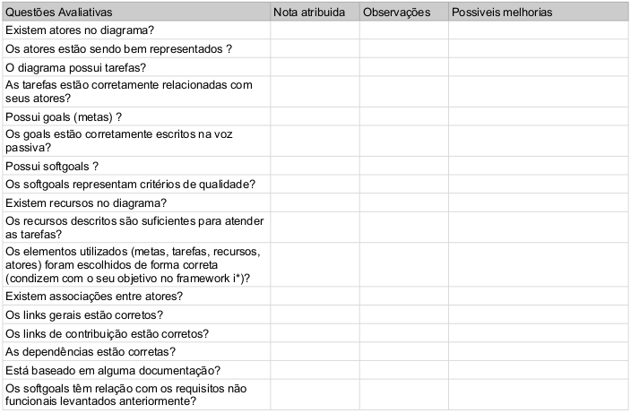
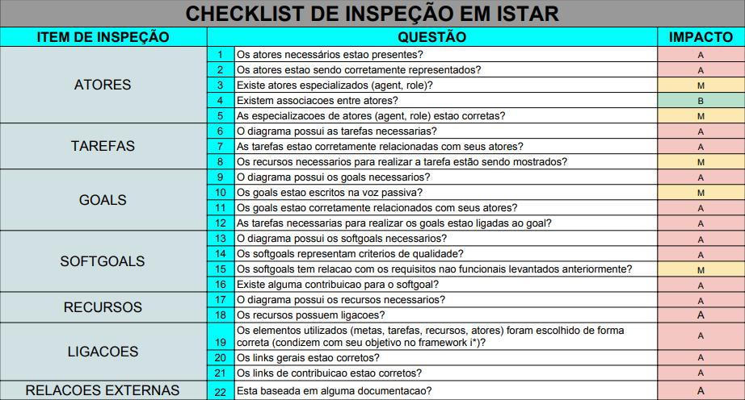
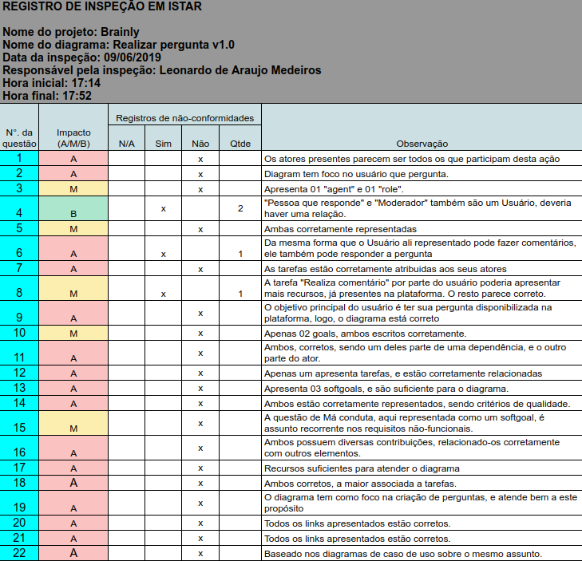
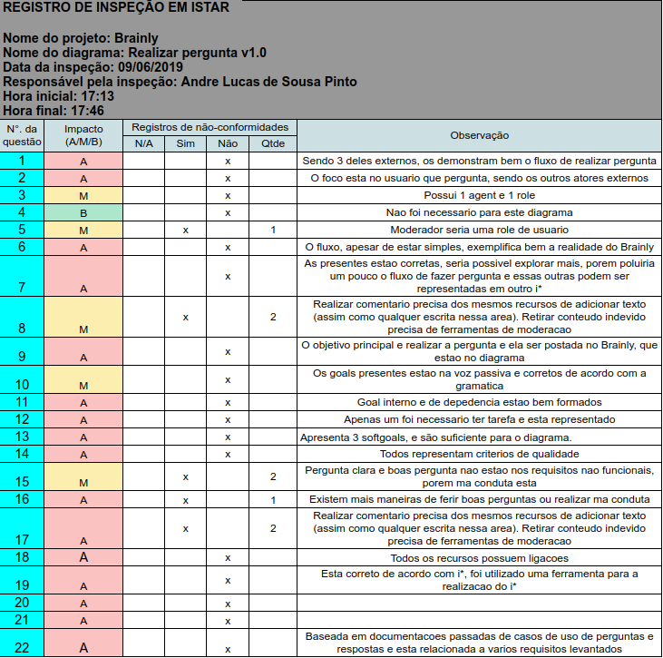
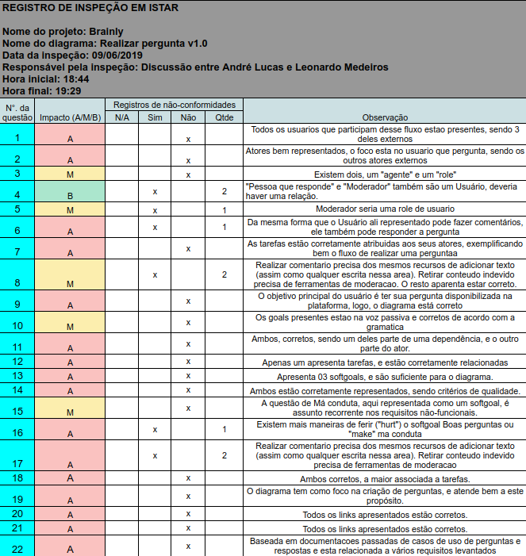
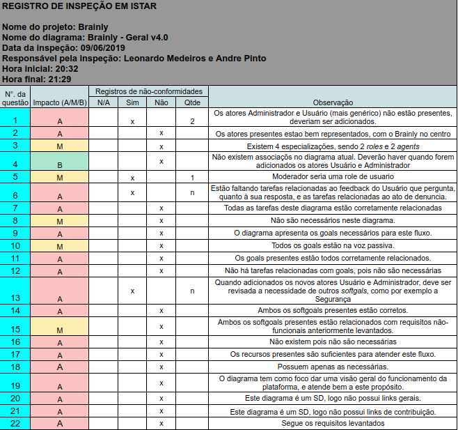

# iStar

|  Versão | Data | Modificação | Autor |
|  :------: | :------: | :------: | :------: |
| 1.0 | 09/06/2019 | Adiciona modelo de verificação (v1) | Leonardo Medeiros, Andre Pinto |
| 1.1 | 09/06/2019 | Adiciona modelo de verificação (v2) | Leonardo Medeiros, Andre Pinto |
| 1.1 | 09/06/2019 | Adiciona a verificação do modelo i* "realizar pergunta v1.0" por Andre, Leonardo e ambos | Leonardo Medeiros, Andre Pinto |
| 1.2 | 09/06/2019 | Adiciona a verificação do modelo i* "Brainly - Geral v4.0" por Andre e Leonardo | Leonardo Medeiros, Andre Pinto |

# INTRODUÇÃO

Os modelos de verificação de i* foram baseados no material disponibilizado pelos professores. A análise mostra o que tem ou não sido cumprido pelos objetos analisados pela equipe em determinados critérios descritos.

# OBJETIVO

Reconhecer e apontar erros presentes nos modelos atuais visando sua melhoria e correção.

# METODOOGIA

O modelo de verificação elaborado pela equipe foi realizado em dupla e após ter o modelo em mãos, a dupla se separou e preencheu individualmente o formulário, ao concluir, se juntou e discutiu, unindo suas ideias a fim de melhorar a análise do modelo em questão. Durante a aplicação do processo a dupla percebeu que a abordagem tomou muito tempo e não foi tão eficiente, logo a abordagem foi alterada e a dupla passou a responder o formulário discutindo cada pergunta desde o começo.

## MODELO DE VERIFICAÇÃO - i* v1.0

## MODELO DE VERIFICAÇÃO - i* v2.0

## VERIFICAÇÃO DO ISTAR "REALIZAR PERGUNTA V1.0" - v1.0

Individual Leonardo

Individual Andre

Sintese: Leonardo e Andre

Audios:
[Leonardo](https://drive.google.com/file/d/1pXXKOsgZi7ksFLsfP-g7jhWzy_O25w4P/view?usp=sharing), [Andre](https://drive.google.com/file/d/1BQy9X-c2qaojW_N7-M9UCGvmyrtpX_bb/view?usp=sharing)

> Obs: devido ao metodo de gravação utilizado, os audios dos participantes ficaram separados (apesar de ser uma conversa simultanea), para melhor entendimento basta reproduzi-los simultaneamente.

## VERIFICAÇÃO DO ISTAR "BRAINLY - GERAL V4.0" - v1.0

Sintese: Leonardo e Andre

Audio: [Discussao](https://drive.google.com/file/d/1d99E9UCn2FyxWRZsSDSxK52dXiv1vsy0/view?usp=sharing)

