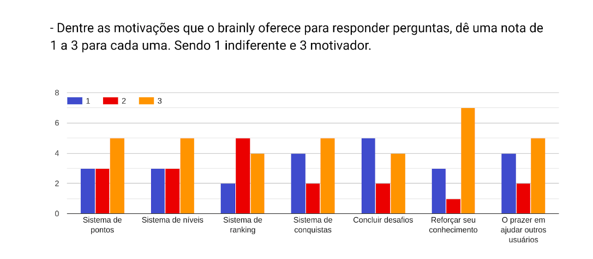
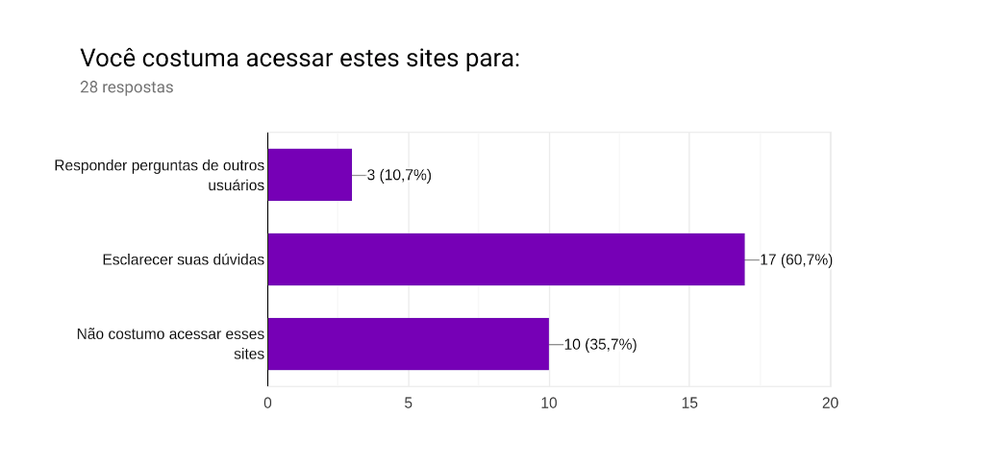
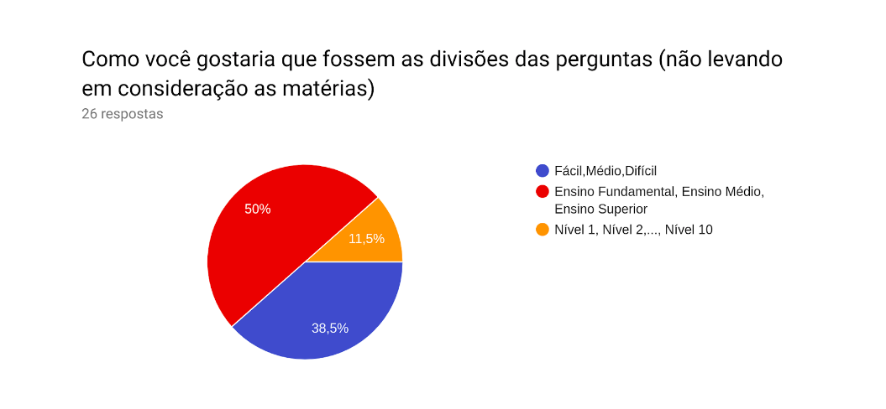
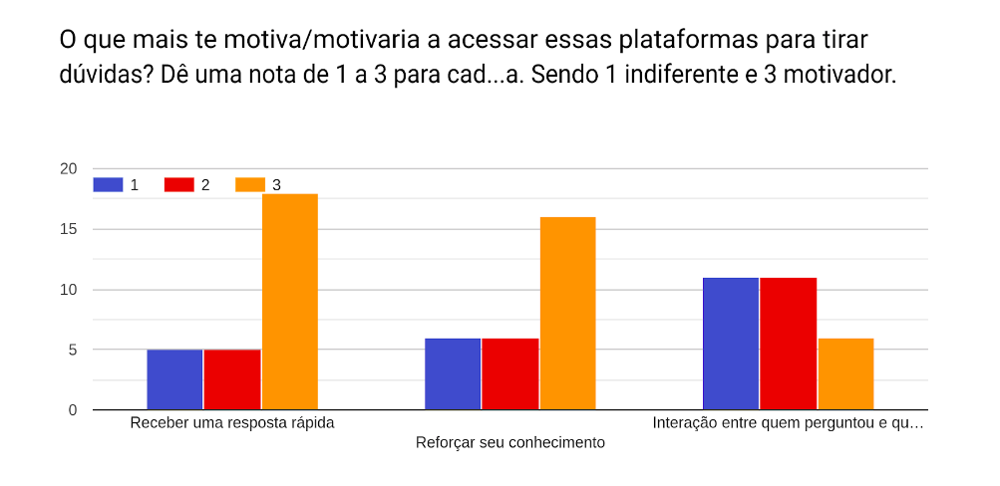

# Análise das respostas do questionário

### Pergunta 1

 
 
De acordo com esse dado a plataforma não é tão conhecida pelo público entrevistado, no caso o público universitário.

### Pergunta 2

- Você entende como funciona o sistema de perguntas? Se não, quais foram suas dificuldades ao usar o sistema?
 
 

|   |
|  :------: |
| Sim |
| sim | 
| Não, interface muito confusa |
| Sim. O guia é bom para fazer perguntas boas |

### Pergunta 3

 
 
Para usuários que já conhecem a plataforma o sistema de gamificação tem incentivado na hora de ajudar a plataforma com respostas. Isso não tira o fato de que reforçar o conhecimento é um foco principal. 

### Pergunta 4
- Você adicionaria alguma outra funcionalidade para motivar os usuário do brainly a responder perguntas? Se sim, qual? 
 
 

|   |
|  :------: |
| Não |
| Sim, mais recompensas | 
| Ajudar ao proximo |
| Responder o pc e não outro alguém. |
| As pessoas que tiveram perguntas respondidas poderiam  mostrar fruto dessa mesma resposta. Seria mais incentivador |
| Pagamento em dinheiro | 
| Retorno monetário. |

### Pergunta 5

 
 
Esses dados mostram que a divisão de matérias tem uma taxa baixa de rejeição, e pode ser considerada boa, sendo que a maioria dos usuários se mostram indiferentes e uma boa parte concorda que a divisão é boa do jeito que está.

### Pergunta 6

 
 
De acordo com o questionário o chat não é algo essencial para os usuários do brainly, portanto a política adotada de indisponibilizar o chat para novos usuários é bastante eficiente. Além de evitar problemas de integridade moral dos usuários não trás uma grande perda para o app.

### Pergunta 7
- Você adicionaria mais áreas de conhecimento no brainly, se sim, quais?
 
 

|   |
|  :------: |
| Não |
| Não sei | 
| A área que a pessoa for perguntar precisar |

### Pergunta 8

 
 
Para mais da metade dos entrevistados, a plataforma tem postura positiva no quesito de exercer seu objetivo principal, a taxa de pessoas que discordam dessa afirmação é baixa.

### Pergunta 9

 
 
O dado acima é reforçado, pelo fato de muitas pessoas conhecem plataformas concorrentes porém não conhecem o brainly. Isso mostra que o sistema tem perdido usuários do âmbito universitário para outras plataformas.

### Pergunta 10

 
 
Boa parte do público não tem intenção de acessar plataformas similares para responder perguntas. Portanto o trabalho de tornar o ato de responder dúvidas atrativo é importante.

### Pergunta 11

 
 
O retorno monetário como incentivo se mostrou indiferente para muitos usuários. O fator mais relevante para incentivar usuários a responder dúvidas é reforçar o conhecimento que ele já possui.

### Pergunta 12

 
 
Pode-se perceber que os usuários de nossa pesquisa em sua maioria preferem a divisão em níveis de escolaridade, assim podemos concluir que o Brainly fez uma boa divisão.

### Pergunta 13

 
 
Essa resposta reforça o que já foi deixado claro, que o principal incentivo para um usuário responder perguntas na plataforma é reforçar seu conhecimento. Também podemos ver que a grande maioria tem interesse apenas em receber respostas rápidas, e que a interação com quem respondeu ou quem perguntou não é algo primordial

### Pergunta 14
- Existe alguma característica dessas plataformas que te desmotiva ou que o desmotivaria a utilizá-las? Se sim, quais e qual sua sugestão para resolução desse problema? 

|   |
|  :------: |
| Não |
| Respostas sem sentido ou sem baseamento científico. | 
| Falta de confiabilidade nas respostas, uma solução seria o uso de referências |
| Resposta "desnecessárias". Se não se sabe a resposta, evitar respostas "sem noção" |
| Desconheço |
| Normalmente quero respostas rápidas,  então só olho as perguntas já feitas e respondidas, não faço novas | 
| Realizar inscrições |
| A falta de confiança nas respostas. Seria  legal se fosse uma plataforma respondida apenas por professores |
| não conheço e não utilizo essas plataformas | 
| Respostas sucintas e mal respondidas |
| Não saber se é confiável. |

As respostas acima mostra que a confiabilidade das respostas é algo de suma importância em uma plataforma como essa. Respostas ruins afetariam a plataforma como um todo. 

### Pergunta 15

 
 
Esse resultado mostra que foi feita uma boa escolha de público para a pesquisa, pois boa parte deste teria ou poderia ter interesse em conhecer o brainly.