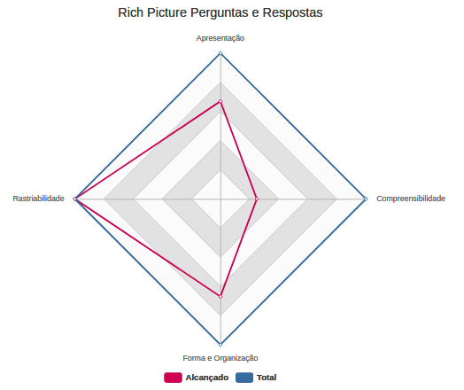

# PRÉ-RASTREABILIDADE

|  Versão |    Data    | Modificação  | Autor |
|  :----: | :--------: | :---------:  | :------: |
|    1.0  | 04/06/2019 | Adição do template | João Rossi |
|    1.1  | 04/06/2019 | Adição da análise dos rich pictures de visão geral, gamificação, plataformas, perguntas e respostas e primeiros passos de um novo usuário não cadastrado e cadastrado |  Ivan Diniz, João Rodrigues, João Rossi, Paulo Rocha |
|    1.2  | 05/06/2019 | Adição da análise das argumentações | João Rossi, Ivan Diniz, Paulo Rocha, João Rodrigues |
|    1.3  | 09/06/2019 | Adição do checklist de inspeção em rich picture | Ivan Diniz, João Rodrigues, Paulo Rocha |
|    1.4  | 09/06/2019 | Adição do checklist de inspeção em argumentação | Ivan Diniz, João Rodrigues, Paulo Rocha |
|    1.5  | 09/06/2019 | Adição da análise das argumentações | Paulo Rocha, João Gabriel |
|    1.6  | 09/06/2019 | Adição da análise dos rich pictures | João Rodrigues, Ivan Diniz |
|    1.7  | 09/06/2019 | Adição dos gráficos de analise dos rich pictures e argumentação | João Rodrigues, Paulo Vítor, Joao Gabriel |
|    1.8  | 10/06/2019 | Adição dos gráficos de analise das argumentações | Joao Gabriel |
|    1.9  | 22/06/2019 | Adição da versão 3 das análises de argumentação | João Rodrigues, Paulo Vitor |
|    2.0  | 22/06/2019 | Adição da versão 3 das análises dos rich pictures | João Rodrigues, Paulo Vitor |

# INTRODUÇÃO

Na análise de pré-rastreabilidade foram estabelecidos critérios com base nas dicas dadas na dinâmica e apresentação. A análise mostra o que tem ou não sido cumprido pelos objetos analizados pela equipe em determinados critérios descritos.

# OBJETIVO

# METODOLOGIA

## MODELO DE VERIFICAÇÃO - RICH PICTURE
**Versão 1**

|  Número |    Critério de avaliação    |
|  :----: | :-------------------------: |
|  1 | Simbologia coerente? |
|  2 | Existe coesão entre imagem e texto? |
|  3 | Existe equilíbrio entre a quantidade de imagem e a de texto? |
|  4 | O modelo é compreensível para qualquer um que ler? |
|  5 | O fluxo é bem definido? |
|  6 | Existe rastreablidade? |
|  7 | A linguagem é objetiva? |

**Versão 2**

| Número | Questão | Item de Inspeção | Impacto |
| :----: | :-----: | :--------------: | :-----: |
|   1   | Simbologia coerente? | Apresentação | A |
|   2   | Existe coesão entre imagem e texto? | Apresentação | M |
|   3   | Existe equilibrio entre a quantidade de imagens e a de texto? | Apresentação | B |
|   4   | O modelo é compreensível para leigos? | Compreensibilidade | A |
|   5   | O fluxo é bem definido? | Compreensibilidade | A |
|   6   | A linguagem é objetiva? | Compreensibilidade | M |
|   7   | O foco está no centro?  | Forma e Organização | A |
|   8   | Utiliza atores? | Forma e Organização | A |
|   9   | Utiliza representação de artefatos físicos?  | Forma e Organização | A |
|   10   | Existe versionamento?  | Rastreabilidade | A |

# INSPEÇÕES 
## IRP 01 - Rich Picture Visão Geral Brainly
### Inspeção Individual v1.0

|  Número |    Tópico    | Cumpre  | Melhoria |
|  :----: | :--------: | :---------:  | :------: |
|  1 | Simbologia coerente? | S |  |
|  2 | Existe coesão entre imagem e texto? | S |  |
|  3 | Existe equilíbrio entre a quantidade de imagem e a de texto? | S |  |
|  4 | O modelo é compreensível para qualquer um que ler? | N | Existem algumas etapas em que faltam textos para ajudar a compreensão, podendo dificultar o entendimento |
|  5 | O fluxo é bem definido? | S |  |
|  6 | Existe rastreablidade? | S |  |
|  7 | A linguagem é objetiva? | S |  |

### Inspeção Individual v2.0

|Nome do projeto| [Rich Picture Visão Geral Brainly](rich_picture.md#rich-picture-visao-geral-brainly) |
| :------------: | :------------: |
| Data da inspeção | 09/06/2019 |
|Responsável pela inspeção |Ivan Diniz|
|Hora inicial| 16h41|
|Hora final| 17h00|

| N°. da questão | Impacto (A/M/B) | Satisfeito? | Observação |
| :------------: | :-------------: | :--------:  | :--------: |
|       1        |        A        |     Sim     | Boa escolha de imagens, pois são semelhantes às utilizadas no Brainly |
|       2        |        M        |     Sim     | - |
|       3        |        B        |     Sim     | - |
|       4        |        A        |     Não     | A complexidade do fluxo dificulta a compreensão do comportamento da aplicação |
|       5        |        A        |     Sim     | Fluxo bem definido, porém complexo e de difícil compreensão |
|       6        |        M        |     Sim     | - |
|       7        |        A        |     Sim     | - |
|       8        |        A        |     Sim     | - |
|       9        |        A        |     Sim     | - |
|      10        |        A        |     Sim     | - |

### Inspeção Individual v3.0

| Nome do projeto           | [Rich Picture Visão Geral Brainly](rich_picture.md#rich-picture-visao-geral-brainly) |
| :-----------------------: | :----------------------------------------------------------------------------------: |
| Data da inspeção          | 22/06/2019 |
| Responsável pela inspeção | João Rodrigues |
| Hora inicial              | 19h22 |
| Hora final                | 19h38 |

| N°. da questão | Impacto (A/M/B) | Satisfeito? | Observação |
| :------------: | :-------------: | :--------:  | :--------: |
|       1        |        A        |     Sim     | Boa escolha de imagens, pois são semelhantes às utilizadas no Brainly. |
|       2        |        M        |     Sim     | As imagens representam bem os textos aos quais estão associadas. |
|       3        |        B        |     Sim     | Foram utilizadas somente as imagens necessárias para ilustrar os textos e foram ilustrados todos os textos. |
|       4        |        A        |     Não     | A complexidade do fluxo dificulta a compreensão do comportamento da aplicação. |
|       5        |        A        |     Sim     | Fluxo bem definido, porém complexo e de difícil compreensão. |
|       6        |        M        |     Sim     | Longos textos não foram utilizados como legenda de imagens, indicação de ações (texto em setas e etc) ou explanação geral. |
|       7        |        A        |     Sim     | O foco é a visão geral da plataforma Brainly, ou seja, o Brainly, que se encontra no centro do artefato. |
|       8        |        A        |     Sim     | A administração, os moderadores, o estudante com dúvida, os estudantes em geral, os bons usuários e os maus usuários são representados. |
|       9        |        A        |     Sim     | É implicita a representação de um dispositivo eletrônico que possibilite a utilização da plataforma Brainly. |
|      10        |        A        |     Sim     | São apresentados as versões e os autores das versões do artefato. |

## IRP 02 - Rich Picture Gamificação
### Inspeção Individual v1.0

|  Número |    Tópico    | Cumpre  | Melhoria |
| :-----: | :----------: | :-----: | :------: |
|    1    | Simbologia coerente? | S | | 
|    2    | Existe coesão entre imagem e texto? | N | A imagem que representa Pontos se assemelha à medalhas. |
|    3    | Existe equilíbrio entre a quantidade de imagem e a de texto? | S | |
|    4    | O modelo é compreensível para qualquer um que ler? | S | |
|    5    | O fluxo é bem definido? | S | |
|    6    | Existe rastreablidade? | S | |
|    6    | A linguagem é objetiva? | S | Poderia informar para que o brainly utiliza a gamificação. |

### Inspeção Individual v2.0

|Nome do projeto| [Rich Picture Gamificação](rich_picture.md#richpicture-gamificacao) |
| :------------: | :------------: |
|Data da inspeção| 09/06/2019|
|Responsável pela inspeção| Paulo Vitor|
|Hora inicial| 16h41|
|Hora final| 17h00|

| N°. da questão | Impacto (A/M/B) | Satisfeito? | Observação |
| :------------: | :-------------: | :--------:  | :--------: |
|       1        |        A        |     Sim     | - |
|       2        |        M        |     Não     | A imagem que representa Pontos se assemelha à medalhas |
|       3        |        B        |     Sim     | - |
|       4        |        A        |     Sim     | - |
|       5        |        A        |     Sim     | Fluxo bem definido, porém o foco da gamificação deve ser o usuário |
|       6        |        M        |     Sim     | Informar a finalidade da gamificação |
|       7        |        A        |     Não     | O foco está no usuário e o usuário não está no centro |
|       8        |        A        |     Sim     | - |
|       9        |        A        |     Sim     | - |
|      10        |        A        |     Sim     | - |

### Inspeção Individual v3.0

| Nome do projeto           | [Rich Picture Gamificação](rich_picture.md#richpicture-gamificacao) |
| :-----------------------: | :----------------------------------------------------------------------------------: |
| Data da inspeção          | 22/06/2019 |
| Responsável pela inspeção | João Rodrigues |
| Hora inicial              | 19h57 |
| Hora final                | 20h16 |

| N°. da questão | Impacto (A/M/B) | Satisfeito? | Observação |
| :------------: | :-------------: | :--------:  | :--------: |
|       1        |        A        |     Sim     | Os símbolos escolhidos são facilmente interpretados, porém é recomendado utilizar símbolos semelhantes aos utilizados no Brainly para se adequar a identidade visual empregada na plataforma. |
|       2        |        M        |     Não     | A imagem que representa Pontos se assemelha à medalhas. |
|       3        |        B        |     Sim     | A utilização de tabelas evita acumulação de texto explicativo ou de imagens ilustrativas. |
|       4        |        A        |     Sim     | Por ser a representação de uma parte de um todo (gamificação aplicada na plataforma Brainly) , o artefato não é complexo e é de fácil compreensão. |
|       5        |        A        |     Sim     | Fluxo bem definido, porém o foco da gamificação deve ser o usuário. |
|       6        |        M        |     Sim     | Longos textos não foram utilizados como legenda de imagens, indicação de ações (texto em setas e etc) ou explanação geral. |
|       7        |        A        |     Não     | O foco da gamificação é o usuário e o usuário não está no centro. |
|       8        |        A        |     Sim     | Os usuários e os usuários com ótimo desempenho na gamificação aplicada na plataforma Brainly são representados. |
|       9        |        A        |     Sim     | É implicita a representação de um dispositivo eletrônico que possibilite a utilização da plataforma Brainly. |
|      10        |        A        |     Sim     | São apresentados as versões e os autores das versões do artefato. |

## IRP 03 - Rich Picture Plataformas
### Inspeção Individual v1.0

|  Número |    Tópico    | Cumpre  | Melhoria |
|  :----: | :--------: | :---------:  | :------: |
|  1 | Simbologia coerente? | S |  |
|  2 | Existe coesão entre imagem e texto? | N | Ter um texto por imagem, mesmo que seja apenas uma palavra |
|  3 | Existe equilíbrio entre a quantidade de imagem e a de texto? | S |  |
|  4 | O modelo é compreensível para qualquer um que ler? | N | Por faltar texto, pode acabar sendo complicado para alguns. |
|  5 | O fluxo é bem definido? |  S |  |
|  6 | Existe rastreablidade? | S |  |
|  7 | A linguagem é objetiva? | S |  |

### Inspeção Individual v2.0

|Nome do projeto| [Rich Picture Plataformas](rich_picture.md#richpicture-plataformas) |
| :------------: | :------------: |
|Data da inspeção| 09/06/2019|
|Responsável pela inspeção| João Rodrigues|
|Hora inicial| 17h00|
|Hora final| 17h08|

| N°. da questão | Impacto (A/M/B) | Satisfeito? | Observação |
| :------------: | :-------------: | :--------:  | :--------: |
|       1        |        A        |     Sim     | Utilizar símbolos semelhantes aos utilizados no Brainly |
|       2        |        M        |     Não     | Adicionar legenda às imagens que não possuem |
|       3        |        B        |     Sim     | Porém é necessário adicionar legenda às imagens que não possuem |
|       4        |        A        |     Não     | Por faltar legenda em algumas imagens, alguns leitores podem ter difilculdade ou não compreender o modelo |
|       5        |        A        |     Sim     | - |
|       6        |        M        |     Sim     | - |
|       7        |        A        |     Não     | Por ser variável, o foco está disperso |
|       8        |        A        |     Sim     | - |
|       9        |        A        |     Sim     | - |
|      10        |        A        |     Sim     | - |

### Inspeção Individual v3.0

| Nome do projeto           | [Rich Picture Plataformas](rich_picture.md#richpicture-plataformas) |
| :-----------------------: | :----------------------------------------------------------------------------------: |
| Data da inspeção          | 22/06/2019 |
| Responsável pela inspeção | João Rodrigues |
| Hora inicial              | 20h25 |
| Hora final                | 20h40 |

| N°. da questão | Impacto (A/M/B) | Satisfeito? | Observação |
| :------------: | :-------------: | :--------:  | :--------: |
|       1        |        A        |     Sim     | Os símbolos escolhidos são facilmente interpretados, porém é recomendado utilizar símbolos semelhantes aos utilizados no Brainly para se adequar a identidade visual empregada na plataforma. |
|       2        |        M        |     Sim     | Utiliza símbolos e imagens que são facilmente interpretadas da maneira correta, porém é recomendado adicionar lengenda às imagens que não possuem. |
|       3        |        B        |     Sim     | Apesar da falta de algumas legendas, a distribuição de imagens e texto no artefato é equilibrada. |
|       4        |        A        |     Não     | Por faltar legenda em algumas imagens, alguns leitores podem encontrar dificuldade em compreender o artefato. |
|       5        |        A        |     Sim     | Apesar de o artefato possuir um ponto central variável, o fluxo está bem definido. |
|       6        |        M        |     Sim     | Longos textos não foram utilizados como legenda de imagens, indicação de ações (texto em setas e etc) ou explanação geral. |
|       7        |        A        |     Sim     | O foco do artefato parece disperso, pois o ponto central desse artefato é variável. Porém, agrupando suas variações nota-se que o foco está no centro do artefato. |
|       8        |        A        |     Sim     | O usuário, os seguidores do usuário na plataforma Brainly e os amigos do usuário na plataforma Brainly são representados. |
|       9        |        A        |     Sim     | Utiliza um dispositivo android, um dispositivo ios e um dispositivo desktop |
|      10        |        A        |     Sim     | São apresentados as versões e os autores das versões do artefato. |

## IRP 04 - Rich Picture Perguntas e Respostas
### Inspeção Individual v1.0

|  Número |    Tópico    | Cumpre  | Melhoria |
|  :----: | :--------: | :---------:  | :------: |
|  1 | Simbologia coerente? | S |  |
|  2 | Existe coesão entre imagem e texto? | N | Na parte de denúncia o moderador avalia uma denúncia, porém um usuário com dúvida e outros usuários só se conectam a imagem denúncia sem dizer a relação. A relação seria "faz" e "fazem" para usuário com dúvida e outros usuários,respectivamente. |
|  3 | Existe equilíbrio entre a quantidade de imagem e a de texto? | S |  |
|  4 | O modelo é compreensível para qualquer um que ler? | N | Na parte de denúncia esclarecer que um usuário faz uma denúncia |
|  5 | O fluxo é bem definido? | S |  |
|  6 | Existe rastreablidade? | S | |
|  7 | A linguagem é objetiva? | S |

### Inspeção Individual v2.0

|Nome do projeto| [Rich Picture Perguntas e Respostas](rich_picture.md#richpicture-perguntas-e-respostas)|
| :------------: | :------------: |
|Data da inspeção| 09/06/2019|
|Responsável pela inspeção| Ivan Diniz|
|Hora inicial| 17h00|
|Hora final| 17h16|

| N°. da questão | Impacto (A/M/B) | Satisfeito? | Observação |
| :------------: | :-------------: | :--------:  | :--------: |
|       1        |        A        |     Sim     | - |
|       2        |        M        |     Não     | Em denúncia, o moderador avalia uma denúncia, porém na conexão entre os atores Usuário Com Dúvida e Outros Usuários não é descrita a relação |
|       3        |        B        |     Sim     | - |
|       4        |        A        |     Não     | Difícil compreensão do ganho e gasto de pontos |
|       5        |        A        |     Não     | Não explica como ganhar ou gastar pontos com as perguntas, pois quem responde e quem pergunta aponta para o mesmo lugar |
|       6        |        M        |     Sim     | - |
|       7        |        A        |     Não     | O foco está disperso, pois as perguntas e respostas, nem os usuários que realizam essas ações estão no centro |
|       8        |        A        |     Sim     | - |
|       9        |        A        |     Sim     | - |
|      10        |        A        |     Sim     | - |

## IRP 05 - Rich Picture Primeiros Passos de Usuário não Cadastrado
### Inspeção Individual v1.0

|  Número |    Tópico    | Cumpre  | Melhoria |
|  :----: | :--------: | :---------:  | :------: |
| 1 | Simbologia coerente? | S |  |
| 2 | Existe coesão entre imagem e texto? | S |  |
| 3 | Existe equilíbrio entre a quantidade de imagem e a de texto? | S |  |
| 4 | O modelo é compreensível para qualquer um que ler? | S |  |
| 5 | O fluxo é bem definido? | S |  |
| 6 | Existe rastreablidade? | N | Se necessário desenvolver nova versão, pois esta é a primeira |
| 7 | A linguaguem é objetiva? | S |  |

### Inspeção Individual v2.0

|Nome do projeto| [Rich Picture Primeiros Passos de Usuário não Cadastrado](rich_picture.md#richpicture-primeiros-passos-de-novo-usuario-nao-cadastrado) |
| :------------: | :------------: |
|Data da inspeção| 09/06/2019|
|Responsável pela inspeção| João Rodrigues|
|Hora inicial| 17h15|
|Hora final| 17h28|

| N°. da questão | Impacto (A/M/B) | Satisfeito? | Observação |
| :------------: | :-------------: | :--------:  | :--------: |
|       1        |        A        |     Sim     | Utilizar simbolos semelhantes aos utilizados no Brainly |
|       2        |        M        |     Sim     | Porém a imagem de Dúvida Esclarecida não a representa satisfatoriamente |
|       3        |        B        |     Sim     | - |
|       4        |        A        |     Não     | É díficil compreender que para realizar uma pergunta o usuário deve estar registrado na plataforma |
|       5        |        A        |     Sim     | Fluxo bem definido, porém complexo e de difícil compreensão |
|       6        |        M        |     Sim     | Algumas palavras apresentam erros de ortografia |
|       7        |        A        |     Não     | O usuário não está no centro do modelo |
|       8        |        A        |     Sim     | - |
|       9        |        A        |     Sim     | - |
|      10        |        A        |     Sim     | - |

## IRP 06 - Rich Picture Primeiros Passos de Novo Usuário Cadastrado
### Inspeção Individual v1.0

|  Número |    Tópico    | Cumpre  | Melhoria |
|  :----: | :--------: | :---------:  | :------: |
|  1 | Simbologia coerente? | S |  |
|  2 | Existe coesão entre imagem e texto? | S |  |
|  3 | Existe equilíbrio entre a quantidade de imagem e a de texto? | S |  |
|  4 | O modelo é compreensível para qualquer um que ler? | S |  |
|  5 | O fluxo é bem definido? | S |  |
|  6 | Existe rastreablidade? | S |  |
|  7 | A linguagem é objetiva? | S |  |

### Inspeção Individual v2.0

|Nome do projeto| [Rich Picture Primeiros Passos de Novo Usuário Cadastrado](rich_picture.md#richpicture-primeiros-passos-de-novo-usuario-cadastrado) |
| :------------: | :------------: |
|Data da inspeção| 09/06/2019|
|Responsável pela inspeção| João Rodrigues|
|Hora inicial| 17h35|
|Hora final| 17h41|

| N°. da questão | Impacto (A/M/B) | Satisfeito? | Observação |
| :------------: | :-------------: | :--------:  | :--------: |
|       1        |        A        |     Sim     | Utilizar simbolos semelhantes aos utilizados no Brainly |
|       2        |        M        |     Sim     | - |
|       3        |        B        |     Sim     | - |
|       4        |        A        |     Sim     | - |
|       5        |        A        |     Sim     | Para complementar o fluxo, deveriam ser descritos os passos posteriores à espera resposta de outros usuários  |
|       6        |        M        |     Sim     | Algumas palavras apresentam erros de ortografia |
|       7        |        A        |     Não     | O novo usuário não está no centro do modelo |
|       8        |        A        |     Sim     | - |
|       9        |        A        |     Sim     | - |
|      10        |        A        |     Sim     | - |

##Gráfico da inspeção dos Rich-Pictures

## MODELO DE VERIFICAÇÃO - ARGUMENTAÇÃO
**Versão 1**

|  Número |    Critério de avaliação    |
|  :----: | :--------: |
| 1 | Inferências corretas |
| 2 | Conflitos corretos |
| 3 | Preferências corretas |
| 4 | Conflitos resolvidos |
| 5 | Coerência entre a tabelas e o grafo |
| 6 | Modelos de alta complexidade |
| 7 | Pré-Rastreabilidade |

**Versão 2**

| Número | Questão | Item de Inspeção | Impacto |
| :----: | :-----: | :--------------: | :-----: |
| 1 | Inferências corretas? | Desenvolvimento | A |
| 2 | Conflitos corretos? | Desenvolvimento | A |
| 3 | Preferências corretas? | Desenvolvimento | A |
| 4 | Conflitos resolvidos? | Desenvolvimento | A |
| 5 | Modelos de alta complexidade? | Forma e Organização | M |
| 6 | Coerência entre a tabelas e o grafo? | Forma e Organização | A |
| 7 | Existe versionamento? | Rastreabilidade | M |
| 8 | Tabela de atores? | Rastreabilidade | A |
| 9 | Possui data? | Rastreabilidade | B |
| 10 | Houve consenso? | Conclusão | A |

# INSPEÇÕES
## IAR 01 - Argumentação sobre o tema
### Inspeção Individual v1.0

|  Número |    Critério de avaliação    | Cumpre  | Melhoria |
|  :----: | :--------: | :---------:  | :------: |
| 1 | Inferências corretas |  S  |  |
| 2 | Conflitos corretos |  S  |  |
| 3 | Preferências corretas |  S  |  |
| 4 | Conflitos resolvidos |  S  |  |
| 5 | Coerência entre a tabelas e o grafo |  S  |  |
| 6 | Modelos de alta complexidade |  S  |  |
| 7 | Pré-Rastreabilidade | S |  |

### Inspeção Individual v2.0

|Nome do projeto| [Argumentação sobre o tema](argumentacao.md#argumentacao-sobre-o-tema)|
| :------------: | :------------: |
|Data da inspeção| 09/06/2019|
|Responsável pela inspeção| Paulo Vítor|
|Hora inicial| 17h00|
|Hora final| 17h15|

| N°. da questão | Impacto (A/M/B) | Satisfeito? | Observação |
|  :-----------: | :-------------: | :--------:  | :--------: |
|      1       |       A       |        Sim       | -         |         
|      2       |       A       |        Sim       | -         |         
|      3       |       A       |        Sim       | -         |         
|      4       |       A       |        Sim       | -         |         
|      5       |       M       |        Sim       | -         |         
|      6       |       A       |        Sim       | -         |         
|      7       |       M       |        Sim       | -         |         
|      8       |       A       |        Sim       | -         |         
|      9       |       B       |        Não       | É relevante indicar a data das argumentações |      
|      10       |       A       |        Sim       | - |  

### Inspeção Individual v3.0

|Nome do projeto| [Argumentação sobre o tema](argumentacao.md#argumentacao-sobre-o-tema)|
| :------------: | :------------: |
|Data da inspeção| 22/06/2019|
|Responsável pela inspeção| Paulo Vítor|
|Hora inicial| 16h50|
|Hora final| 17h25|

| N°. da questão | Impacto (A/M/B) | Satisfeito? | Observação |
|  :-----------: | :-------------: | :--------:  | :--------: |
|      1       |       A       |        Sim       | Está correto o uso do rótulo it para indicar a aplicação de uma regra de inferência. Todas as inferências tem pelo menos uma linha que entra e uma que sai.   |         
|      2       |       A       |        Sim       | Está correto o uso do rótulo C para indicar a aplicação da regra de conflito assim como a adição dos vértices em conflito. Todos os conflitos possuem pelo menos uma linha que entra e uma que sai.         |         
|      3       |       A       |        Sim       | Está correto o uso do rótulo P para indicar a aplicação de uma regra de inferência. Todas as preferências possuem pelo menos uma linha que entra e uma que sai. Uma preferência também pode ser dada entre outras preferências.         |         
|      4       |       A       |        Sim       | Todos os conflitos criados da argumentação foram resolvidos por meio de escolha de preferência.         |         
|      5       |       M       |        Sim       | O modelo de argumentação apresenta uma quantidade boa de argumentos, teve mais de duas pessoas envolvidas e possui link para votações e enquetes que demonstram a escolha das preferências.          |         
|      6       |       A       |        Sim       | -         |         
|      7       |       M       |        Sim       | Existe versionamento presente em link disponível na própria página da argumentação.        |         
|      8       |       A       |        Sim       | Tabela de atores existente porém não há uma descrição de quem são os professores e quem são os participantes do grupo.         |         
|      9       |       B       |        Não       | É relevante indicar a data das argumentações. |      
|      10       |       A       |        Sim       | Houve consenso entre os participantes da argumentação o que pode ser demonstrado pela preferência P2. |  

## IAR 02 - Argumentação sobre o sistema de mensagens
### Inspeção Individual v1.0

|  Número |    Critério de avaliação    | Cumpre  | Melhoria |
|  :----: | :--------: | :---------:  | :------: |
| 1 | Inferências corretas |  S  |  |
| 2 | Conflitos corretos |  S  |  |
| 3 | Preferências corretas |  S  |  |
| 4 | Conflitos resolvidos |  S  |  |
| 5 | Coerência entre a tabelas e o grafo |  S  |  |
| 6 | Modelos de alta complexidade |  N  | Enriquecer as discussões |
| 7 | Pré-Rastreabilidade | N |  |

### Inspeção Individual v2.0

|Nome do projeto| Argumentação sobre o sistema de mensagens|
| :------------: | :------------: |
|Data da inspeção| 09/06/2019|
|Responsável pela inspeção| Paulo Vítor|
|Hora inicial| 17h15|
|Hora final| 17h23|

| N°. da questão | Impacto (A/M/B) | Satisfeito? | Observação |
|  :-----------: | :-------------: | :--------:  | :--------: |
|      1       |       A       |        Sim       | -         |         
|      2       |       A       |        Sim       | -         |         
|      3       |       A       |        Sim       | -         |         
|      4       |       A       |        Sim       | -         |         
|      5       |       M       |        Não       | Enriquecer as discussões, tentar trazer mais proposições. |         
|      6       |       A       |        Sim       | -         |         
|      7       |       M       |        Sim       | - |         
|      8       |       A       |        Sim       | -         |         
|      9       |       B       |        Não       | É relevante indicar a data das argumentações |     
|      10       |       A       |        Sim       | - |    

### Inspeção Individual v3.0

|Nome do projeto| [Argumentação sobre o sistema de mensagens](argumentacao.md#argumentacao-sobre-o-sistema-de-mensagens)|
| :------------: | :------------: |
|Data da inspeção| 22/06/2019|
|Responsável pela inspeção| Paulo Vítor|
|Hora inicial| 17h25|
|Hora final| 17h50|

| N°. da questão | Impacto (A/M/B) | Satisfeito? | Observação |
|  :-----------: | :-------------: | :--------:  | :--------: |
|      1       |       A       |        Sim       | Está correto o uso do rótulo it para indicar a aplicação de uma regra de inferência. Todas as inferências tem pelo menos uma linha que entra e uma que sai.   |         
|      2       |       A       |        Sim       | Está correto o uso do rótulo C para indicar a aplicação da regra de conflito assim como a adição dos vértices em conflito. Todos os conflitos possuem pelo menos uma linha que entra e uma que sai.         |         
|      3       |       A       |        Sim       | Está correto o uso do rótulo P para indicar a aplicação de uma regra de inferência. Todas as preferências possuem pelo menos uma linha que entra e uma que sai. Uma preferência também pode ser dada entre outras preferências.         |         
|      4       |       A       |        Sim       | Todos os conflitos criados da argumentação foram resolvidos por meio de escolha de preferência.         |         
|      5       |       M       |        Não       | O modelo de argumentação apresenta uma quantidade pequena de argumentos, apesar de ter mais de duas pessoas envolvidas e possuir link para votações que demonstram a escolha das preferências.          |         
|      6       |       A       |        Sim       | -         |         
|      7       |       M       |        Sim       | Existe sistema de versionamento porém é o primeiro modelo.        |         
|      8       |       A       |        Sim       | Tabela de atores existente porém não há uma descrição de quem são os professores e quem são os participantes do grupo.         |         
|      9       |       B       |        Não       | É relevante indicar a data das argumentações. |      
|      10       |       A       |        Sim       | Houve consenso entre os participantes da argumentação o que pode ser demonstrado pela preferência P2. |  

## IAR 03 - Argumentação sobre os níveis do Brainly
### Inspeção Individual v1.0

|  Número |    Critério de avaliação    | Cumpre  | Melhoria |
|  :----: | :--------: | :---------:  | :------: |
| 1 | Inferências corretas |  S  |  |
| 2 | Conflitos corretos |  S  |  |
| 3 | Preferências corretas |  S  |  |
| 4 | Conflitos resolvidos |  S  |  |
| 5 | Coerência entre a tabelas e o grafo |  S  |  |
| 6 | Modelos de alta complexidade |  S  |  |
| 7 | Pré-Rastreabilidade | N |  |

### Inspeção Individual v2.0

|Nome do projeto| Argumentação sobre os níveis do Brainly|
| :------------: | :------------: |
|Data da inspeção| 09/06/2019|
|Responsável pela inspeção| João Gabriel|
|Hora inicial| 17h23|
|Hora final| 17h28|

| N°. da questão | Impacto (A/M/B) | Satisfeito? | Observação |
|  :-----------: | :-------------: | :--------:  | :--------: |
|      1       |       A       |        Sim       | -         |         
|      2       |       A       |        Sim       | -         |         
|      3       |       A       |        Sim       | -         |         
|      4       |       A       |        Sim       | -         |         
|      5       |       M       |        Sim       | -         |         
|      6       |       A       |        Sim       | -         |         
|      7       |       M       |        Sim       | - |         
|      8       |       A       |        Sim       | -         |         
|      9       |       B       |        Não       | É relevante indicar data das argumentações |         
|      10       |       A       |        Sim       | - |      

### Inspeção Individual v3.0

|      Nome do projeto      | [Argumentação sobre os níveis do Brainly](argumentacao.md#argumentacao-sobre-os-niveis-do-brainly) |
| :-----------------------: | :------------------------------------------------------------------------------------------------: |
|     Data da inspeção      |  22/06/2019    |
| Responsável pela inspeção | João Rodrigues |
|         Hora inicial      | 18h06 |
|         Hora final        | 18h22 |

| N°. da questão | Impacto (A/M/B) |   Satisfeito?    | Observação |
| :------------: | :-------------: | :-------------:  | :--------: |
|       1        |        A        |        Sim       | A inferências foram aplicadas corretamente aos argumentos, porém estão representadas incorretamente no grafo pela letra h, que deveria ser it. |
|       2        |        A        |        Sim       | Os conflitos foram aplicados e representados corretamente. |         
|       3        |        A        |        Sim       | As preferências foram aplicadas corretamente, porém estão representados incorretamente no grafo pela palavra pref, que deveria se P. |         
|       4        |        A        |        Sim       | Os conflitos foram resolvidos corretamente utilizando as preferências. |         
|       5        |        M        |        Sim       | Poderiam ter sido elaborados mais argumentos por parte dos participantes. |
|       6        |        A        |        Sim       | As informações apresentadas no grafo são encontradas e aprofundadas na tabela. |         
|       7        |        M        |        Sim       | Poderiam ser elaborados outras versões dessa argumentação. |         
|       8        |        A        |        Sim       | Não existe tabela de atores, mas esses são bem identificados no decorrer da apresentação do modelo de argumentação. |    
|       9        |        B        |        Não       | Necessário indicar a data em que foi realizada a argumentação. |      
|      10        |        A        |        Sim       | Foi apresentada uma preferência (P1) sem argumentos contrários, indicando consenso entre os participantes da argumentação. |  

##Gráfico da inspeção das argumentações

