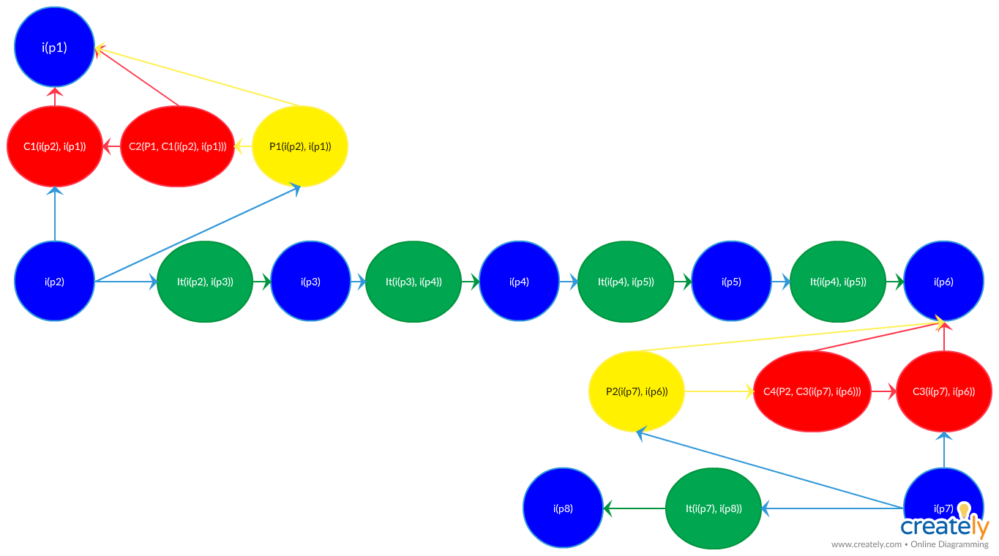
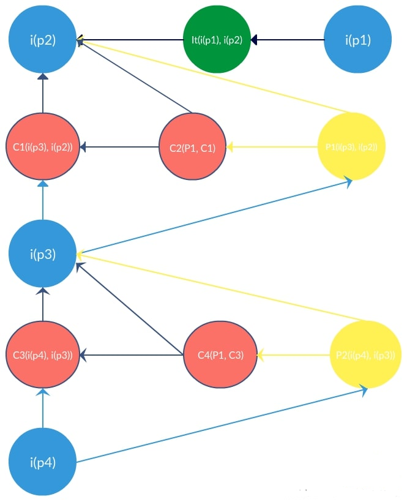
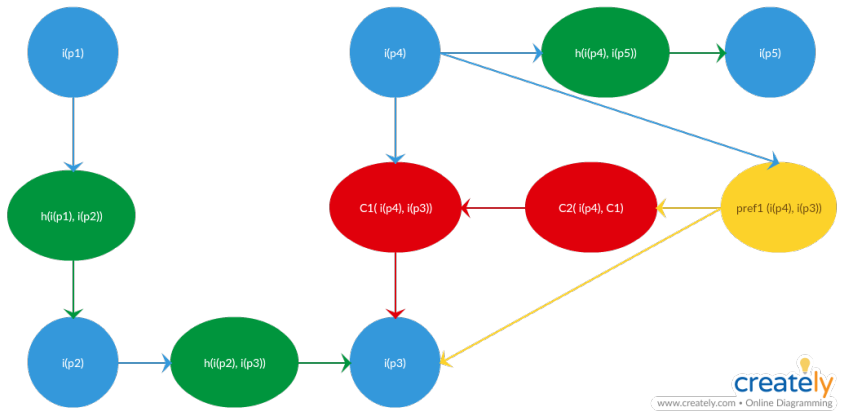

# ARGUMENTAÇÃO

## Versionamento

|  Versão | Data | Modificação | Autor |
|  :------: | :------: | :------: | :------: |
| 1.0 | 31/03/2019 | Argumentação sobre o tema | Lieverton |
| 1.0 | 31/03/2019 | Argumentação sobre o sistema de mensagens | Welison |
| 1.0 | 01/04/2019 | Argumentação sobre os níveis | André Pinto, Leonardo Medeiros, Welison Regis |

## Argumentação

A argumentação pode ser definida como uma organização discursiva que inclui a negociação de argumentos a favor e contrários a um ponto de vista, objetivando chegar a uma conclusão.

Para demonstrar as argumentações será utilizado o *framework* ACE (*Acceptability Evaluation Framework*).

## Argumentação sobre o tema

| Autor | Proposição | Inferência |
|  :------: | :------: | :------: |
| grupo | _i(p1)_ | Escolhemos twich TV. |
| professores | _i(p2)_ | [O grupo não pode escolher twich TV pois já foi tema em semestres anteriores.](https://welisonr.github.io/2019.1-Requisitos-Brainly/nao_twich/) |
| André | _i(p3)_ | Precisamos escolher outro tema. |
| Gustavo | _i(p4)_ | Vamos fazer telegram, steam, youtube ou ifood.|
| Paulo | _i(p5)_ | Pode ser steam, tem muita  coisa.
| Ivan | _i(p6)_ | Gostei da ideia do steam. |
| Welison | _i(p7)_ | Minha sugestão é o brainly, site voltado para estudo, não acho que seja bom pegar algo tão grande.|
| professores | _i(p8)_ |[Tema ok.](https://welisonr.github.io/2019.1-Requisitos-Brainly/confirmacao_tema/) |

| Autor | Preferência | Inferência |
|  :------: | :------: | :------: |
| Professores | _P1_ | Por imposição o grupo teve que escolher outro tema. |
| Grupo | _P2_ | [Por meio de votação foi escolhido o brainly.](https://welisonr.github.io/2019.1-Requisitos-Brainly/votacao_tema/) |

[versão anterior](https://welisonr.github.io/2019.1-Requisitos-Brainly/argumentacao_versoes/)

## Argumentação sobre o sistema de mensagens

| Autor | Inferência | Inferência |
|  :------: | :------: | :------: |
| Leonardo | i(p1) | Todos os usuários devem dispor do 'chat' para aumentar o entrosamento e discussão das questões apresentadas na plataforma. |
| Ivan | I(p2) | O Brainly, como um serviço prestado em território nacional, deve fornecer o 'chat' e resguardar as diretrizes constitucionais de forma a assegurar a integridade física, moral e intelectual de seus usuários ao utilizar o serviço. |
| Paulo | i(p3) | O 'chat' é utilizado de maneira indevida por alguns usuários, o que ocasiona xingamentos, solicitação de dados pessoais, assédio, etc. Logo, deve ser retirado da plataforma. |
| Welison| i(p4) | O usuário dispor de um 'chat' básico de modo a possibilitar os usuários a conversarem com moderadores e administradores para retirar dúvidas, além de liberar a ferramenta para usuários com boa reputação no site. |

| Autor | Preferência | Inferência |
|  :------: | :------: | :------: |
| [Votação](https://welisonr.github.io/2019.1-Requisitos-Brainly/votacao_mensagem/) | _P1_ |Por votação, decidiu-se que o ‘Brainly’ deve retirar o ‘chat’ devido a complicações legais e éticas. |
| [Votação](https://welisonr.github.io/2019.1-Requisitos-Brainly/votacao_mensagem/) | _P2_ | Por votação, decidiu-se que o Brianly deve fornecer uma ferramenta de comunicação entre a administração, moderadores e usuários, além de possibilitar o uso do recurso por bons usuários. |

## Argumentação sobre os níveis do Brainly

| Autor | Proposição | Inferência |
|  :------: | :------: | :------: |
|Leonardo | i(p1) | O nível do usuário deve ser dinâmico e incentivar aqueles usuários mais ativos na plataforma. Logo, usuários inativos devem perder níveis de experiência ao se tornarem inativos. |
| André | i(p2) | Os usuários devem ser incentivados a continuar usando o sistema e a continuar ajudando os outros, podendo perder experiência todo mês. |
| Leonardo | i(p3) | Ao ter que manter seu nível todo mês, o usuário demonstra mais atividade e confiança ao usuário que fez a pergunta. |
|Welison | i(p4) | Alguns usuários experientes podem não ter mais tanto tempo para continuar a contribuir tanto, porém, isso não significa a perda de habilidade em responder às perguntas. |
|Welison | i(p5) | Os usuários experientes devem possuir nível alto, para passar confiança em suas respostas. |

| Autor | Preferência | Inferência |
|  :------: | :------: | :------: |
| Votação | _P1_ | O fato de perder experiência desmotiva o usuário a continuar colaborando para a plataforma, então deve-se manter o nível do usuário.|
