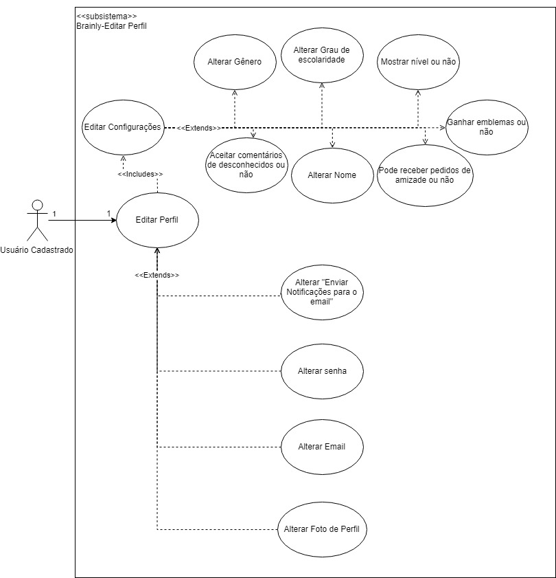

# [EDITAR PERFIL](cenarios10x5f8c4.md#alterar-perfil)

## Versionamento

|  Versão | Data | Modificação | Autor |
|  :------: | :------: | :------: | :------:
| 1.0 | 29/04/2019 | Adição do diagrama de casos de uso | Leonardo Medeiros, Ivan Dobbin |
| [1.1](modelagem_v1/casos_uso/casos_uso_alterar_perfil.md | 29/04/2019 | Adição da especificação de casos de uso | Leonardo Medeiros, Ivan Dobbin, João Rossi |
| 2.0 | 23/06/2019 | Atualização do diagrama | João Rossi |
| 2.1 | 23/06/2019 | Refatoração das especificações de caso de uso | João Rossi |

## Diagrama de Casos de Uso v2

## Especificação de Casos de Uso

### UC01

| UC01 | Editar perfil |
| -------------: | :---|
| **Descrição** | Um usuário cadastrado acessa a pagina de edição de perfil. |
| [Usuário](lexicos10x5f8c4.md#l12660) | Ator que possui acesso às funcionalidade comuns da plataforma, como, fazer perguntas, escrever respostas e comentários, adicionar amigos, entre outras. |
| **Pré-condições** | - Ter acesso à internet;  - Ter uma conta na plataforma;  - Estar logado. |
| **Fluxo básico** | 1. Usuário acessa a pagina de edição de perfil através do menu principal.|
| **Fluxos alternativos** | - |
| **Fluxos de exceções** | [1] Usuário não encontra a página de edição de perfil, no menu principal |
|  **Requisitos Especiais** | - O sistema deve possuir uma versão mobile de fácil acesso e com baixo consumo de bateria/dados [INT3.11](introspeccao.md#int03). |

### UC02

| UC02 | Alterar preferências de notificações por email |
| -------------: | :---|
| **Descrição** | Um usuário cadastrado acessa o menu de alteração de perfil e altera o envio de notificações por email. |
| [Usuário](lexicos10x5f8c4.md#l12660) | Ator que possui acesso às funcionalidade comuns da plataforma, como, fazer perguntas, escrever respostas e comentários, adicionar amigos, entre outras. |
| **Pré-condições** | - Ter acesso à internet;  - Ter uma conta na plataforma;  - Estar logado. |
| **Fluxo básico** | 1. Usuário clica em editar perfil;  2. Usuário escolhe a opção de Enviar notificações por e-mail ;  3. Usuário seleciona opções para sempre receber e-mails da plataforma;  4. Usuário seleciona opções para receber e-mails ocasionalmente da plataforma;  5. Após selecionar tudo que deseja, o usuário salva suas mudanças.|
| **Fluxos alternativos** | 3.a Usuário clica no botão de preferências recomendadas;  3.b Usuário encontra todas as opções que deseja previamente selecionadas;  4.a Usuário encontra todas as opções que deseja previamente selecionadas;   5.a Usuário decide voltar e selecionar mais opções;  5.b Usuário decide voltar e desmarcar mais opções.|
| **Fluxos de exceções** | [5] Usuário salva suas preferências mas selecionou as opções erradas. |
|  **Requisitos Especiais** | - O usuário deve ser responsável por todos os dados enviados ou transmitidos em conexão com os serviços [BR2.12](brainstorm.md#tabela-de-requisitos-nao-funcionais). |

### UC03

| UC03 | Alterar senha |
| -------------: | :---|
| **Descrição** | Um usuário cadastrado acessa o menu de alteração de perfil e atualiza sua senha. |
| [Usuário](lexicos10x5f8c4.md#l12660) | Ator que possui acesso às funcionalidade comuns da plataforma, como, fazer perguntas, escrever respostas e comentários, adicionar amigos, entre outras. |
| **Pré-condições** | - Ter acesso à internet;  - Ter uma conta na plataforma;  - Estar logado. |
| **Fluxo básico** | 1. Usuário clica em editar perfil;  2. Usuário escolhe a opção de Senha ;  3. Usuário escreve sua senha atual;  4. Usuário escolhe e escreve sua nova senha;  5. Usuário reescreve sua nova senha;  6. Após ter preenchido tudo, usuário confirma a alteração de sua senha.|
| **Fluxos alternativos** | 3.a Usuário decide manter a senha atual e cancela a operação;  3.b Usuário coloca primeiro a nova senha.|
| **Fluxos de exceções** | [3] Usuário esquece sua senha atual;  [6] Usuário cancela a operação ao invés de confirmar. |
|  **Requisitos Especiais** | - O usuário deve ser responsável por todos os dados enviados ou transmitidos em conexão com os serviços [BR2.12](brainstorm.md#tabela-de-requisitos-nao-funcionais);  - O sistema deve possuir um sistema de segurança mais seguro possível dentro dos conhecimentos de segurança atuais [BR2.10](brainstorm.md#tabela-de-requisitos-nao-funcionais).|

### UC04

| UC04 | Alterar email |
| -------------: | :---|
| **Descrição** | Um usuário cadastrado acessa o menu de alteração de perfil e atualiza seu email. |
| [Usuário](lexicos10x5f8c4.md#l12660) | Ator que possui acesso às funcionalidade comuns da plataforma, como, fazer perguntas, escrever respostas e comentários, adicionar amigos, entre outras. |
| **Pré-condições** | - Ter acesso à internet;  - Ter uma conta na plataforma;  - Estar logado. |
| **Fluxo básico** | 1. Usuário clica em editar perfil;  2. Usuário escolhe a opção de email ;  3. Usuário escreve sua senha atual;  4. Usuário escolhe e escreve seu novo email;  5. Após ter preenchido tudo, usuário confirma a alteração de sua senha.|
| **Fluxos alternativos** | 3.a Usuário decide manter o email atual e cancela a operação;  3.b Usuário coloca primeiro o novo email.|
| **Fluxos de exceções** | [3] Usuário esquece sua senha atual;  [5] Usuário cancela a operação ao invés de confirmar. |
|  **Requisitos Especiais** | - O usuário deve ser responsável por todos os dados enviados ou transmitidos em conexão com os serviços [BR2.12](brainstorm.md#tabela-de-requisitos-nao-funcionais);  - O sistema deve possuir um sistema de segurança mais seguro possível dentro dos conhecimentos de segurança atuais [BR2.10](brainstorm.md#tabela-de-requisitos-nao-funcionais).|

### UC05

| UC05 | Alterar foto de perfil |
| -------------: | :---|
| **Descrição** | Um usuário cadastrado acessa o menu de alteração de perfil e atualiza sua foto de perfil. |
| [Usuário](lexicos10x5f8c4.md#l12660) | Ator que possui acesso às funcionalidade comuns da plataforma, como, fazer perguntas, escrever respostas e comentários, adicionar amigos, entre outras. |
| **Pré-condições** | - Ter acesso à internet;  - Ter uma conta na plataforma;  - Estar logado. |
| **Fluxo básico** | 1. Usuário clica em editar perfil;  2. Usuário escolhe a opção de escolher foto de perfil ;  3. Usuário clica no botão de carregar um arquivo e seleciona uma foto ou gif para perfil;  4. Usuário salva sua nova foto.|
| **Fluxos alternativos** | 3.a Usuário decide manter a foto atual e cancela a operação.|
| **Fluxos de exceções** | [3] Usuário escolhe um arquivo de tipo inválido;  [4] Usuário cancela a operação ao invés de confirmar;  |
|  **Requisitos Especiais** | - O usuário deve ser responsável por todos os dados enviados ou transmitidos em conexão com os serviços [BR2.12](brainstorm.md#tabela-de-requisitos-nao-funcionais).|

### UC06

| UC06 | Editar configurações |
| -------------: | :---|
| **Descrição** | Um usuário cadastrado acessa o menu de alteração de perfil, dentro do menu de edição de perfil. |
| [Usuário](lexicos10x5f8c4.md#l12660) | Ator que possui acesso às funcionalidade comuns da plataforma, como, fazer perguntas, escrever respostas e comentários, adicionar amigos, entre outras. |
| **Pré-condições** | - Ter acesso à internet;  - Ter uma conta na plataforma;  - Estar logado. |
| **Fluxo básico** | 1. Dentro do menu de edição de perfil, o usuário acessa o menu Configurações. |
| **Fluxos alternativos** | 1.a Usuário navega pelos menus, procurando a opção de deletar conta. |
| **Fluxos de exceções** | [1] Usuário não sabe que deve acessar o menu de Configurações para encontrar a opção de Deletar conta |
|  **Requisitos Especiais** | - O sistema deve possuir uma versão mobile de fácil acesso e com baixo consumo de bateria/dados [INT3.11](introspeccao.md#int03). |

### UC07

| UC07 | Alterar gênero |
| -------------: | :---|
| **Descrição** | Um usuário cadastrado acessa o menu de configurações dentro de alteração de perfil e muda seu gênero. |
| [Usuário](lexicos10x5f8c4.md#l12660) | Ator que possui acesso às funcionalidade comuns da plataforma, como, fazer perguntas, escrever respostas e comentários, adicionar amigos, entre outras. |
| **Pré-condições** | - Ter acesso à internet;  - Ter uma conta na plataforma;  - Estar logado. |
| **Fluxo básico** | 1. Dentro do menu de edição de perfil, o usuário acessa o menu Configurações;  2. Usuário clica em gênero e altera;  3. Usuário salva sua mudança. |
| **Fluxos alternativos** | 2.a Usuário decide manter o mesmo e cancela a operação. |
| **Fluxos de exceções** | [2] Usuário cancela a operação ao invés de salvar |
|  **Requisitos Especiais** | - O sistema deve possuir uma versão mobile de fácil acesso e com baixo consumo de bateria/dados [INT3.11](introspeccao.md#int03). |

### UC08

| UC08 | Aceitar comentários de desconhecidos |
| -------------: | :---|
| **Descrição** | Um usuário cadastrado acessa o menu de configurações dentro de alteração de perfil e muda a configuração sobre comentários de desconhecidos. |
| [Usuário](lexicos10x5f8c4.md#l12660) | Ator que possui acesso às funcionalidade comuns da plataforma, como, fazer perguntas, escrever respostas e comentários, adicionar amigos, entre outras. |
| **Pré-condições** | - Ter acesso à internet;  - Ter uma conta na plataforma;  - Estar logado. |
| **Fluxo básico** | 1. Dentro do menu de edição de perfil, o usuário acessa o menu Configurações;  2. Usuário marca a opção de aceitar comentários de desconhecidos;  3. Usuário salva sua mudança. |
| **Fluxos alternativos** | 2.a Usuário decide manter o mesmo e cancela a operação. 2.b Usuário desmarca a opção de aceitar comentários de desconhecidos |
| **Fluxos de exceções** | [2] Usuário cancela a operação ao invés de salvar |
|  **Requisitos Especiais** | - O sistema deve possuir uma versão mobile de fácil acesso e com baixo consumo de bateria/dados [INT3.11](introspeccao.md#int03). |

### UC09

| UC09 | Alterar grau de escolaridade |
| -------------: | :---|
| **Descrição** | Um usuário cadastrado acessa o menu de configurações dentro de alteração de perfil e altera seu nível de escolaridade. |
| [Usuário](lexicos10x5f8c4.md#l12660) | Ator que possui acesso às funcionalidade comuns da plataforma, como, fazer perguntas, escrever respostas e comentários, adicionar amigos, entre outras. |
| **Pré-condições** | - Ter acesso à internet;  - Ter uma conta na plataforma;  - Estar logado. |
| **Fluxo básico** | 1. Dentro do menu de edição de perfil, o usuário acessa o menu Configurações;  2. Usuário clica em escolher grau de escolaridade e seleciona para qual deseja trocar;  3. Usuário salva sua mudança. |
| **Fluxos alternativos** | 2.a Usuário decide manter o mesmo e cancela a operação. |
| **Fluxos de exceções** | [2] Usuário cancela a operação ao invés de salvar;   [2] Usuário seleciona uma opção errada.|
|  **Requisitos Especiais** | - O sistema deve possuir uma versão mobile de fácil acesso e com baixo consumo de bateria/dados [INT3.11](introspeccao.md#int03). |

### UC10

| UC10 | Alterar nome |
| -------------: | :---|
| **Descrição** | Um usuário cadastrado acessa o menu de configurações dentro de alteração de perfil e seu nome. |
| [Usuário](lexicos10x5f8c4.md#l12660) | Ator que possui acesso às funcionalidade comuns da plataforma, como, fazer perguntas, escrever respostas e comentários, adicionar amigos, entre outras. |
| **Pré-condições** | - Ter acesso à internet;  - Ter uma conta na plataforma;  - Estar logado. |
| **Fluxo básico** | 1. Dentro do menu de edição de perfil, o usuário acessa o menu Configurações;  2. Usuário escreve o seu novo nome para ser exibido no perfil;  3. Usuário salva sua mudança. |
| **Fluxos alternativos** | 2.a Usuário decide manter o mesmo e cancela a operação. |
| **Fluxos de exceções** | [2] Usuário cancela a operação ao invés de salvar;   [2] Usuário escreve um nome errado.|
|  **Requisitos Especiais** | - O sistema deve possuir uma versão mobile de fácil acesso e com baixo consumo de bateria/dados [INT3.11](introspeccao.md#int03). |

### UC11

| UC11 | Mostrar o nível |
| -------------: | :---|
| **Descrição** | Um usuário cadastrado acessa o menu de configurações dentro de alteração de perfil e muda a configuração de mostrar o nível. |
| [Usuário](lexicos10x5f8c4.md#l12660) | Ator que possui acesso às funcionalidade comuns da plataforma, como, fazer perguntas, escrever respostas e comentários, adicionar amigos, entre outras. |
| **Pré-condições** | - Ter acesso à internet;  - Ter uma conta na plataforma;  - Estar logado. |
| **Fluxo básico** | 1. Dentro do menu de edição de perfil, o usuário acessa o menu Configurações;  2. Usuário marca a opção de mostrar seu nível;  3. Usuário salva sua mudança. |
| **Fluxos alternativos** | 2.a Usuário decide manter o mesmo e cancela a operação. 2.b Usuário desmarca a opção de mostrar o nível |
| **Fluxos de exceções** | [2] Usuário cancela a operação ao invés de salva.r |
|  **Requisitos Especiais** | - O sistema deve possuir uma versão mobile de fácil acesso e com baixo consumo de bateria/dados [INT3.11](introspeccao.md#int03). |

### UC12

| UC12 | Receber pedidos de amizade |
| -------------: | :---|
| **Descrição** | Um usuário cadastrado acessa o menu de configurações dentro de alteração de perfil e muda a configuração de receber pedidos de amizade. |
| [Usuário](lexicos10x5f8c4.md#l12660) | Ator que possui acesso às funcionalidade comuns da plataforma, como, fazer perguntas, escrever respostas e comentários, adicionar amigos, entre outras. |
| **Pré-condições** | - Ter acesso à internet;  - Ter uma conta na plataforma;  - Estar logado. |
| **Fluxo básico** | 1. Dentro do menu de edição de perfil, o usuário acessa o menu Configurações;  2. Usuário marca a opção de habilitar o recebimento de pedidos de amizade;  3. Usuário salva sua mudança. |
| **Fluxos alternativos** | 2.a Usuário decide manter o mesmo e cancela a operação. 2.b Usuário desmarca a opção de habilitar o recebimento de pedidos de amizade. |
| **Fluxos de exceções** | [2] Usuário cancela a operação ao invés de salvar. |
|  **Requisitos Especiais** | - O sistema deve possuir uma versão mobile de fácil acesso e com baixo consumo de bateria/dados [INT3.11](introspeccao.md#int03). |

### UC13

| UC13 | Ganhar emblemas |
| -------------: | :---|
| **Descrição** | Um usuário cadastrado acessa o menu de configurações dentro de alteração de perfil e muda a configuração de receber pedidos de amizade. |
| [Usuário](lexicos10x5f8c4.md#l12660) | Ator que possui acesso às funcionalidade comuns da plataforma, como, fazer perguntas, escrever respostas e comentários, adicionar amigos, entre outras. |
| **Pré-condições** | - Ter acesso à internet;  - Ter uma conta na plataforma;  - Estar logado. |
| **Fluxo básico** | 1. Dentro do menu de edição de perfil, o usuário acessa o menu Configurações;  2. Usuário marca a opção de ganhar emblemas;  3. Usuário salva sua mudança. |
| **Fluxos alternativos** | 2.a Usuário decide manter o mesmo e cancela a operação. 2.b Usuário desmarca a opção de ganhar emblemas. |
| **Fluxos de exceções** | [2] Usuário cancela a operação ao invés de salvar. |
|  **Requisitos Especiais** | - O sistema deve possuir uma versão mobile de fácil acesso e com baixo consumo de bateria/dados [INT3.11](introspeccao.md#int03). |

