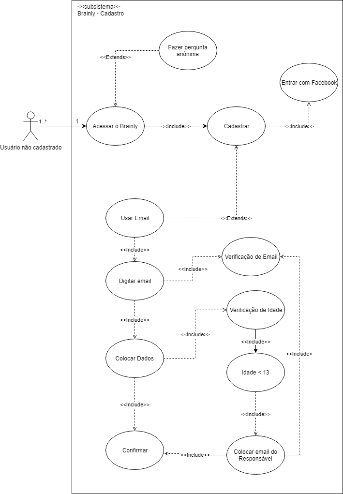

# [CADASTRO](rich_picture.md#RichPicture Primeiros Passos de Novo Usuário Não Cadastrado)

## Versionamento

|  Versão | Data | Modificação | Autor |
|  :------: | :------: | :------: | :------:
| 1.0 | 29/04/2019 | Adição da especificação de casos de uso | Lieverton, Leonardo Medeiros, Paulo Vítor, João Matheus, João Rossi |

## Diagrama de Casos de Uso

## Especificação de Casos de Uso

### 1 Breve descrição
Usuário faz o cadastro de uma nova conta na plataforma Brainly para ter acesso a mais funcionalidades, como, responder perguntas.
### 2 Breve descrição dos atores
#### 2.1 [Usuário](lexicos10x5f8c4.md#L12660)
Ator que possui acesso às funcionalidade comuns da plataforma, como, fazer perguntas, escrever respostas e comentários, adicionar amigos, entre outras. 
### 3 Pré-condições
Possuir um sistema operacional compatível com alguma das plataformas disponibilizadas pelo Brainly.

Possuir um email para o cadastro ou uma conta no Facebook.

Possuir acesso à internet.
### 4 Fluxo básico de eventos
	1. O caso de uso começa quando o usuário decide criar uma conta no Brainly seja para fazer uma pergunta ou responder.

	2. Usuário escolher entrar com uma conta do Facebook.
### 5 Fluxos alternativos
	2.a Cadastrar com email
	2.a.4 Usuário com menos de 13 anos.

### 6 Subfluxo
	2.a Cadastrar com email
		1. Usuário escolhe usar uma conta de email para cadastro.
		2. Usuário digita o email.
		3. Email é verificado.
		4. Usuário digita seus dados.
		5. Usuário confirma seu email.

	2.a.4 Usuário com menos de 13 anos.
		1. Usuário insere o email do responsável.
		2. Email do responśavel é verificado.
		3. Responśavel realiza a confirmação de email.
### 7 Fluxo de exceção
	[2] Usuário aperta f5(reinicia a página) acidentalmente, e volta para o passo 2.

	[2] Usuário digita um email inválido e recebe a mensagem E-mail incorreto porém a caixa de texto continua preenchida.

	[2] Usuário digita um email inválido e recebe a mensagem Nome de usuário deve ter 3-20 caracteres. Escolha outro nome de 
	usuário.

	[2] Usuário digita uma senha inválida e recebe a mensagem Deve ter entre 6-32 caracteres. Marque "Mostrar" para ver o que você digitou.

	[2] Usuário digita uma data de nascimento inválida e vai para o subfluxo 2.a.4.

### 8 Requisitos Especiais
1. Responsabilizar o usuário por todos os dados enviados ou transmitidos em conexão com os serviços - [BR2.12](brainstorm.md).
2. Ao se cadastrar o usuário terá acesso aos termos de uso e para concluir o registro deverá aceitá-lo - [AP1.13](analise_protocolo.md).
3. A plataforma ter uma boa curva de aprendizagem, sem causar impacto aos novos usuários - [INT3.9](introspeccao.md).
4. O cadastro na plataforma deve ocorrer de uma maneira rápida e prática - [AP3.3](analise_protocolo.md).
5. Não utilizar informações de pessoas menores de 16 anos sem autorização - [BR2.7](brainstorm.md).
6. Poder monitorar e registrar atividades nos serviços da brainly sem autorização prévia - [BR2.11](brainstorm.md).
7. Receber permissão total, no registro de usuário, sobre seus dados pessoais para criar trabalhos derivados, usar para publicidade ou marketing - [BR2.13](brainstorm.md).
8. Cobrar por assinatura de serviços - [BR2.19](brainstorm.md).