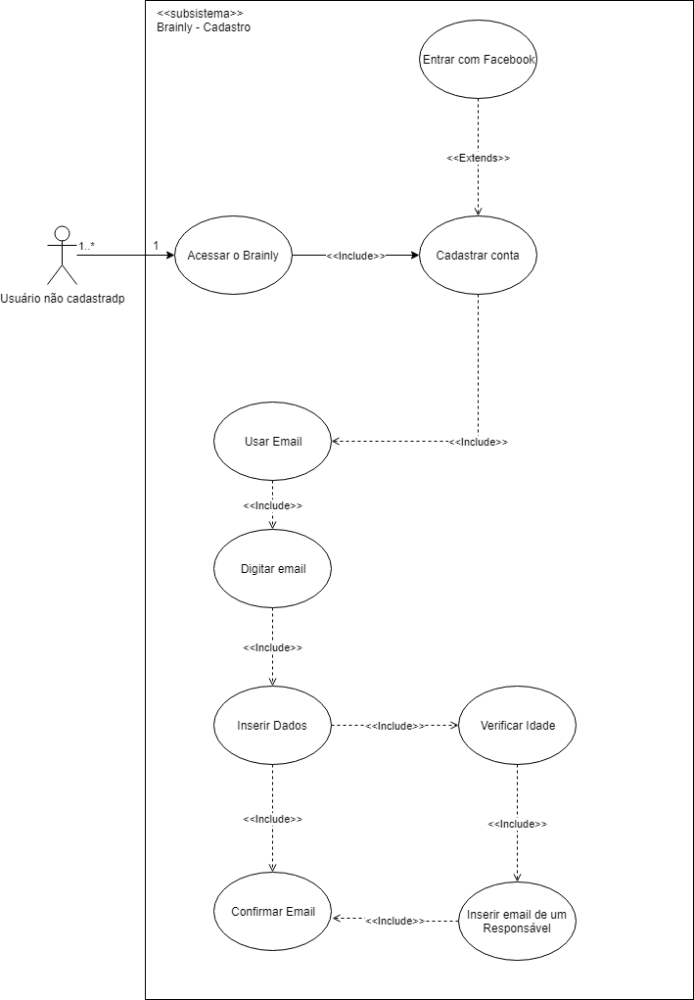

# [CADASTRO](rich_picture.md#RichPicture Primeiros Passos de Novo Usuário Não Cadastrado)

## Versionamento

|  Versão | Data | Modificação | Autor |
|  :------: | :------: | :------: | :------:
| 1.0 | 29/04/2019 | Adição da especificação de casos de uso | Lieverton, Leonardo Medeiros, Paulo Vítor, João Matheus, João Rossi |
| [1.1](modelagem_v1/casos_uso/casos_uso_cadastro.md) | 29/04/2019 | Adição do Diagrama de casos de uso | Ivan Diniz Dobbin,João Matheus, João Rossi, Leonardo Medeiros |
| 2.0 | 22/06/2019 | Refatoração do diagrama de caso de uso de Cadastro | Leonardo Medeiros |

## Diagrama de Casos de Uso

## Especificação de Casos de Uso

### UC01

| UC01 | Acessar o Brainly |
| -------------: | :---|
| **Descrição** | Um usuário acessa a plataforma Brainly. |
| Usuário não cadastrado | Ator que pretende criar uma conta, tornando-se um [usuário](lexicos10x5f8c4.md#L12660), para possuir acesso às funcionalidade comuns da plataforma, como, fazer perguntas, escrever respostas e comentários, adicionar amigos, entre outras. |
| **Pré-condições** | - Ter acesso à internet |
| **Fluxo básico** | 1. Usuário pesquisa pela sua dúvida no Brainly;  2. Se o usuário não encontrar uma tarefa relacionada, usuário faz uma pergunta;  3. Usuário adiciona a matéria associada à pergunta;  4. Usuário atribui pontos à questão; 5. Se o usuário estiver satisfeito com a questão ele a submete.|
| **Fluxos alternativos** | 2.a Usuário encontra a questão desejada;  5.a Usuário adiciona anexos; 5.b Usuário adiciona equações na ferramenta LaTeX; 5.c Usuário adiciona símbolos matemáticos; 5.d Usuário adiciona texto com diferentes formatações.|
| **Fluxos de exceções** | [2 - 4] Usuário reinicia a página acidentalmente, ao clicar em fazer pergunta novamente, tudo o que o usuário tinha digitado e escolhido na pergunta anteriormente se mantém; [2] Usuário digita uma pergunta com menos de 20 caracteres e recebe uma mensagem de erro sem  que sua mensagem seja apagada. |
|  **Requisitos Especiais** | - Responsabilizar o usuário por todos os dados enviados ou transmitidos em conexão com os serviços [BR2.1](brainstorm.md#tabela-de-requisitos-nao-funcionais);  - Apagar perguntas que estão sem respostas por muito tempo [BR2.15](brainstorm.md#tabela-de-requisitos-nao-funcionais);  - Possuir idade mínima (13) para se registrar na plataforma [BR2.1](brainstorm.md#tabela-de-requisitos-nao-funcionais). |
