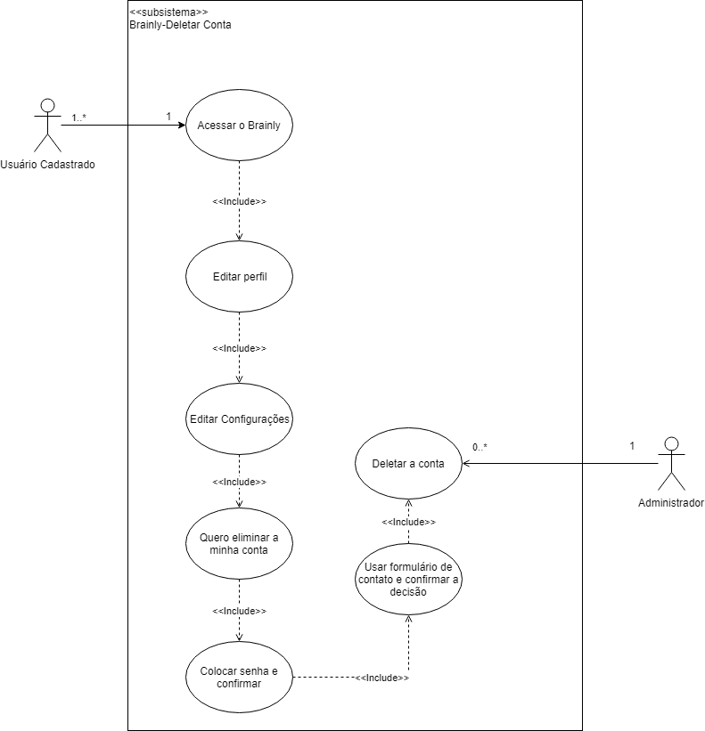

# [DELETAR CONTA](cenarios10x5f8c4.md#C3029)

## Versionamento

|  Versão | Data | Modificação | Autor |
|  :------: | :------: | :------: | :------:
| 1.0 | 29/04/2019 | Adição da especificação de casos de uso e diagrama| Lieverton, Leonardo Medeiros, Paulo Vítor, João Matheus, Ivan Diniz, João Rossi |

## Diagrama de Casos de Uso

## Especificação de Casos de Uso

### 1 Breve descrição
Usuário solicita que sua conta no Brainly seja deletada.
### 2 Breve descrição dos atores
#### 2.1 [Usuário](lexicos10x5f8c4.md#L12660)
Ator que possui acesso às funcionalidade comuns da plataforma, como, fazer perguntas, escrever respostas e comentários, adicionar amigos, entre outras. 
#### 2.2 [Administrador](lexicos10x5f8c4.md#L12529)
Ator, que trabalha diretamente para o Brainly, responsável pela coordenação das atividades de moderação e pela gerência de contas e necessidades das plataformas Brainly. 
## 3 Pré-condições
Possuir uma conta na plataforma Brainly.
## 4 Fluxo básico de eventos
O caso de uso começa quando o usuário decide solicitar que sua conta no Brainly seja deletada.

Usuário entre em sua conta no Brainly.

Usuário acessa o seu perfil.

Usuário escolhe editar suas configurações.

Usuário seleciona: “Quero eliminar minha conta”.

Usuário confirma sua identidade inserindo sua senha.

Usuário preenche um formulário de contato para confirmar a sua decisão.

O administrador deleta a conta.

## 5 Fluxo de exceção
    [2] Usuário não possui acesso à sua conta no Brainly.

    [7] Usuário não confirma sua decisão.
## 6 Requisitos Especiais
1. Deve ser possível ao moderador a exclusão de contas e o banimento do usuário - [INT 2.15](priorizacao.md).

