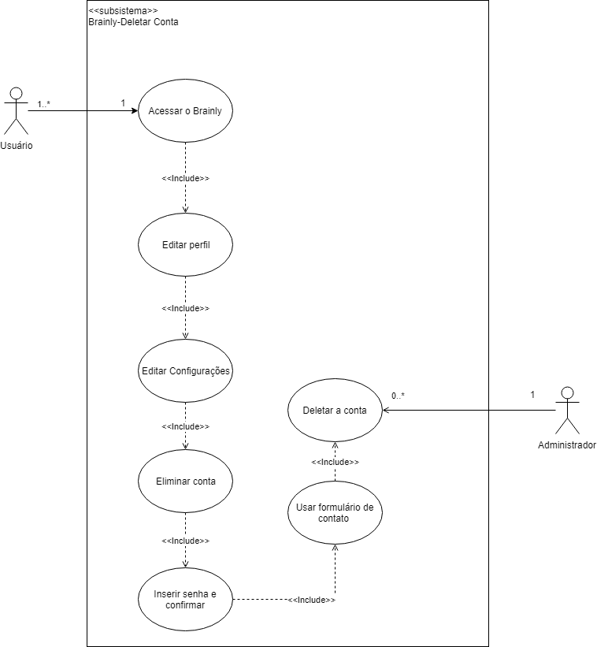

# [DELETAR CONTA](cenarios10x5f8c4.md#C3029)

## Versionamento

|  Versão | Data | Modificação | Autor |
|  :------: | :------: | :------: | :------:
| [1.0](modelagem_v1/casos_uso/casos_uso_deletar_conta.md) | 29/04/2019 | Adição da especificação de casos de uso e diagrama| Lieverton, Leonardo Medeiros, Paulo Vítor, João Matheus, Ivan Diniz, João Rossi |
| 2.0 | 29/04/2019 | Adição do diagrama de caso de uso verão 2, baseado na análise | Leonardo Medeiros |

## Diagrama de Casos de Uso

## Especificação de Casos de Uso

### UC01

| UC01 | Acessar o Brainly |
| -------------: | :---|
| **Descrição** | . |
| . | . |
| **Pré-condições** | - . |
| **Fluxo básico** | 1. ;|
| **Fluxos alternativos** | - |
| **Fluxos de exceções** | [1]  |
|  **Requisitos Especiais** | - . |

