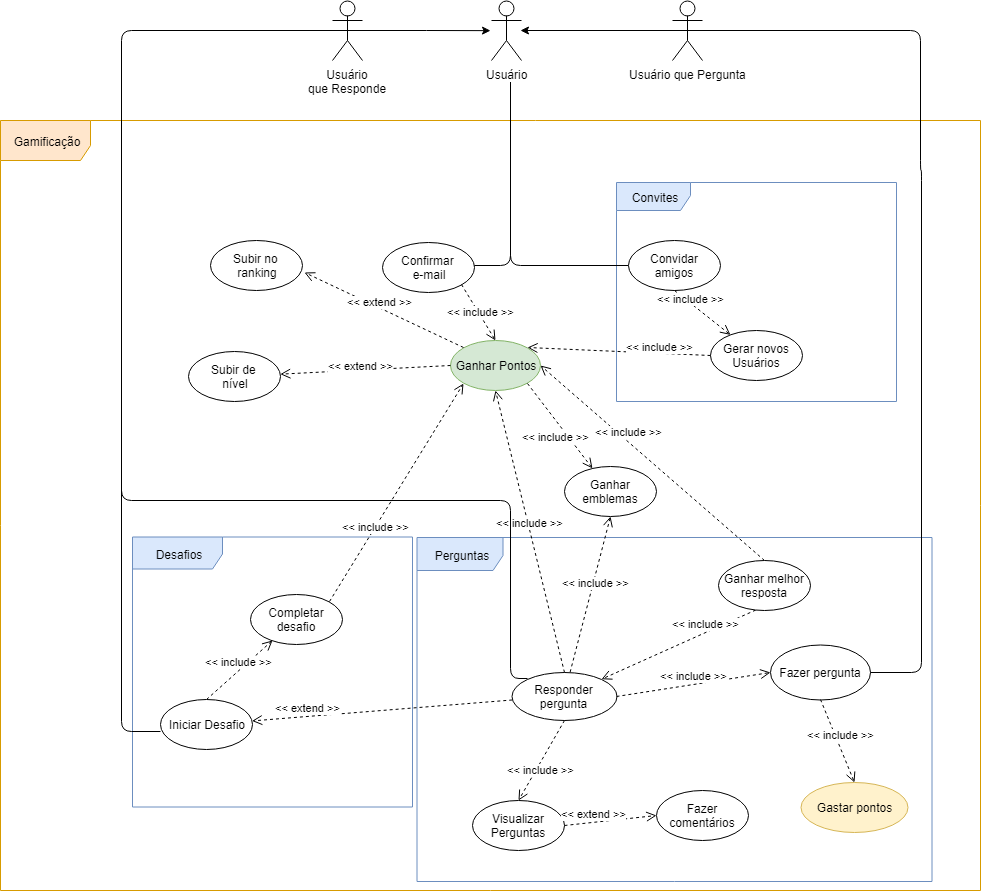

# [GAMIFICAÇÃO](rich_picture.md#richpicture-gamificacao)

## Versionamento

|  Versão | Data | Modificação | Autor |
|  :------: | :------: | :------: | :------: |
| 0.1 | 28/04/2019 | Adição do diagrama de casos de uso de gamificação | Leonardo Medeiros, Ivan Diniz Dobbin, João Rodrigues, João Rossi|
| 1.0 | 28/04/2019 | Especificação de casos de uso | Leonardo Medeiros, Ivan Diniz Dobbin, João Rodrigues, João Rossi|
| 1.1 | 28/04/2019 | Adição do segundo diagrama de casos de uso de gamificação | Gustavo Marques e André Lucas |
| 1.2 | 28/04/2019 | Adição do terceiro diagrama de casos de uso de gamificação | Gustavo Marques e André Lucas |
| [2.0](modelagem_v1/casos_uso/casos_uso_gamificacao.md) | 28/04/2019 | Mudança nas especificações de caso de uso de acordo com o novo diagrama de casos de uso | Gustavo Marques e André Lucas |
| 3.0 | 23/06/2019 | Adição da quarta versão do diagrama de casos de uso de gamificação | Leonardo Medeiros |
| 3.1 | 23/06/2019 | Adição das especificações de casos de uso | Leonardo Medeiros |

## Diagrama de Casos de Uso

## Especificação de Casos de Uso

### UC01

| UC01 | Ganhar pontos |
| -------------: | :---|
| **Descrição** | Ao realizar certas ações na plataforma, o usuário ganha pontos. Base do sistema de gamificação. |
| [Usuário](lexicos10x5f8c4.md#l12660) | Ator que possui acesso às funcionalidade comuns da plataforma, como, fazer perguntas, escrever respostas e comentários, adicionar amigos, entre outras. |
| **Pré-condições** | - Ter acesso à internet;  - Ter uma conta na plataforma Brainly. |
| **Fluxo básico** | 1. Usuário realiza alguma tarefa que possui pontos como recompensa; 2. Usuário ganha pontos por realizar a tarefa.|
| **Fluxos alternativos** | - |
| **Fluxos de exceções** | [1] Usuário tem os pontos ganhos removidos por um moderador ou administrador, devido ao descumprimento de alguma das regras da plataforma. |
|  **Requisitos Especiais** | - A plataforma deve possuir membros ativos que ajudem a comunidade a crescer e respondam as perguntas de forma rápida e fácil [INT3.6](introspecção);  - Para aplicação de punições, deve-se levar em conta a conduta (advertências) do usuário na plataforma [INT2.10](introspecção). |

### UC02

| UC02 | Convidar amigos |
| -------------: | :---|
| **Descrição** | Usuário convida algum amigo para juntar-se à plataforma. |
| [Usuário](lexicos10x5f8c4.md#l12660) | Ator que possui acesso às funcionalidade comuns da plataforma, como, fazer perguntas, escrever respostas e comentários, adicionar amigos, entre outras. |
| **Pré-condições** | - Ter acesso à internet;  - Ter uma conta na plataforma Brainly. |
| **Fluxo básico** | 1. Usuário convida amigos para juntarem-se à plataforma; 2. Usuário recebe pontos para cada amigo que se cadastrar partindo de seu convite.|
| **Fluxos alternativos** | - |
| **Fluxos de exceções** | [1] Amigos que recebem o convite não o aceitam; [2] Amigos se cadastram sem usar o convite do Usuário. |
|  **Requisitos Especiais** | - A plataforma deve possuir membros ativos que ajudem a comunidade a crescer e respondam as perguntas de forma rápida e fácil [INT3.6](introspecção). |

### UC03

| UC03 | Gerar novos Usuários |
| -------------: | :---|
| **Descrição** | Novo usuário se cadastra na plataforma a partir do convite de um outro usuário. |
| [Usuário](lexicos10x5f8c4.md#l12660) | Ator que possui acesso às funcionalidade comuns da plataforma, como, fazer perguntas, escrever respostas e comentários, adicionar amigos, entre outras. |
| **Pré-condições** | - Ter acesso à internet. |
| **Fluxo básico** | 1. Usuário se cadastra na plataforma a partir deo convite de um outro usuário. |
| **Fluxos alternativos** | 1.a Novo usuário convida outros usuários. |
| **Fluxos de exceções** | [1] Novo usuário se cadastra sem usar o convite do outro usuário |
|  **Requisitos Especiais** | - A plataforma deve possuir membros ativos que ajudem a comunidade a crescer e respondam as perguntas de forma rápida e fácil [INT3.6](introspecção). |

### UC04

| UC04 | Confirmar email |
| -------------: | :---|
| **Descrição** | Após o cadastro de um novo usuário, o mesmo deve confirmar o email de cadastro. |
| [Usuário](lexicos10x5f8c4.md#l12660) | Ator que possui acesso às funcionalidade comuns da plataforma, como, fazer perguntas, escrever respostas e comentários, adicionar amigos, entre outras. |
| **Pré-condições** | - Ter acesso à internet;  - Ter se cadastrado recentemente na plataforma. |
| **Fluxo básico** | 1. Usuário se cadastra na plataforma; 2. Usuário recebe email de confirmação de cadastro; 3. Usuário confirma a criação da conta via link presente no email recebido 4. Usuário recebe pontos por confirmar o email. |
| **Fluxos alternativos** | 1.a Usuário se cadastra pelo Facebook, não sendo necessário uso de email. |
| **Fluxos de exceções** | [1] Usuário cadastra endereço de email errado [2] Usuário não recebe o email de confirmação [2] Usuário não tem acesso à conta de email cadastrada. |
|  **Requisitos Especiais** | - O cadastro na plataforma deve ocorrer de uma maneira rápida e prática [AP3.3](analise_protocolo.md) |

### UC05

| UC05 | Subir no ranking |
| -------------: | :---|
| **Descrição** | Após receber pontos por realizar tarefa, um usuário sobe sua posição no ranking de  contribuidores. |
| [Usuário](lexicos10x5f8c4.md#l12660) | Ator que possui acesso às funcionalidade comuns da plataforma, como, fazer perguntas, escrever respostas e comentários, adicionar amigos, entre outras. |
| **Pré-condições** | - Ter acesso à internet;  - Ter uma conta na plataforma Brainly. |
| **Fluxo básico** | 1. Usuário completa uma tarefa; 2. Usuário recebe pontos pela tarefa realizada; 3. Usuário sobe sua posição nos rankings de contribuição. |
| **Fluxos alternativos** | - |
| **Fluxos de exceções** | [1-3] Usuário tem os pontos ganhos removidos por um moderador ou administrador, devido ao descumprimento de alguma das regras da plataforma. |
|  **Requisitos Especiais** | - Deve-se recrutar usuários para a moderação conforme o seu bom desempenho na plataforma [INT2.7](introspeccao.md);  - Para aplicação de punições, deve-se levar em conta a conduta (advertências) do usuário na plataforma [INT2.10](introspecção). |

### UC06

| UC06 | Subir de nível |
| -------------: | :---|
| **Descrição** | Após receber pontos por realizar tarefa, um usuário sobe seu nível. |
| [Usuário](lexicos10x5f8c4.md#l12660) | Ator que possui acesso às funcionalidade comuns da plataforma, como, fazer perguntas, escrever respostas e comentários, adicionar amigos, entre outras. |
| **Pré-condições** | - Ter acesso à internet;  - Ter uma conta na plataforma Brainly. |
| **Fluxo básico** | 1. Usuário completa uma tarefa; 2. Usuário recebe pontos pela tarefa realizada; 3. Usuário sobe seu nível. |
| **Fluxos alternativos** | - |
| **Fluxos de exceções** | [1-3] Usuário tem os pontos ganhos removidos por um moderador ou administrador, devido ao descumprimento de alguma das regras da plataforma. |
|  **Requisitos Especiais** | - Deve-se recrutar usuários para a moderação conforme o seu bom desempenho na plataforma [INT2.7](introspeccao.md);  - Para aplicação de punições, deve-se levar em conta a conduta (advertências) do usuário na plataforma [INT2.10](introspecção). |

### UC07

| UC07 | Realizar pergunta |
| -------------: | :---|
| [Usuário](lexicos10x5f8c4.md#l12660) | Ator que possui acesso às funcionalidade comuns da plataforma, como, fazer perguntas, escrever respostas e comentários, adicionar amigos, entre outras. |
| **Pré-condições** | - Ser cadastrado na plataforma Brainly;  - Possuir no mínimo dez pontos para realizar uma pergunta;  - Estar logado. |
| **Fluxo básico** | 1. Usuário pesquisa pela sua dúvida no Brainly;  2. Se o usuário não encontrar uma tarefa relacionada, usuário faz uma pergunta;  3. Usuário adiciona a matéria associada à pergunta;  4. Usuário atribui pontos à questão; 5. Se o usuário estiver satisfeito com a questão ele a submete.|
| **Fluxos alternativos** | 2.a Usuário encontra a questão desejada;  5.a Usuário adiciona anexos; 5.b Usuário adiciona equações na ferramenta LaTeX; 5.c Usuário adiciona símbolos matemáticos; 5.d Usuário adiciona texto com diferentes formatações.|
| **Fluxos de exceções** | [2 - 4] Usuário reinicia a página acidentalmente, ao clicar em fazer pergunta novamente, tudo o que o usuário tinha digitado e escolhido na pergunta anteriormente se mantém; [2] Usuário digita uma pergunta com menos de 20 caracteres e recebe uma mensagem de erro sem  que sua mensagem seja apagada. |
|  **Requisitos Especiais** | - Responsabilizar o usuário por todos os dados enviados ou transmitidos em conexão com os serviços [BR2.1](brainstorm.md#tabela-de-requisitos-nao-funcionais);  - Apagar perguntas que estão sem respostas por muito tempo [BR2.15](brainstorm.md#tabela-de-requisitos-nao-funcionais);  - Possuir idade mínima (13) para se registrar na plataforma [BR2.1](brainstorm.md#tabela-de-requisitos-nao-funcionais);  - A plataforma deve possuir membros ativos que ajudem a comunidade a crescer e respondam as perguntas de forma rápida e fácil [INT3.6](introspecção);  - Apagar perguntas que estão sem respostas por muito tempo [BR2.15](brainstorm.md#tabela-de-requisitos-nao-funcionais) |

### UC08

| UC08 | Ganhar melhor resposta |
| -------------: | :---|
| **Descrição** | Após responder uma pergunta, a resposta do usuário pode receber o titulo de melhor resposta. |
| [Usuário](lexicos10x5f8c4.md#l12660) | Ator que possui acesso às funcionalidade comuns da plataforma, como, fazer perguntas, escrever respostas e comentários, adicionar amigos, entre outras. |
| **Pré-condições** | - Ter acesso à internet;  - Ter uma conta na plataforma Brainly;  - Um usuário fazer uma pergunta ([UC10](#uc10));  - Ter respondido a uma pergunta. |
| **Fluxo básico** | 1. Usuário responde a uma pergunta; 2. Outro usuário responde à pergunta; 3. Usuário dono da pergunta escolhe uma das respostas como "Melhor resposta". |
| **Fluxos alternativos** | 1.a Outro usuário já havia respondido à pergunta (leva direto para etapa 3) |
| **Fluxos de exceções** | [1] A pergunta já recebeu duas respostas; [3] O dono da pergunta escolhe a outra resposta como a melhor;  [3] Dono da pergunta não marca nenhuma das resposta como a melhor.   [1-3] Usuário tem a resposta removida por um moderador ou administrador, devido ao descumprimento de alguma das regras da plataforma. |
|  **Requisitos Especiais** | - Deve-se recrutar usuários para a moderação conforme o seu bom desempenho na plataforma [INT2.7](introspeccao.md);  - Responsabilizar o usuário por todos os dados enviados ou transmitidos em conexão com os serviços [BR2.1](brainstorm.md#tabela-de-requisitos-nao-funcionais);  - A plataforma deve possuir membros ativos que ajudem a comunidade a crescer e respondam as perguntas de forma rápida e fácil [INT3.6](introspecção);  - Para aplicação de punições, deve-se levar em conta a conduta (advertências) do usuário na plataforma [INT2.10](introspecção). |

### UC09

| UC09 | Ganhar emblemas |
| -------------: | :---|
| **Descrição** | Após realizar uma tarefa, ou um conjunto de tarefas, um usuário recebe um emblema. |
| [Usuário](lexicos10x5f8c4.md#l12660) | Ator que possui acesso às funcionalidade comuns da plataforma, como, fazer perguntas, escrever respostas e comentários, adicionar amigos, entre outras. |
| **Pré-condições** | - Ter acesso à internet;  - Ter uma conta na plataforma Brainly;  - Ainda não ter recebido este emblema. |
| **Fluxo básico** | 1. Usuário realiza uma ou mais tarefas; 2. Após concluir determinado número de tarefas, usuário recebe o respectivo emblema. |
| **Fluxos alternativos** | - |
| **Fluxos de exceções** | [1-2] Usuário tem as tarefas anuladas por um moderador ou administrador, devido ao descumprimento de alguma das regras da plataforma. |
|  **Requisitos Especiais** | - Deve-se recrutar usuários para a moderação conforme o seu bom desempenho na plataforma [INT2.7](introspeccao.md);  - Responsabilizar o usuário por todos os dados enviados ou transmitidos em conexão com os serviços [BR2.1](brainstorm.md#tabela-de-requisitos-nao-funcionais);  - A plataforma deve possuir membros ativos que ajudem a comunidade a crescer e respondam as perguntas de forma rápida e fácil [INT3.6](introspecção);  - Para aplicação de punições, deve-se levar em conta a conduta (advertências) do usuário na plataforma [INT2.10](introspecção). |

### UC10

| UC10 | Responder pergunta |
| -------------: | :---|
| **Descrição** | Um usuário da comunidade acessa o Brainly e responde uma pergunta. |
| [Usuário](lexicos10x5f8c4.md#l12660) | Ator que possui acesso às funcionalidade comuns da plataforma, como, fazer perguntas, escrever respostas e comentários, adicionar amigos, entre outras. |
| **Pré-condições** | - Ser cadastrado na plataforma Brainly;  - Estar logado;  - Um usuário fazer uma pergunta ([UC10](#uc10));  - A pegunta não ser respondida por 2 usuários.|
| **Fluxo básico** | 1. Usuário da comunidade, que deseja contribuir, navega pela listas de perguntas;  2. Usuário da comunidade escolhe uma pergunta;  3. Usuário da comunidade responde uma pergunta. |
| **Fluxos alternativos** | 3.a Usuário adiciona anexos; 3.b Usuário adiciona equações na ferramenta LaTeX; 3.c Usuário adiciona símbolos matemáticos; 3.d Usuário adiciona texto com diferentes formatações.|
| **Fluxos de exceções** | [3] Usuário da comunidade digita uma resposta com menos de 20 caracteres e recebe uma mensagem de erro sem  que sua mensagem seja apagada. |
|  **Requisitos Especiais** | - Responsabilizar o usuário por todos os dados enviados ou transmitidos em conexão com os serviços [BR2.1](brainstorm.md#tabela-de-requisitos-nao-funcionais);  - Possuir idade mínima (13) para se registrar na plataforma [BR2.1](brainstorm.md#tabela-de-requisitos-nao-funcionais);  - A ferramenta que possibilita respostas deve ser consistente entre as plataformas [INT1.2](introspeccao.md);  - A plataforma deve possuir membros ativos que ajudem a comunidade a crescer e respondam as perguntas de forma rápida e fácil [INT3.6](introspecção). |

### UC11

| UC11 | Visualizar perguntas |
| -------------: | :---|
| **Descrição** | Usuário da comunidade, que deseja contribuir, navega pela listas de perguntas; |
| [Usuário](lexicos10x5f8c4.md#l12660) | Ator que possui acesso às funcionalidade comuns da plataforma, como, fazer perguntas, escrever respostas e comentários, adicionar amigos, entre outras. |
| **Pré-condições** | - Ter acesso à internet;  - Ter uma conta na plataforma Brainly;  - Um usuário fazer uma pergunta ([UC10](#uc10)). |
| **Fluxo básico** | 1. Usuário navega pela lista de perguntas; 2. Usuário escolhe perguntas que tem interesse em responder; 3. Usuário lê as perguntas que se interessa, podendo ou não responde-las. |
| **Fluxos alternativos** | 1.a Usuário filtra as perguntas por area de conhecimento; 1.b Usuário filtra as perguntas por nivel de escolaridade; 1.c Usuário lê apenas os titulos (primeiras palavras) das perguntas e não se interessa por responder nenhuma. |
| **Fluxos de exceções** | [3] Usuário decide responder a pergunta, mas outros dois usuário já estão a responde-la. |
|  **Requisitos Especiais** | - Deve-se recrutar usuários para a moderação conforme o seu bom desempenho na plataforma [INT2.7](introspeccao.md);  - Responsabilizar o usuário por todos os dados enviados ou transmitidos em conexão com os serviços [BR2.1](brainstorm.md#tabela-de-requisitos-nao-funcionais);  - A plataforma deve possuir membros ativos que ajudem a comunidade a crescer e respondam as perguntas de forma rápida e fácil [INT3.6](introspecção). |

### UC12

| UC12 | Fazer comentários |
| -------------: | :---|
| **Descrição** | Um usuário com interesse de interagir ou realizar um esclarecimento faz um comentário a partir de uma pergunta ou resposta. |
| [Usuário](lexicos10x5f8c4.md#l12660) | Ator que possui acesso às funcionalidade comuns da plataforma, como, fazer perguntas, escrever respostas e comentários, adicionar amigos, entre outras. |
| **Pré-condições** | - Ser cadastrado na plataforma Brainly;  - Estar logado;  - Um usuário fazer uma pergunta ([UC10](#uc10)) ou um usuário responder uma pergunta ([UC07](#uc07)).|
| **Fluxo básico** | 1. Um usuário com interesse de interagir ou realizar um esclarecimento faz um comentário a partir de uma pergunta ou resposta. |
| **Fluxos alternativos** | 1.a Um usuário faz uma denúncia  e um moderador faz um comentário. |
| **Fluxos de exceções** | [1] Usuário da comunidade digita um comentário com menos de 20 caracteres e recebe uma mensagem de erro sem  que sua mensagem seja apagada.|
|  **Requisitos Especiais** | - Responsabilizar o usuário por todos os dados enviados ou transmitidos em conexão com os serviços [BR2.1](brainstorm.md#tabela-de-requisitos-nao-funcionais);  - Possuir idade mínima (13) para se registrar na plataforma [BR2.1](brainstorm.md#tabela-de-requisitos-nao-funcionais);  - Os moderadores devem conscientizar os usuários sobre as políticas de conduta da plataforma [INT2.9](introspecção);  - Para aplicação de punições, deve-se levar em conta a conduta (advertências) do usuário na plataforma [INT2.10](introspecção). |

### UC13

| UC13 | Iniciar desafio |
| -------------: | :---|
| **Descrição** | Usuário da comunidade, que deseja ganhar mais pontos, escolhe um desafio; |
| [Usuário](lexicos10x5f8c4.md#l12660) | Ator que possui acesso às funcionalidade comuns da plataforma, como, fazer perguntas, escrever respostas e comentários, adicionar amigos, entre outras. |
| **Pré-condições** | - Ter acesso à internet;  - Ter uma conta na plataforma Brainly;  - Não estar participando de outro desafio. |
| **Fluxo básico** | 1. Usuário navega pela lista de desafios; 2. Usuário escolhe um desafio e seleciona inicia-lo. |
| **Fluxos alternativos** | 1.a Usuário filtra os desafios por área de conhecimento; 2.a Usuário não escolhe nenhum desafio. |
| **Fluxos de exceções** | - |
|  **Requisitos Especiais** | - Deve-se recrutar usuários para a moderação conforme o seu bom desempenho na plataforma [INT2.7](introspeccao.md);  - A plataforma deve possuir membros ativos que ajudem a comunidade a crescer e respondam as perguntas de forma rápida e fácil [INT3.6](introspecção). |

### UC14

| UC14 | Concluir desafio |
| -------------: | :---|
| **Descrição** | Usuário da comunidade, que participa de um desafio, conclui o desafio para ganhar mais pontos; |
| [Usuário](lexicos10x5f8c4.md#l12660) | Ator que possui acesso às funcionalidade comuns da plataforma, como, fazer perguntas, escrever respostas e comentários, adicionar amigos, entre outras. |
| **Pré-condições** | - Ter acesso à internet;  - Ter uma conta na plataforma Brainly;  - Estar participando de um desafio. |
| **Fluxo básico** | 1. Usuário realiza as tarefas necessárias para  concluir o desafio; 2. Usuário recebe pontos por concluir o desafio. |
| **Fluxos alternativos** | 1.a Acaba o tempo do desafio. |
| **Fluxos de exceções** | [2] Usuário tem alguma das tarefas referentes ao desafio anuladas por um moderador ou administrador, devido ao descumprimento de alguma das regras da plataforma.  |
|  **Requisitos Especiais** | - Responsabilizar o usuário por todos os dados enviados ou transmitidos em conexão com os serviços [BR2.1](brainstorm.md#tabela-de-requisitos-nao-funcionais);  - Deve-se recrutar usuários para a moderação conforme o seu bom desempenho na plataforma [INT2.7](introspeccao.md);  - A plataforma deve possuir membros ativos que ajudem a comunidade a crescer e respondam as perguntas de forma rápida e fácil [INT3.6](introspecção);  - Para aplicação de punições, deve-se levar em conta a conduta (advertências) do usuário na plataforma [INT2.10](introspecção). |

