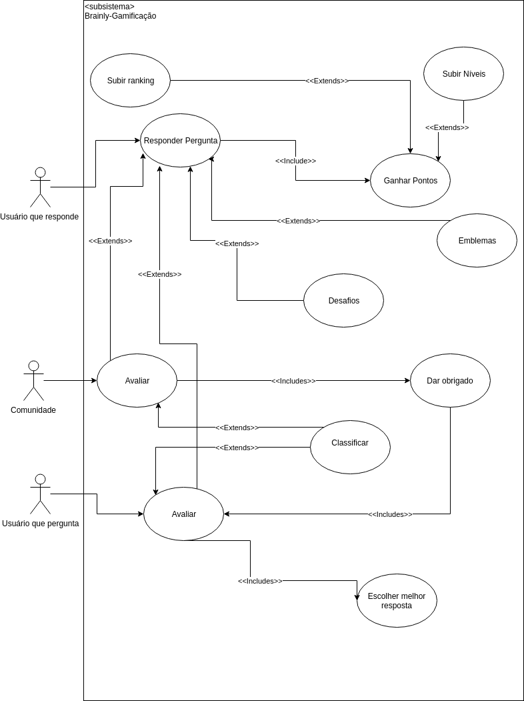
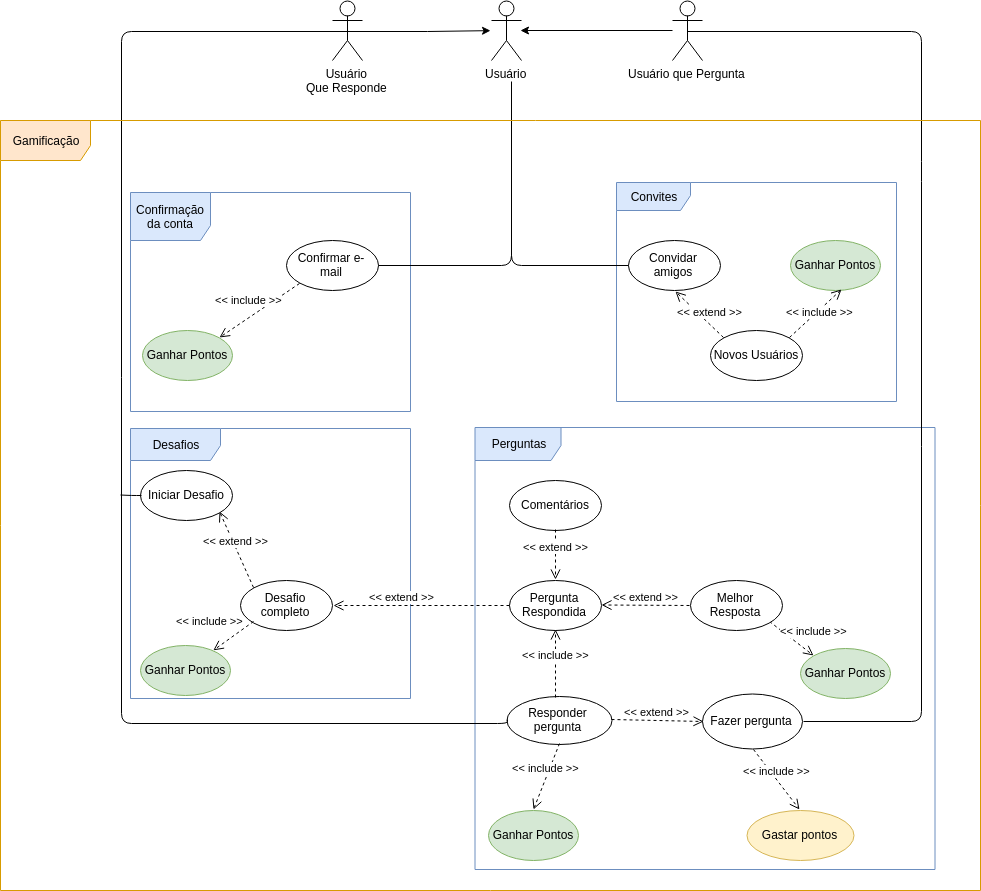
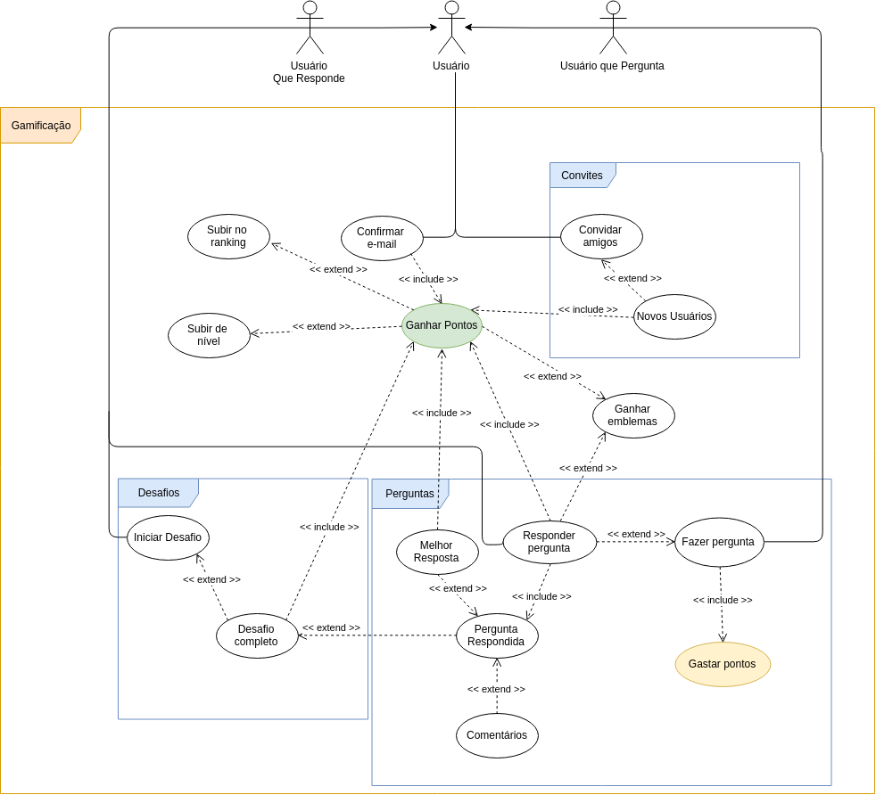

# [GAMIFICAÇÃO](rich_picture.md#RichPicture-Gamificação)

## Versionamento

|  Versão | Data | Modificação | Autor |
|  :------: | :------: | :------: | :------: |
| 0.1 | 28/04/2019 | Adição do diagrama de casos de uso de gamificação | Leonardo Medeiros, Ivan Diniz Dobbin, João Rodrigues, João Rossi|
| 0.2 | 28/04/2019 | Especificação de casos de uso | Leonardo Medeiros, Ivan Diniz Dobbin, João Rodrigues, João Rossi|
| 0.3 | 28/04/2019 | Adição do segundo diagrama de casos de uso de gamificação | Gustavo Marques e André Lucas |
| 0.4 | 28/04/2019 | Adição do terceiro diagrama de casos de uso de gamificação | Gustavo Marques e André Lucas |

## Diagrama de Casos de Uso

## Especificação de Casos de Uso

### 1 Breve descrição
Técnica aplicada para incentivar os usuários a contribuir com a plataforma Brainly, ou seja, confirmar e-mail, convidar amigos e responder perguntas.

### 2 Breve descrição dos atores
#### 2.1 [Usuário que pergunta](lexicos10x5f8c4.md#L12660)
Ator que realiza pergunta na plataforma Brainly.
#### 2.2 [Usuário que responde](lexicos10x5f8c4.md#L12660)
Ator que responde pergunta na plataforma Brainly.
#### 2.3 [Comunidade](lexicos10x5f8c4.md#L12525)
Conjunto de usuários em prol de se ajudarem.
## 3 Pré-condições
Ser cadastrado na plataforma Brainly.
## 4 Fluxo básico de eventos

### 5 Fluxos alternativos

## 6 Fluxo de Exceções

## 7 Requisitos Especiais

