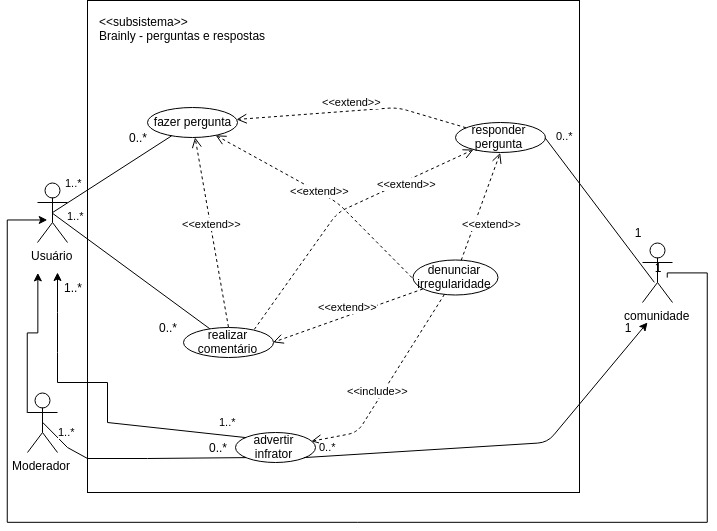

# CASO DE USO - [PERGUNTAS E RESPOSTAS](rich_picture.md#richpicture-perguntas-e-respostas)

## Versionamento

|  Versão | Data | Modificação | Autor |
|  :------: | :------: | :------: | :------: |
| 0.1 | 28/04/2019 | Adição do diagrama de casos de uso de perguntas e respostas | Lieverton, Welison |
| [1.0](modelagem_v1/casos_uso/casos_uso_perguntas_respostas.md) | 28/04/2019 | Adição da especificação dos casos de uso de perguntas e respostas | Lieverton, João Matheus, Paulo Vitor, João Rossi |
| 1.1 | 21/06/2019 | Refatora diagrama de caso de uso de perguntas e respostas | Lieverton Silva, Welison Regis |
| 2.0 | 21/06/2019 | Adiciona 5 especificações de caso de uso de perguntas e respostas | Lieverton Silva, Welison Regis |

## Diagrama de Casos de Uso

## Especificação de Casos de Uso

### UC01

| UC01 | Fazer pergunta |
| -------------: | :---|
| **Descrição** | Um usuário acessa o Brainly e faz uma pergunta. |
| [Usuário](lexicos10x5f8c4.md#l12660) | Ator que possui acesso às funcionalidade comuns da plataforma, como, fazer perguntas, escrever respostas e comentários, adicionar amigos, entre outras. |
| **Pré-condições** | - Ser cadastrado na plataforma Brainly;  - Possuir no mínimo dez pontos para realizar uma pergunta;  - Estar logado. |
| **Fluxo básico** | 1. Usuário pesquisa pela sua dúvida no Brainly;  2. Se o usuário não encontrar uma tarefa relacionada, usuário faz uma pergunta;  3. Usuário adiciona a matéria associada à pergunta;  4. Usuário atribui pontos à questão; 5. Se o usuário estiver satisfeito com a questão ele a submete.|
| **Fluxos alternativos** | 2.a Usuário encontra a questão desejada;  5.a Usuário adiciona anexos; 5.b Usuário adiciona equações na ferramenta LaTeX; 5.c Usuário adiciona símbolos matemáticos; 5.d Usuário adiciona texto com diferentes formatações.|
| **Fluxos de exceções** | [2 - 4] Usuário reinicia a página acidentalmente, ao clicar em fazer pergunta novamente, tudo o que o usuário tinha digitado e escolhido na pergunta anteriormente se mantém; [2] Usuário digita uma pergunta com menos de 20 caracteres e recebe uma mensagem de erro sem  que sua mensagem seja apagada. |
|  **Requisitos Especiais** | - Responsabilizar o usuário por todos os dados enviados ou transmitidos em conexão com os serviços [BR2.1](brainstorm.md#tabela-de-requisitos-nao-funcionais);  - Apagar perguntas que estão sem respostas por muito tempo [BR2.15](brainstorm.md#tabela-de-requisitos-nao-funcionais);  - Possuir idade mínima (13) para se registrar na plataforma [BR2.1](brainstorm.md#tabela-de-requisitos-nao-funcionais);  - A plataforma deve possuir membros ativos que ajudem a comunidade a crescer e respondam as perguntas de forma rápida e fácil [INT3.6](introspecção);  - Apagar perguntas que estão sem respostas por muito tempo [BR2.15](brainstorm.md#tabela-de-requisitos-nao-funcionais) |

### UC02

| UC02 | Responder pergunta |
| -------------: | :---|
| **Descrição** | Um usuário da comunidade acessa o Brainly e responde uma pergunta. |
| [Usuário](lexicos10x5f8c4.md#l12660) | Ator que possui acesso às funcionalidade comuns da plataforma, como, fazer perguntas, escrever respostas e comentários, adicionar amigos, entre outras. |
| [Comunidade](lexicos10x5f8c4.md#l12525) | Conjunto de usuários em prol de se ajudarem. |
| **Pré-condições** | - Ser cadastrado na plataforma Brainly;  - Estar logado;  - Um usuário fazer uma pergunta ([5. UC01](#uc01));  - A pegunta não ser respondida por 2 usuários.|
| **Fluxo básico** | 1. Usuário da comunidade, que deseja contribuir, navega pela listas de perguntas;  2. Usuário da comunidade escolhe uma pergunta;  3. Usuário da comunidade responde uma pergunta. |
| **Fluxos alternativos** | 3.a Usuário adiciona anexos; 3.b Usuário adiciona equações na ferramenta LaTeX; 3.c Usuário adiciona símbolos matemáticos; 3.d Usuário adiciona texto com diferentes formatações.|
| **Fluxos de exceções** | [3] Usuário da comunidade digita uma resposta com menos de 20 caracteres e recebe uma mensagem de erro sem  que sua mensagem seja apagada. |
|  **Requisitos Especiais** | - Responsabilizar o usuário por todos os dados enviados ou transmitidos em conexão com os serviços [BR2.1](brainstorm.md#tabela-de-requisitos-nao-funcionais);  - Possuir idade mínima (13) para se registrar na plataforma [BR2.1](brainstorm.md#tabela-de-requisitos-nao-funcionais);  - A ferramenta que possibilita respostas deve ser consistente entre as plataformas [INT1.2](introspeccao.md);  - A plataforma deve possuir membros ativos que ajudem a comunidade a crescer e respondam as perguntas de forma rápida e fácil [INT3.6](introspecção). |

### UC03

| UC03 | Realizar comentário |
| -------------: | :---|
| **Descrição** | Um usuário com interesse de interagir ou realizar um esclarecimento faz um comentário a partir de uma pergunta ou resposta. |
| [Usuário](lexicos10x5f8c4.md#l12660) | Ator que possui acesso às funcionalidade comuns da plataforma, como, fazer perguntas, escrever respostas e comentários, adicionar amigos, entre outras. |
| [Moderador](lexicos10x5f8c4.md#l12528) | Ator que modera os conteúdos do Brainly, esclarece as políticas da plataforma à comunidade e mantém o nível de qualidade das perguntas, respostas e comentários. |
| **Pré-condições** | - Ser cadastrado na plataforma Brainly;  - Estar logado;  - Um usuário fazer uma pergunta ([5. UC01](#uc01)) ou um usuário responder uma pergunta ([3. UC02](#uc02)).|
| **Fluxo básico** | 1. Um usuário com interesse de interagir ou realizar um esclarecimento faz um comentário a partir de uma pergunta ou resposta. |
| **Fluxos alternativos** | 1.a Um usuário faz uma denúncia ([3. UC04](#uc04)) e um moderador faz um comentário. |
| **Fluxos de exceções** | [1] Usuário da comunidade digita um comentário com menos de 20 caracteres e recebe uma mensagem de erro sem  que sua mensagem seja apagada.|
|  **Requisitos Especiais** | - Responsabilizar o usuário por todos os dados enviados ou transmitidos em conexão com os serviços [BR2.1](brainstorm.md#tabela-de-requisitos-nao-funcionais);  - Possuir idade mínima (13) para se registrar na plataforma [BR2.1](brainstorm.md#tabela-de-requisitos-nao-funcionais). |

### UC04

| UC04 | Denunciar irregularidade |
| -------------: | :---|
| **Descrição** | Um usuário após ver uma irregularidade faz uma denúncia. |
| [Usuário](lexicos10x5f8c4.md#l12660) | Ator que possui acesso às funcionalidade comuns da plataforma, como, fazer perguntas, escrever respostas e comentários, adicionar amigos, entre outras. |
| **Pré-condições** | - Ser cadastrado na plataforma Brainly;  - Estar logado;  - Um usuário fazer uma pergunta ([5. UC01](#uc01)) ou um usuário responder uma pergunta ([3. UC02](#uc02)) ou um usuário fazer um comentário ([1. UC03](#uc03)) indevido.|
| **Fluxo básico** | 1. O usuário após ver uma irregularidade faz uma denúncia;  2. O usuário seleciona a categoria;  3. Usuário confirma a denúncia. |
| **Fluxos alternativos** | - |
| **Fluxos de exceções** | - |
|  **Requisitos Especiais** | - Responsabilizar o usuário por todos os dados enviados ou transmitidos em conexão com os serviços [BR2.1](brainstorm.md#tabela-de-requisitos-nao-funcionais);  - Possuir idade mínima (13) para se registrar na plataforma [BR2.1](brainstorm.md#tabela-de-requisitos-nao-funcionais). |

### UC05

| UC05 | Advertir infrator |
| -------------: | :---|
| **Descrição** | Um moderador após receber uma denúncia de irregularidade avalia a veracidade do conteúdo. |
| [Usuário](lexicos10x5f8c4.md#l12660) | Ator que possui acesso às funcionalidade comuns da plataforma, como, fazer perguntas, escrever respostas e comentários, adicionar amigos, entre outras. |
| [Moderador](lexicos10x5f8c4.md#l12528) | Ator que modera os conteúdos do Brainly, esclarece as políticas da plataforma à comunidade e mantém o nível de qualidade das perguntas, respostas e comentários. |
| **Pré-condições** | - Ser moderador na plataforma Brainly;   - Estar logado;  - Receber uma denúncia ou visualizar uma irregularidade.|
| **Fluxo básico** | 1. O moderador visualiza as denúncias no painel de moderação;  2. O moderador escolhe uma denúncia para avaliar; 3. Se houver irregularidade o moderador exclui o conteúdo indevido. |
| **Fluxos alternativos** | 2.a O moderador pede a correção do conteúdo.   3.a O moderador aplica advertência;  3.b O moderador tira pontos do usuário infrator;   3.c O moderador comunica o usuário infrator. |
| **Fluxos de exceções** | [2 3] O moderdarador fica bloqueado devido grande número de ações em um curto período de tempo.|
|  **Requisitos Especiais** | - Responsabilizar o usuário por todos os dados enviados ou transmitidos em conexão com os serviços [BR2.1](brainstorm.md#tabela-de-requisitos-nao-funcionais);  - Possuir idade mínima (13) para se registrar na plataforma [BR2.1](brainstorm.md#tabela-de-requisitos-nao-funcionais);  - Para aplicação de punições, deve-se levar em conta a conduta (advertências) do usuário na plataforma
[INT2.10](introspeccao.md). |
