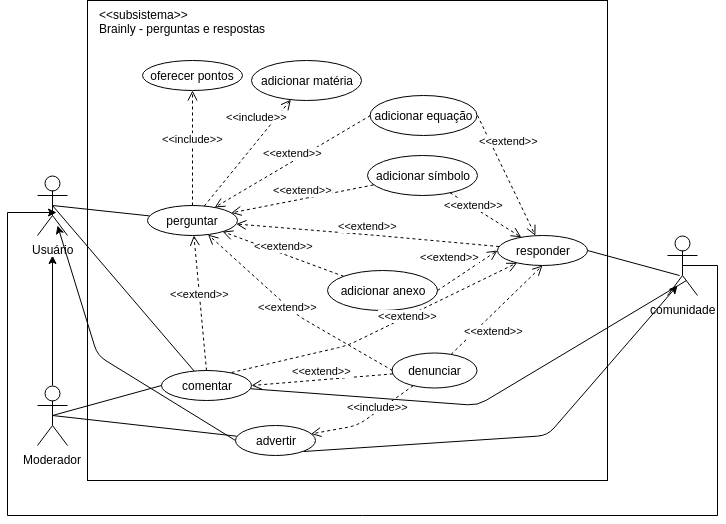

# [PERGUNTAS E RESPOSTAS](rich_picture.md#RichPicture Perguntas e Respostas)

## Versionamento

|  Versão | Data | Modificação | Autor |
|  :------: | :------: | :------: | :------: |
| 1.0 | 28/04/2019 | Adição do diagrama de casos de uso de perguntas e respostas | Lieverton |

## Diagrama de Casos de Uso

## Especificação de Casos de Uso

### 1 Breve descrição
O usuário faz uma pergunta para ser respondida por outros usuários, utilizando seus pontos para recompensar quem respondê-la de maneira coerente.

### 2 Breve descrição dos atores

#### 2.1 [Usuário](lexicos10x5f8c4.md#L12660)
Ator que possui acesso às funcionalidade comuns da plataforma, como, fazer perguntas, escrever respostas e comentários, adicionar amigos, entre outras.

#### 2.2 [Moderador](lexicos10x5f8c4.md#L12528)
Ator que modera os conteúdos do Brainly, esclarece as políticas da plataforma à comunidade e mantém o nível de qualidade das perguntas, respostas e comentários.

#### 2.3 [Comunidade](lexicos10x5f8c4.md#L12525)
Conjunto de usuários em prol de se ajudarem.

### 3 Pré-condições
Ser cadastrado na plataforma Brainly.
Possuir no mínimo dez pontos para realizar uma pergunta.

### 4 Fluxo básico de eventos

    1. O caso de uso começa quando o usuário possui uma dúvida e decide fazer uma pergunta na plataforma Brainly para saná-la.

    2. Usuário digita uma pergunta.

    3. Usuário oferece pontos.

    4. Usuário adiciona matéria que corresponde à área de conhecimento da pergunta.

    5. O usuário finaliza a pergunta.

    6. Um segundo usuário da comunidade, que deseja contribuir, navega pela listas de perguntas.

    7. Esse usuário escolhe uma pergunta.

    8. Esse usuário responde a pergunta.

### 5 Fluxos alternativos

    2.a Usuário adiciona uma equação à pergunta.

    2.b Usuário adiciona um anexo à pergunta.

    2.c Usuário adiciona símbolo à pergunta. 

    7.a Usuários ou moderadores comentam em uma pergunta.

    7.b A comunidade denuncia más práticas em uma pergunta.

    7.c O moderador adverte o usuário que cometeu a infração.

    8.a Usuários ou moderadores comentam em uma resposta.

    8.b A comunidade denuncia más práticas em uma pergunta.

    8.c O moderador adverte o usuário que cometeu a infração.

### 6 Fluxo de Exceções

    [2 - 4] Usuário aperta f5(reinicia a página) acidentalmente, ao clicar em fazer pergunta novamente, tudo o que o usuário tinha digitado e escolhido na pergunta anteriormente se mantém.

    [2] Usuário digita uma pergunta com menos de 20 caracteres e recebe uma mensagem de erro sem  que sua mensagem seja apagada.

### 7 Requisitos Especiais

1. Responsabilizar o usuário por todos os dados enviados ou transmitidos em conexão com os serviços [BR2.1](brainstorm.md#Tabela de Requisitos Funcionais).

2. Apagar perguntas que estão sem respostas por muito tempo [BR2.15](brainstorm.md).

3. A ferramenta que possibilita respostas deve ser consistente entre as plataformas [INT1.2](introspeccao.md).

4. Para aplicação de punições, deve-se levar em conta a conduta (advertências) do usuário na plataforma
[INT2.10](introspeccao.md).

5. Possuir idade mínima (13) para se registrar na plataforma [BR2.1](brainstorm.md).

6. A plataforma deve possuir membros ativos que ajudem a comunidade a crescer e respondam as perguntas de forma rápida e fácil [INT3.6](introspeccao).