# Forward-From

## Versionamento

| Versão |   Data    |            Modificação             |       Autor        |
| :----: | :-------: | :--------------------------------: | :----------------: |
|  1.0   | 16/06/2019 | Preenchimento código e descrição dos requisitos | Welison Regis, João Gabriel Rossi |
|  1.1   | 16/06/2019 | Preenchimento US e Épico | Paulo Vitor Rocha, Gustavo Marques |
|  1.2   | 16/06/2019 | Preenchimento dos NFR na tabela | Ivan Diniz Dobbin, Lieverton Santos |
|  1.3   | 16/06/2019 | Preenchimento das operacionalizações na tabela | André Pinto, Leonardo Medeiros, João Matheus |
|  1.4   | 16/06/2019 | Link para US, EP e NFR | André Pinto, Leonardo Medeiros, João Matheus |
|  1.5   | 16/06/2019 | Link específico para US, EP e NFR | Paulo Vitor Rocha |
|  1.6   | 18/06/2019 | Adiciona GIFs e imagens das funcionalidades (RF1 - RF48) | Welison Regis |
|  1.7   | 19/06/2019 | Adiciona hyperlinks e descrições das imagens e GIFS | Welison Regis |
|  1.8   | 18/06/2019 | Adiciona GIFs e imagens dos requisitos não funcionais (RNF1 - RNF15) | Gustavo Marques |
|  1.9   | 18/06/2019 | Adição de linkangem na tabela de requisitos não funcionais | Gustavo Marques |
|  2.0   | 19/06/2019  | Descrição Metodologias                                      | João Rossi |

## Metodologia

### Métodos de desenvolvimento
A metodologia utilizada pelo grupo foi, em grande parte, o pareamento para tarefas mais manuais, como procurar as elicitações para linkar com cada requisito utilizado na tabela, sendo funcional ou não-funcional e para tarefas menos manuais, que requerem mais análise do grupo, trabalhamos em equipes maiores, de 3, 4 ou até com o grupo inteiro.  
Foi decidido adotar essas duas diferentes metodologias pois necessitávamos de mão de obra em algumas partes e havia a necessidade de otimizar o tempo trabalhado, mas trabalhar individualmente poderia gerar um alto número de conflitos na própria wiki, além de existir a possibilidade de deixar passar alguma elicitação ou modelo em branco, mas, infelizmente, em alguns momentos foi necessária a existência de trabalhos individuais por motivos de provas e outros trabalhos, e mesmo assim foram revisados pelos outros integrantes.  
Na outra parte citada, os requisitos utilizados nas matrizes, era necessário ter pontos de vista diferentes, pois precisávamos escolher requisitos sem existir repetição, além de englobar todos os requisitos previamente levantados e modelados, por isso foi preferível ter mais pessoas ajudando em cada matriz.   

### Ferramentas
No quesito ferramentas, utilizamos o drive e a própria wiki para montar as matrizes de backward from e forward from, tendo como base as tabelas do drive para podermos ter o retorno em tempo real, podendo ter mais pessoas mexendo nela, e após ter feito no drive, passamos para a wiki e fizemos a hiperlinkagem entre os requisitos e as elicitações e modelos em que o mesmo aparece.  
Além das ferramentas para criação de tabelas, utilizamos o [Chrome Capture](https://chrome.google.com/webstore/detail/chrome-capture/ggaabchcecdbomdcnbahdfddfikjmphe), uma extensão do chrome que facilitou na hora de captura de prints e GIF's para mostrar aonde cada requisito está implementado na própria aplicação.

## Tabela de Requisitos funcionais

| Código |   Descrição   |   US   |  Épico  |  Funcionalidade  |
| :----: | :-----------: | :----: | :-----: | :--------------: |
| RF1  |  O sistema deve suportar diversos formatos de anexos que ocupem um espaço razoável  | [US17](backlog.md#us17) | [EP03-Questões](backlog.md#ep03) |[IMG01](forward.md#img01) |
| RF2  |  O usuário pode compartilhar questões da plataforma  | [US18](backlog.md#us18) | [EP03-Questões](backlog.md#ep03) | NOVO |
| RF3  |  O feed das contribuições de um usuário pode ser visualizado em seu perfil  | [US42](backlog.md#us42) | [EP05-Perfil](backlog.md#ep05) | [IMG02](forward.md#img02) |
| RF4  |  É possível se comunicar e retirar dúvidas nos comentários da própria questão.  | [US20](backlog.md#us20) | [EP03-Questões](backlog.md#ep03) | [IMG03](forward.md#img03) |
| RF5  |  O sistema deve fornecer recursos de escrita, como: negrito, itálico, sublinhado, diferentes tamanhos de texto.  | [US21](backlog.md#us21) | [EP03-Questões](backlog.md#ep03) | [IMG04](forward.md#img04) |
| RF6  |  O sistema deve facilitar a inserção de símbolos matemáticos, assim como textos em LaTeX  | [US22](backlog.md#us22) | [EP03-Questões](backlog.md#ep03) | [IMG05](forward.md#img05) |
| RF7  |  O sistema deve fornecer recurso de highlight(destaque) para certas informações, como citações  | [US23](backlog.md#us23) | [EP03-Questões](backlog.md#ep03) | NOVO |
| RF8  |  O sistema deve possibilitar a inserção adequada de código-fonte  | [US22](backlog.md#us22) | [EP03-Questões](backlog.md#ep03) | NOVO |
| RF9  |  Deve ser possível moderar em múltiplas plataformas (web e mobile)  | [US49](backlog.md#us49) | [EP07-Multiplataforma](backlog.md#ep07) | NOVO |
| RF10 |  As advertências dos usuários devem constar em seus perfis  | [US26](backlog.md#us26) | [EP05-Perfil](backlog.md#ep05) | [IMG06](forward.md#img06) |
| RF11 |  Deve haver categorias de denúncias  | [US27](backlog.md#us27) | [EP04-Moderação](backlog.md#ep04) | [IMG07](forward.md#img07) |
| RF12 |  Deve ser possível ao moderador filtrar o tipo de denúncia por categorias  | [US28](backlog.md#us28) | [EP04-Moderação](backlog.md#ep04) | [IMG08](forward.md#img08) |
| RF13 |  Qualquer usuário deve ter a opção de realizar denúncias por modalidades de irregularidade  | [US29](backlog.md#us29) | [EP04-Moderação](backlog.md#ep04) | [IMG09](forward.md#img09) |
| RF14 |  A plataforma deve dispor recursos de bot para realizar denúncias automáticas de irregularidades  | [US30](backlog.md#us30) | [EP04-Moderação](backlog.md#ep04) | NOVO |
| RF15 |  Deve haver níveis entre moderadores, o que libera mais ou menos ferramentas de moderação  | [US31](backlog.md#us31) | [EP04-Moderação](backlog.md#ep04) | [IMG10](forward.md#img10) |
| RF16 |  Os moderadores devem ter um canal de comunicação entre eles junto a administração  | [US32](backlog.md#us32) | [EP04-Moderação](backlog.md#ep04) | NOVO |
| RF17 |  Deve ser possível aos moderadores visualizar o número de ações realizadas, dispostas em um ranking de moderadores  | [US33](backlog.md#us33) | [EP04-Moderação](backlog.md#ep04) | [IMG11](forward.md#img11) |
| RF18 |  O moderador deve ter acesso a uma painel central que possibilite avaliar as denúncias realizadas  | [US34](backlog.md#us34) | [EP04-Moderação](backlog.md#ep04) | [IMG12](forward.md#img12) |
| RF19 |  O moderador deve dispor de recurso para apagar questões, respostas e comentários  | [US35](backlog.md#us35) | [EP04-Moderação](backlog.md#ep04) | [IMG13](forward.md#img13) |
| RF20 |  Deve ser possível ao moderador a exclusão de contas e o banimento do usuário  | [US36](backlog.md#us36) | [EP04-Moderação](backlog.md#ep04) | [IMG14](forward.md#img14) |
| RF21 |  Após denúncia, o moderador poderá pedir a correção de uma atividade  | [US37](backlog.md#us37) | [EP04-Moderação](backlog.md#ep04) | [IMG15](forward.md#img15) |
| RF22 |  O moderador poderá aprovar uma tarefa denunciada, indicando sua regularidade  | [US38](backlog.md#us38) | [EP04-Moderação](backlog.md#ep04) | [IMG16](forward.md#img16) |
| RF23 |  O moderador deve dispor de mensagens padrões para facilitar a exclusão de irregularidades  | - | [EP04-Moderação](backlog.md#ep04) | [IMG17](forward.md#img17) |
| RF24 |  O sistema deve oferecer a mesma experiência para usuários de diferentes plataformas  | - | [EP07-Multiplataforma](backlog.md#ep07) | NOVO |
| RF25 |  A plataforma deve oferecer um meio para que o usuário entre em sua conta a partir de redes sociais  | [US11](backlog.md#us11) | [EP02-Autenticação](backlog.md#ep02) | [IMG18](forward.md#img18) |
| RF26 |  Aumento de recompensa por bater um certo valor de pontos no software  | - | [EP06-Gamificação](backlog.md#ep06) | [IMG19](forward.md#img19) |
| RF27 |  Ter diferentes versões, tanto web como mobile  | [US50](backlog.md#us50) | [EP07-Multiplataforma](backlog.md#ep07) | [IMG20](forward.md#img20) |
| RF28 |  Um usuário no app pode seguir outro  | [US40](backlog.md#us40) | [EP05-Perfil](backlog.md#ep05) | NOVO |
| RF29 |  Uma pergunta pode ter até duas respostas  | [US24](backlog.md#us24) | [EP03-Questões](backlog.md#ep03) | [IMG21](forward.md#img21) |
| RF30 |  O usuário ganha pontos ao responder e paga com pontos para fazer uma pergunta  | - | [EP06-Gamificação](backlog.md#ep06) | [IMG22](forward.md#img22) |
| RF31 |  O usuário ao bater uma pontuação e quantidade de melhor resposta ele sobe de nível  | [US44](backlog.md#us44) | [EP06-Gamificação](backlog.md#ep06) | [IMG23](forward.md#img23) |
| RF32 |  Os usuários com melhor pontuação ficam em uma lista e ganham pontos por serem os melhores  | [US45](backlog.md#us45) | [EP06-Gamificação](backlog.md#ep06) | [IMG24](forward.md#img24) |
| RF33 |  Registro do usuário no sistema  | [US13](backlog.md#us13) | [EP02-Autenticação](backlog.md#ep02) | [IMG25](forward.md#img25) |
| RF34 |  O usuário poderá ver perguntas e respondê-las  | [US25](backlog.md#us25) | [EP03-Questões](backlog.md#ep03) | [IMG26](forward.md#img26) |
| RF35 |  A página tem um sistema de rolagem  | - | - | [IMG27](forward.md#img27) |
| RF36 |  As perguntas podem ser categorizadas por matéria  | [US19](backlog.md#us19) | [EP03-Questões](backlog.md#ep03) | [IMG28](forward.md#img28) |
| RF37 |  O sistema deve informar ao usuário realização de tarefas e pontuação  | [US46](backlog.md#us46) | [EP06-Gamificação](backlog.md#ep06) | [IMG29](forward.md#img29) |
| RF38 |  O usuário poderá fazer perguntas  | - | [EP03-Questões](backlog.md#ep03) | [IMG30](forward.md#img30) |
| RF39 |  O usuário poderá sair da sua conta  | [US39](backlog.md#us39) | [EP05-Perfil](backlog.md#ep05) | [IMG31](forward.md#img31) |
| RF40 |  Ao se cadastrar o usuário terá acesso aos termos de uso e para concluir o registro deverá aceitá-lo  | [US12](backlog.md#us12) | [EP02-Autenticação](backlog.md#ep02) | [IMG32](forward.md#img32) |
| RF41 |  O sistema deve oferecer ao usuário uma forma de ele dar feedback às respostas  | [US47](backlog.md#us47) | [EP06-Gamificação](backlog.md#ep06) | [IMG33](forward.md#img33) |
| RF42 |  Gerenciar e personalizar conta  | [US41](backlog.md#us41) | [EP05-Perfil](backlog.md#ep05) | [IMG34](forward.md#img34) |
| RF43 |  Recuperar senha  | [US14](backlog.md#us14) | [EP02-Autenticação](backlog.md#ep02) | [IMG35](forward.md#img35) |
| RF44 |  Cancelar conta  | [US15](backlog.md#us15) | [EP02-Autenticação](backlog.md#ep02) | NOVO |
| RF45 |  Alterar a região do sistema  | [US43](backlog.md#us43) | [EP05-Perfil](backlog.md#ep05) | NOVO |
| RF46 |  Login  | [US10](backlog.md#us10) | [EP02-Autenticação](backlog.md#ep02) | [IMG36](forward.md#img36) |
| RF47 |  Cadastro com email  | [US13](backlog.md#us13) | [EP02-Autenticação](backlog.md#ep02) | [IMG37](forward.md#img37) |
| RF48 |  Responder pergunta  | [US16](backlog.md#us16) | [EP03-Questões](backlog.md#ep03) | [IMG38](forward.md#img38) |

## Tabela de Requisitos não funcionais

Versão 1

| Código |   Descrição   |   NFR  |  Operacionalizações  |  Funcionalidade  |
| :----: |    :--------------: | :----: | :-----: | :--------------: |
|RNF1  |  A ferramenta que possibilita respostas deve ser consistente entre as plataformas| [NFR-Suportabilidade](nfr.md#nfr02) | "Disponibilizar plataformas semelhantes". |[IMG39](#img39), [IMG40](#img40)|
|RNF2  |A plataforma deve possuir membros ativos que ajudem a comunidade a crescer e respondam as perguntas de forma rápida e fácil  | [NFR-Confiabilidade](nfr.md#nfr01) | "Ter vários usuários frequentes na plataforma";"Fazer propagandas para atrair usuários";"Aplicar gamificação";"Enviar notificações". |  [IMG41](#img41), [IMG42](#img42) |
|  RNF3| Deve-se recrutar usuários para a moderação conforme o seu bom desempenho na plataforma | - | - |  |
|RNF4  |  Os moderadores devem conscientizar os usuários sobre as políticas de conduta da plataforma|[NFR-Suporte ao usuário](nfr.md#nfr03)  | "Disseminar práticas recomendadas";"Disponibilizar a política de privacidade";"Disponibilizar a política de cookies";"Disponibilizar o regulamento"; | [IMG43](#img43) |
| RNF5 | Para aplicação de punições, deve-se levar em conta a conduta (advertências) do usuário na plataforma |[NFR-Confiabilidade](nfr.md#nfr01)  | "Administradores dão advertências ou punições";"Moderadores dão advertências ou punições";"Usuários denunciam perguntas e respostas". | [Regulamento Braily](https://brainly.com.br/pages/regulamento) |
| RNF6 | A plataforma ter uma boa curva de aprendizagem, sem causar impacto aos novos usuários |[NFR-Usabilidade](nfr.md#nfr05)  |"Dar suporte aos usuários";"Ter uma seção Fale Conosco";"Disponibilizar um tutorial";"Disponibiizar Documentação".  | [IMG44](#img44) |
|RNF7  | O sistema deve possuir uma versão mobile de fácil acesso e com baixo consumo de bateria/dados | - | - | [IMG45](#img45) |
| RNF8 | Manter o sistema gratuito para atrair mais usuários, utilizando apenas de ads para a monetização | [NFR-Confiabilidade](nfr.md#nfr01) | "Adicionar anúncios na plataforma";"Ter patrocinadores";"Vender dados". | [IMG46](#img46) |
|  RNF9| O cadastro na plataforma deve ocorrer de uma maneira rápida e prática |[NFR-Usabilidade](nfr.md#nfr05)  |"Cadastrar por meio de redes sociais";"Cadastrar via facebook";"Requisitar apenas informações úteis para o funcionamento do sistema".  | [IMG47](#img47) |
|  RNF10|O sistema poderia ter um sistema de tutorial mais rápido com menos passos  | - | - | [IMG48](#img48) |
|RNF11  | Possuir idade mínima (13) para se registrar na plataforma |  [NFR-Confiabilidade](nfr.md#nfr01)|  "Requerer consentimento dos responsáveis para cadastro de usuários com menos de 13 anos"|  |
|RNF12  | Não utilizar informações de pessoas menores de 16 anos sem autorização |[NFR-Confiabilidade](nfr.md#nfr01)  |"Requerer consentimento dos responsáveis para utilizar dados de usuários com menos de 16 anos"  | [IMG49](#img49), [Políticas de privacidade](https://brainly.com.br/pages/privacy_policy) |
| RNF13 |  Possuir medidas de segurança para proteção de dados (não especificada pelo site)| - | - | [IMG50](#img50) |
| RNF14 |  Poder monitorar e registrar atividades nos serviços da brainly sem autorização prévia| - | - | [IMG51](#img51),  [Regulamento Braily](https://brainly.com.br/pages/regulamento)|
|RNF15  | Responsabilizar o usuário por todos os dados enviados ou transmitidos em conexão com os serviços | - | - |  [IMG52](#img52) [Políticas de privacidade](https://brainly.com.br/pages/privacy_policy) |
| RNF16 | Receber permissão total, no registro de usuário, sobre seus dados pessoais para criar trabalhos derivados, usar para publicidade ou marketing | [NFR-Confiabilidade](nfr.md#nfr01) | "Solicitar permissão para utilizar os dados do usuário";"Usar dados para publicidade e marketing".  | |
|  RNF17| Apagar perguntas que estão sem respostas por muito tempo | [NFR-Desempenho](nfr.md#nfr04) |  "Apagar perguntas sem resposta periodicamente".|  |
|RNF18  |Atualizar automaticamente as plataformas mobile  |[NFR-Suportabilidade](nfr.md#nfr02)  | "Disponibilizar atualização" |  |
| RNF19 |Cobrar por assinatura de serviços  | - | - |  |

Versão 2

| Código |   Descrição   |   NFR  |  Operacionalizações  |  Funcionalidade  |
| :----: |    :--------------: | :----: | :-----: | :--------------: |
|RNF1  |  A ferramenta que possibilita respostas deve ser consistente entre as plataformas| [NFR-Suportabilidade](nfr.md#nfr02) | "Disponibilizar plataformas semelhantes". |[IMG39](#img39), [IMG40](#img40)|
|RNF2  |A plataforma deve possuir membros ativos que ajudem a comunidade a crescer e respondam as perguntas de forma rápida e fácil  | [NFR-Confiabilidade](nfr.md#nfr01) | "Ter vários usuários frequentes na plataforma";"Fazer propagandas para atrair usuários";"Aplicar gamificação";"Enviar notificações". |  [IMG41](#img41), [IMG42](#img42) |
|  RNF3| Deve-se recrutar usuários para a moderação conforme o seu bom desempenho na plataforma | NFR-Confiabilidade | "Recrutar usuários para a moderação conforme o seu bom desempenho na plataformar" |  |
|RNF4  |  Os moderadores devem conscientizar os usuários sobre as políticas de conduta da plataforma|[NFR-Suporte ao usuário](nfr.md#nfr03)  | "Moderadores conscientizarem os usuários sobre a política da plataforma" | [IMG43](#img43) |
| RNF5 | Para aplicação de punições, deve-se levar em conta a conduta (advertências) do usuário na plataforma |[NFR-Confiabilidade](nfr.md#nfr01)  | "Administradores dão advertências ou punições";"Moderadores dão advertências ou punições";"Usuários denunciam perguntas e respostas". | [Regulamento Braily](https://brainly.com.br/pages/regulamento) |
| RNF6 | A plataforma ter uma boa curva de aprendizagem, sem causar impacto aos novos usuários |[NFR-Usabilidade](nfr.md#nfr05)  |"Dar suporte aos usuários";"Ter uma seção Fale Conosco";"Disponibilizar um tutorial";"Disponibiizar Documentação".  | [IMG44](#img44) |
|RNF7  | O sistema deve possuir uma versão mobile de fácil acesso e com baixo consumo de bateria/dados | NFR-Suportability | "Reduzir os gatos de bateria e dados em uma versão mobile opcional"| [IMG45](#img45) |
| RNF8 | Manter o sistema gratuito para atrair mais usuários, utilizando apenas de ads para a monetização | [NFR-Confiabilidade](nfr.md#nfr01) | "Adicionar anúncios na plataforma";"Ter patrocinadores";"Vender dados". | [IMG46](#img46) |
|  RNF9| O cadastro na plataforma deve ocorrer de uma maneira rápida e prática |[NFR-Usabilidade](nfr.md#nfr05)  |"Cadastrar por meio de redes sociais";"Cadastrar via facebook";"Requisitar apenas informações úteis para o funcionamento do sistema".  | [IMG47](#img47) |
|  RNF10|O sistema poderia ter um sistema de tutorial mais rápido com menos passos  | NFR-Usabilidade | "Disponibilizar   um tutorial simples e rápido" | [IMG48](#img48) |
|RNF11  | Possuir idade mínima (13) para se registrar na plataforma |  [NFR-Confiabilidade](nfr.md#nfr01)|  "Requerer consentimento dos responsáveis para cadastro de usuários com menos de 13 anos"|  |
|RNF12  | Não utilizar informações de pessoas menores de 16 anos sem autorização |[NFR-Confiabilidade](nfr.md#nfr01)  |"Requerer consentimento dos responsáveis para utilizar dados de usuários com menos de 16 anos"  | [IMG49](#img49), [Políticas de privacidade](https://brainly.com.br/pages/privacy_policy) |
| RNF13 |  Possuir medidas de segurança para proteção de dados (não especificada pelo site)| NFR-Confiabilidade | "Possuir um ótimo sistema de segurança de dados" | [IMG50](#img50) |
| RNF14 |  Poder monitorar e registrar atividades nos serviços da brainly sem autorização prévia| NFR-Suporte ao usuário | "Monitorar e registrar atividades nos serviços da brainly sem autorização prévia"  | [IMG51](#img51),  [Regulamento Braily](https://brainly.com.br/pages/regulamento)|
|RNF15  | Responsabilizar o usuário por todos os dados enviados ou transmitidos em conexão com os serviços | NFR-Confiabilidade | "Responsabilizar o usuário por todos os dados enviados ou transmitidos dentro da plataforma" |  [IMG52](#img52) [Políticas de privacidade](https://brainly.com.br/pages/privacy_policy) |
| RNF16 | Receber permissão total, no registro de usuário, sobre seus dados pessoais para criar trabalhos derivados, usar para publicidade ou marketing | [NFR-Confiabilidade](nfr.md#nfr01) | "Solicitar permissão para utilizar os dados do usuário";"Usar dados para publicidade e marketing".  | |
|  RNF17| Apagar perguntas que estão sem respostas por muito tempo | [NFR-Desempenho](nfr.md#nfr04) |  "Apagar perguntas sem resposta periodicamente".|  |
|RNF18  |Atualizar automaticamente as plataformas mobile  |[NFR-Suportabilidade](nfr.md#nfr02)  | "Disponibilizar atualização" |  |
| RNF19 |Cobrar por assinatura de serviços  | NFR-Confiabiliade | "Cobrar por assinatura de serviços " |  |

## IMG01

| RF1 - anexar arquivos de vários formatos às minhas perguntas |
|:--:|
|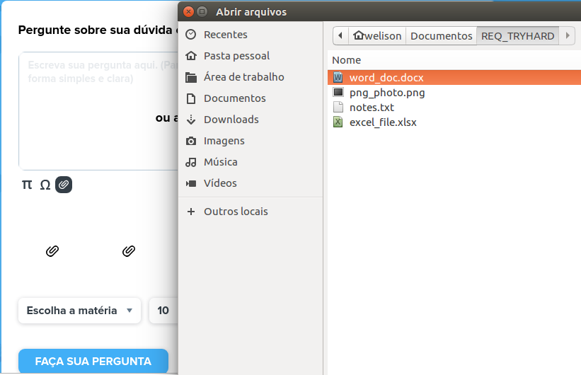|

## IMG02

| RF3 - visualizar feed de contribuições feitas para a plataforma |
|:--:|
||

## IMG03

| RF4 - retirar dúvidas nos comentários da questão |
|:--:|
||

## IMG04

| RF5 - Disponibilizar negrito, itálico, sublinhado e diferentes tamanhos de texto. |
|:--:|
|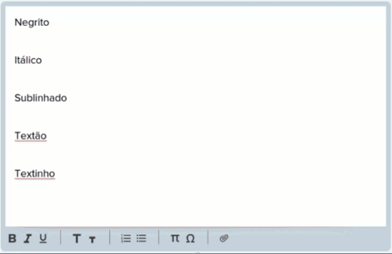|

## IMG05

| RF6 - O sistema deve facilitar a inserção de símbolos matemáticos, assim como textos em LaTeX |
|:--:|
|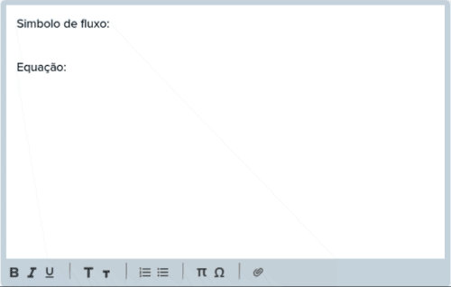|

## IMG06

| RF10 - ver as advertências de um usuário na página de seu perfil |
|:--:|
|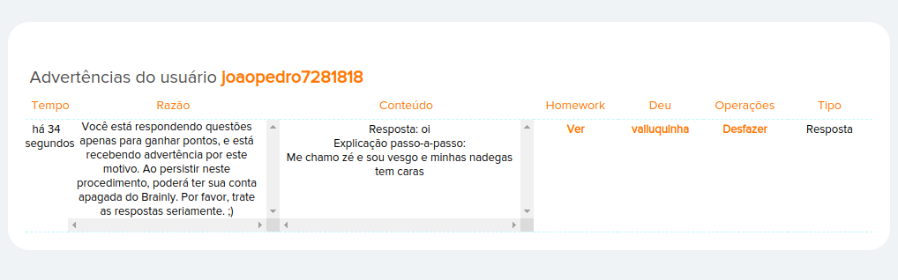|

## IMG07

| RF11 - visualizar as denúncias separadas por categorias |
|:--:|
||

## IMG08

| RF12 - filtrar o tipo de denúncia para moderação |
|:--:|
|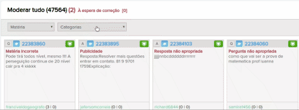|

## IMG09

| RF13 - denunciar irregularidades por parte do usuário |
|:--:|
||

## IMG10

| RF15 - Deve haver níveis entre moderadores, o que libera mais ou menos ferramentas de moderação |
|:--:|
|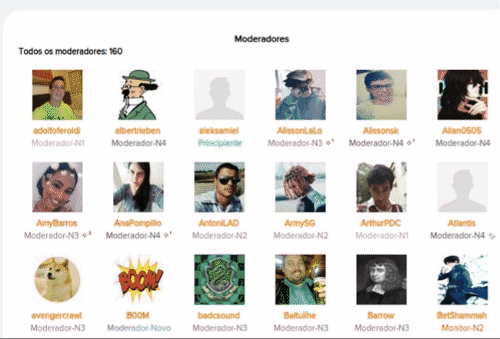|

## IMG11

| RF17 - Deve haver o número de ações e um ranking de moderadores |
|:--:|
|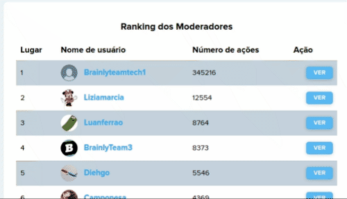|

## IMG12

| RF18 - O moderador deve ter acesso a uma painel central que possibilite avaliar as denúncias realizadas |
|:--:|
|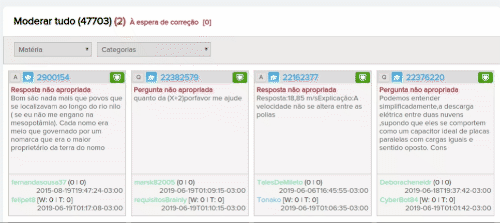|

## IMG13

| RF19 - O moderador deve dispor de recurso para apagar questões, respostas e comentários |
|:--:|
|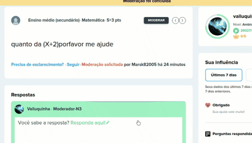|

## IMG14

| RF20 - Deve ser possível ao moderador a exclusão de contas e o banimento do usuário |
|:--:|
|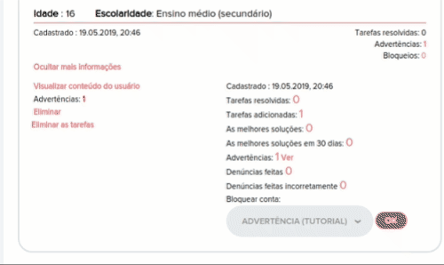|

## IMG15

| RF21 - Após denúncia, o moderador poderá pedir a correção de uma atividade |
|:--:|
|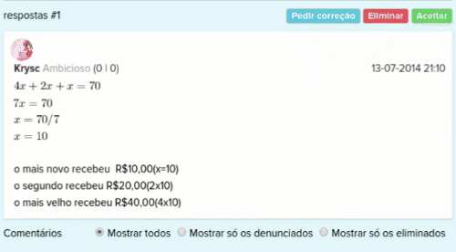|

## IMG16

| RF22 - O moderador poderá aprovar uma tarefa denunciada, indicando sua regularidade |
|:--:|
|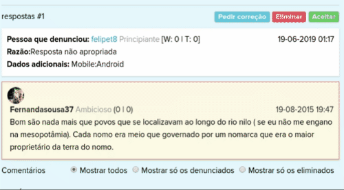|

## IMG17

| RF23 - O moderador deve dispor de mensagens padrões para facilitar a exclusão de irregularidades |
|:--:|
|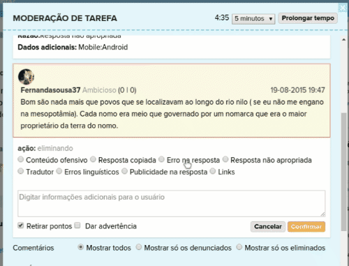|

## IMG18

| RF25 - A plataforma deve oferecer um meio para que o usuário entre em sua conta a partir de redes sociais |
|:--:|
||

## IMG19

| RF26 - Aumento de recompensa por bater um certo valor de pontos no software |
|:--:|
||

## IMG20

| Mobile | Web |
|:--:|:--:|
||  |

## IMG21

| RF29 - Uma pergunta pode ter até duas respostas |
|:--:|
||

## IMG22

| RF30 - O usuário ganha pontos ao responder e paga com pontos para fazer uma pergunta |
|:--:|
|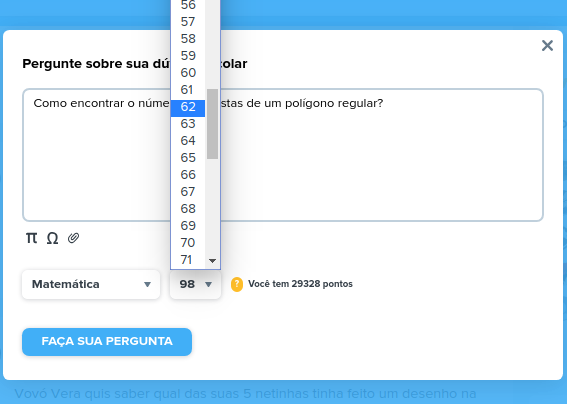|

## IMG23

| RF31 - O usuário ao bater uma pontuação e quantidade de melhor resposta ele sobe de nível |
|:--:|
|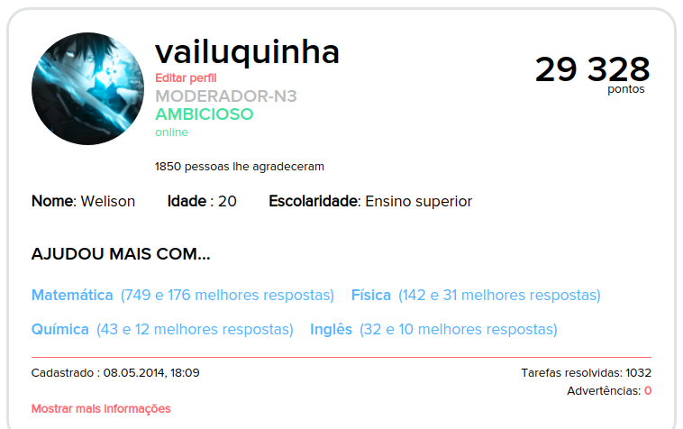|

## IMG24

| RF32 - Os usuários com melhor pontuação ficam em uma lista e ganham pontos por serem os melhores |
|:--:|
|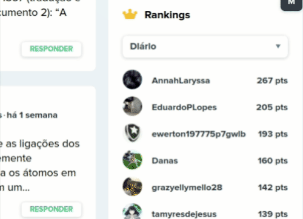|

## IMG25

| RF33 - Registro do usuário no sistema |
|:--:|
||

## IMG26

| RF34 - O usuário poderá ver perguntas e respondê-las |
|:--:|
||

## IMG27

| RF35 - A página tem um sistema de rolagem |
|:--:|
|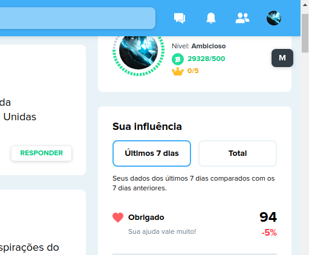|

## IMG28

| RF36 - As perguntas podem ser categorizadas por matéria |
|:--:|
||

## IMG29

| RF37 - O sistema deve informar ao usuário realização de tarefas e pontuação |
|:--:|
|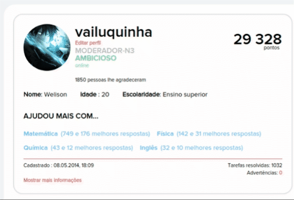|

## IMG30

| RF38 - O usuário poderá fazer perguntas |
|:--:|
||

## IMG31

| RF39 - O usuário poderá sair da sua conta |
|:--:|
||

## IMG32

| RF40 - Ao se cadastrar o usuário terá acesso aos termos de uso e para concluir o registro deverá aceitá-lo |
|:--:|
|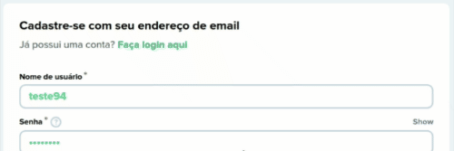|

## IMG33

| RF41 - Realizar comentários nas respostas |
|:--:|
||

## IMG34

| RF42 - Gerenciar e personalizar conta |
|:--:|
|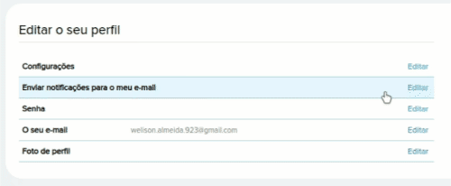|

## IMG35

| RF43 - Recuperar senha |
|:--:|
|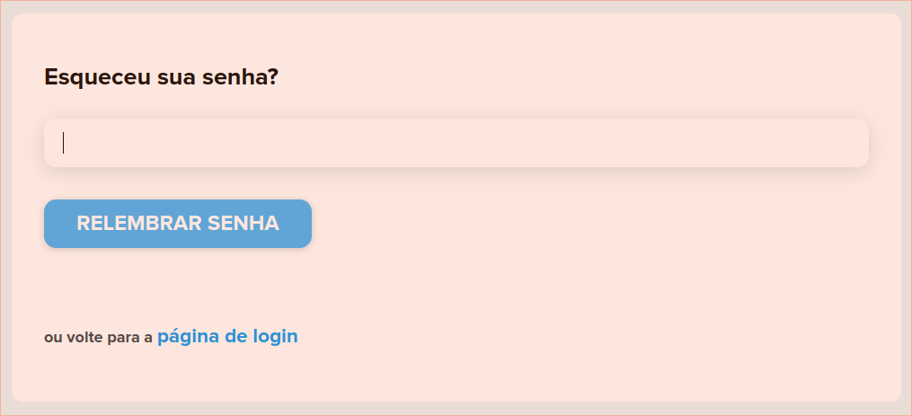|

## IMG36

| RF46 - Login |
|:--:|
|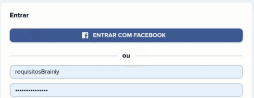|

## IMG37

| RF47 - Cadastro com email |
|:--:|
||

## IMG38

| RF48 - Responder pergunta |
|:--:|
|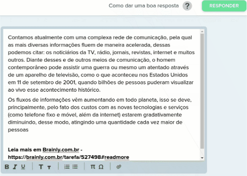|

## IMG39

| RNF1 -A ferramenta que possibilita respostas deve ser consistente entre as plataformas - Web |
|:--:|
||

## IMG40

| RNF1 -A ferramenta que possibilita respostas deve ser consistente entre as plataformas - Celular |
|:--:|
||

## IMG41

| RNF2 -A plataforma deve possuir membros ativos que ajudem a comunidade a crescer e respondam as perguntas de forma rápida e fácil - Web |
|:--:|
||

## IMG42

| RNF2 -A plataforma deve possuir membros ativos que ajudem a comunidade a crescer e respondam as perguntas de forma rápida e fácil - Celular |
|:--:|
||

## IMG43

| RNF4 -Os moderadores devem conscientizar os usuários sobre as políticas de conduta da plataforma	|
|:--:|
||

## IMG44

| RNF6 -A plataforma ter uma boa curva de aprendizagem, sem causar impacto aos novos usuários	|
|:--:|
|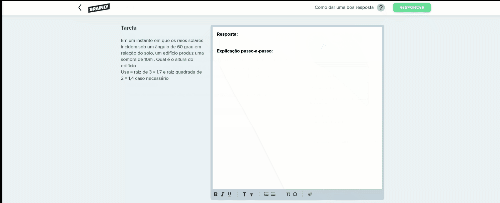|

## IMG45

| RNF7 -O sistema deve possuir uma versão mobile de fácil acesso e com baixo consumo de bateria/dados		|
|:--:|
||

## IMG46

| RNF8 -Manter o sistema gratuito para atrair mais usuários, utilizando apenas de ads para a monetização|
|:--:|
|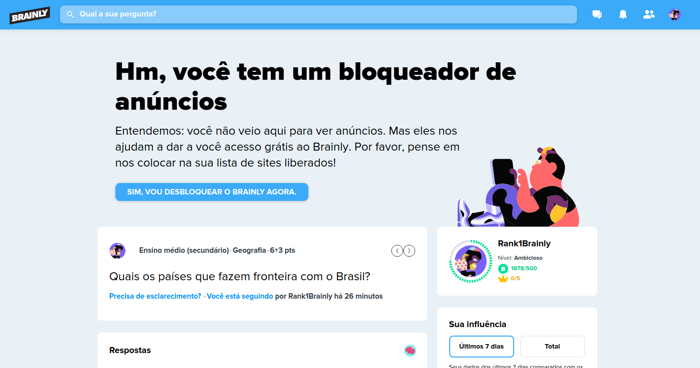|

## IMG47 

| RNF9 -O cadastro na plataforma deve ocorrer de uma maneira rápida e prática|
|:--:|
||

## IMG48

| RNF10 - O sistema poderia ter um sistema de tutorial mais rápido com menos passos |
|:--:|
||

## IMG49

| RNF12 - Não utilizar informações de pessoas menores de 16 anos sem autorização	 |
|:--:|
|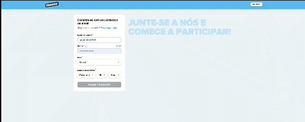|

## IMG50

| RNF13 - Possuir medidas de segurança para proteção de dados (não especificada pelo site) |
|:--:|
|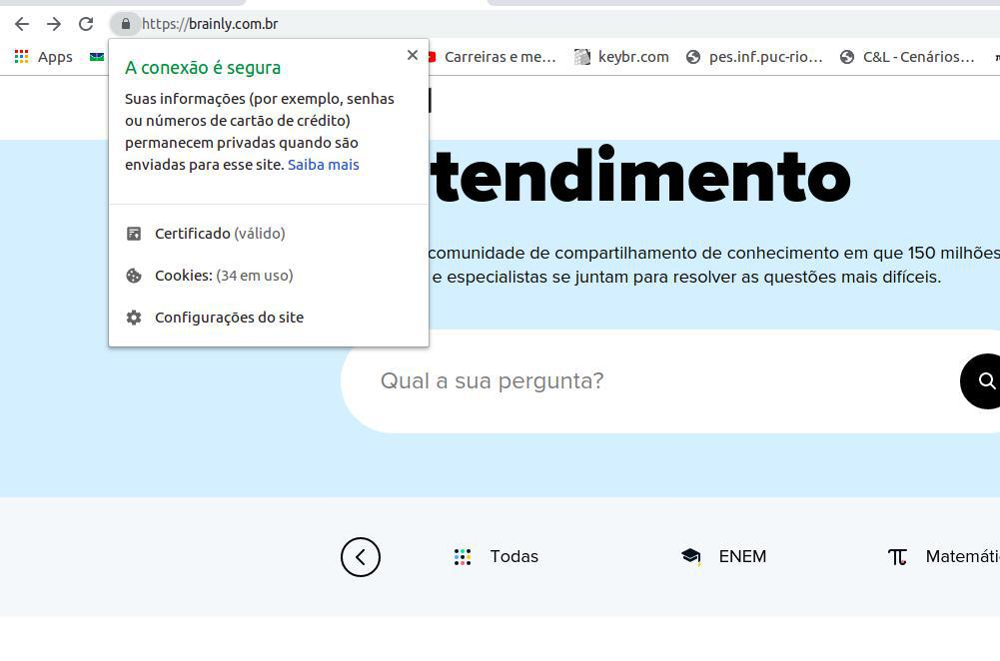|

## IMG51

| RNF14 - Poder monitorar e registrar atividades nos serviços da brainly sem autorização prévia |
|:--:|
|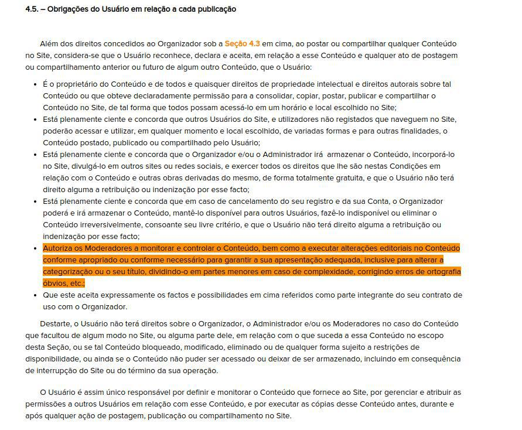|

## IMG52

| RNF15 - Responsabilizar o usuário por todos os dados enviados ou transmitidos em conexão com os serviços |
|:--:|
|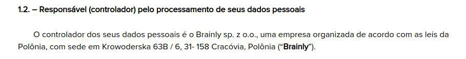|