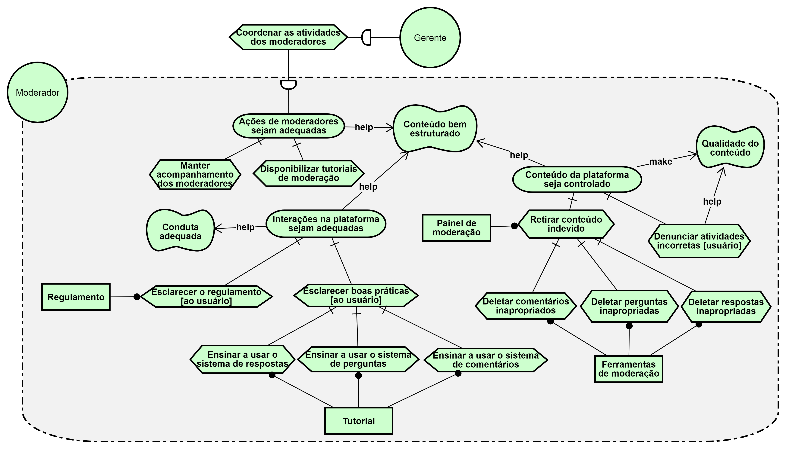

# NFR

## Versionamento

|  Versão |    Data    | Modificação  | Autor |
|  :----: | :--------: | :---------:  | :------: |
|    1.0  | 27/05/2019 | Adição do I* de dependencias | Gustavo Marques, André Pinto |
|    1.1  | 27/05/2019 | Adição do I* de moderação | Welison Regis |
|    1.2  | 28/05/2019 | Adição do I* da plataforma | Gustavo Marques, André Pinto, Leonardo Medeiros |
|    1.3  | 28/05/2019 | Adição da versão 2.0 do I* de dependências | Gustavo Marques, André Pinto, Leonardo Medeiros |
|    1.4  | 28/05/2019 | Adição da versão 2.0 do I* de moderadores | João Gabriel, Ivan Diniz, João Mateus, Paulo Rocha, Wellison Regis |

## I* Depedency - V 1.0

## I* Depedency - V 2.0

## Moderação - Qualidade de conteúdo V 1.0

## Moderação - Qualidade de conteúdo V 2.0

## Plataforma Brainly
