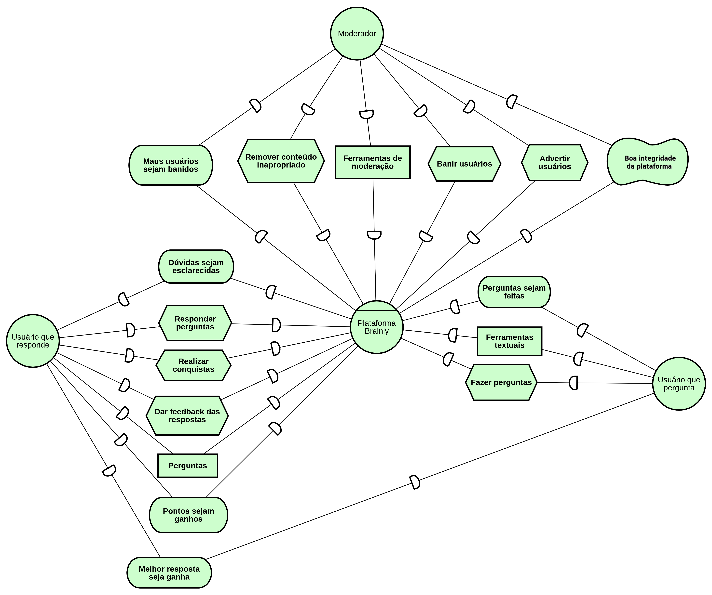
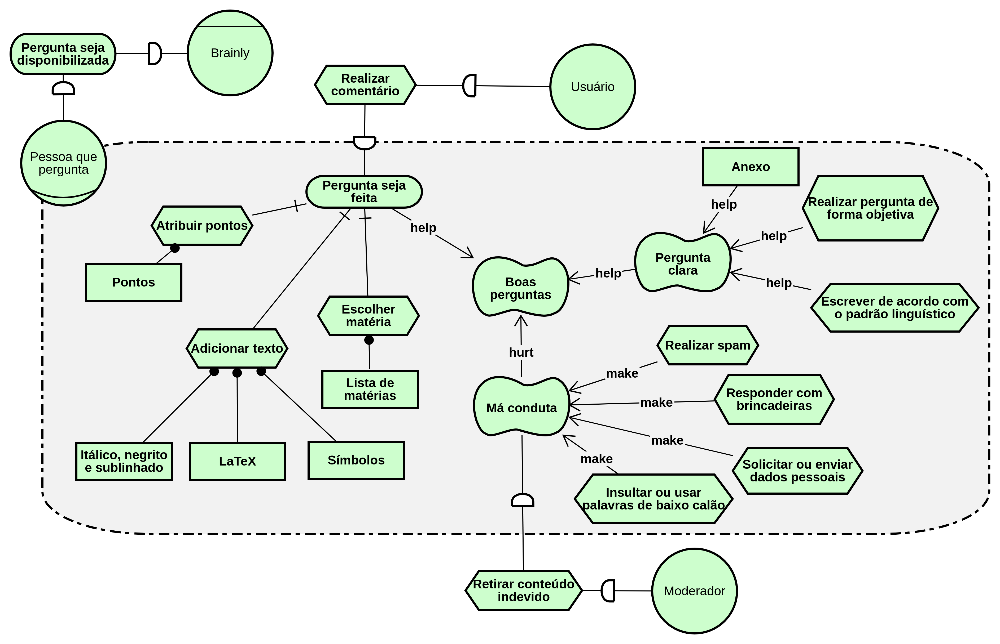

# Istar

## Versionamento

|  Versão |    Data    | Modificação  | Autor |
|  :----: | :--------: | :---------:  | :------: |
|    1.0  | 27/05/2019 | Adição do I* de dependencias | Gustavo Marques, André Pinto |
|    1.1  | 27/05/2019 | Adição do I* de moderação | Welison Regis |
|    1.2  | 28/05/2019 | Adição do I* da plataforma | Gustavo Marques, André Pinto, Leonardo Medeiros |
|    1.3  | 28/05/2019 | Adição da versão 2.0 do I* de dependências | Gustavo Marques, André Pinto, Leonardo Medeiros |
|    1.4  | 28/05/2019 | Adição da versão 2.0 do I* de moderadores | João Gabriel, Ivan Diniz, João Mateus, Paulo Rocha, Wellison Regis |
|    1.5  | 28/05/2019 | Adição da versão 2.0 do I* da plataforma | Gustavo Marques, André Pinto, Leonardo Medeiros |
|    1.6  | 28/05/2019 | Adição da versão 1.0 do I* de gamificação | Ivan Diniz, Paulo Rocha, João Gabriel, Leonardo Medeiros, João Matheus |
|    1.7  | 29/05/2019 | Adição da versão 1.0 do I* de realizar pergunta | Lieverton Silva, Welison Regis |
|    1.8  | 29/05/2019 | Adição da versão 1.0 do I* de realizar resposta | Lieverton Silva, Welison Regis |
|    1.9  | 29/05/2019 | Adição de introdução e referências do i* | Welison Regis |

# Introdução

O **framework i*** propõe uma **abordagem orientada a agentes** para engenharia de requisitos centrada nas **características intencionais do agente**, isto é, as metas, metas-flexíveis e outras abstrações. Os artefatos dividem-se no **Modelo Estratégico de Dependência** (SD) que apresenta uma visão mais geral do sistema e o **Modelo de Raciocínio Estratégico** (SR) que especifica os subsistemas com os seus devidos atores.

Ferramenta utilizada para modelagem: [piStar](http://www.cin.ufpe.br/jhcp/pistar/).

# ISD 1
## Brainly - Geral v1.0

## Brainly - Geral v2.0

## Brainly - Geral v3.0

# ISR01
## Plataforma Brainly v1.0

## Plataforma Brainly v2.0

# ISR02

Modelagens Associadas: [**Casos de uso de perguntas e respostas**](./casos_uso_perguntas_respostas.md), [EP03](./backlog.md#ep03), [US16](./backlog.md#us16), [US17](./backlog.md#us17), [US18](./backlog.md#us18), [US19](./backlog.md#us19), [US20](./backlog.md#us20), [US21](./backlog.md#us21), [US22](./backlog.md#us22), [US23](./backlog.md#us23), [US24](./backlog.md#us24), [US25](./backlog.md#us25).

## Realizar pergunta v1.0

# ISR03

Modelagens Associadas: [**Casos de uso de perguntas e respostas**](./casos_uso_perguntas_respostas.md), [EP03](./backlog.md#ep03), [US16](./backlog.md#us16), [US17](./backlog.md#us17), [US18](./backlog.md#us18), [US19](./backlog.md#us19), [US20](./backlog.md#us20), [US21](./backlog.md#us21), [US22](./backlog.md#us22), [US23](./backlog.md#us23), [US24](./backlog.md#us24), [US25](./backlog.md#us25).

## Realizar resposta v1.0

# ISR04

Modelagens Associadas: [EP04](./backlog.md#ep04), [US26](./backlog.md#us26), [US27](./backlog.md#us27), [US28](./backlog.md#us28), [US29](./backlog.md#us29), [US30](./backlog.md#us30), [US31](./backlog.md#us31), [US32](./backlog.md#us32), [US33](./backlog.md#us33), [US34](./backlog.md#us34), [US35](./backlog.md#us35), [US36](./backlog.md#us36), [US37](./backlog.md#us37), [US38](./backlog.md#us38).

## Moderação - Qualidade de conteúdo v1.0

## Moderação - Qualidade de conteúdo v2.0

# ISR05
## Gamificação v1.0

Modelagens Associadas: [**Casos de uso de gamificação**](./casos_uso_perguntas_respostas.md), [EP06](./backlog.md#ep06), [US44](./backlog.md#us44), [US45](./backlog.md#us45),  [US46](./backlog.md#us46), [US47](./backlog.md#us47), [US48](./backlog.md#us48).

# REFERÊNCIA

[1] SERRANO, Maurício; SERRANO, Milene. **Requisitos - Aula 20. 1º/2019**. Material apresentado para a disciplina de Requisitos de Software no curso de Engenharia de Software da UnB, FGA.

[2] Pimentel, J.: piStar Tool - Goal Modeling. [Disponível aqui](http://www.cin.ufpe.br/jhcp/pistar/). Acessado em 29 maio 2019.

[3] PUC-RIO. **O Framework de Modelagem i***. In: PUC-RIO. Requisitos de Software. PUC-Rio: [s. n.], [2007?]. [Disponível aqui](https://www.maxwell.vrac.puc-rio.br/15000/15000_3.PDF). Acesso em: 29 maio 2019.