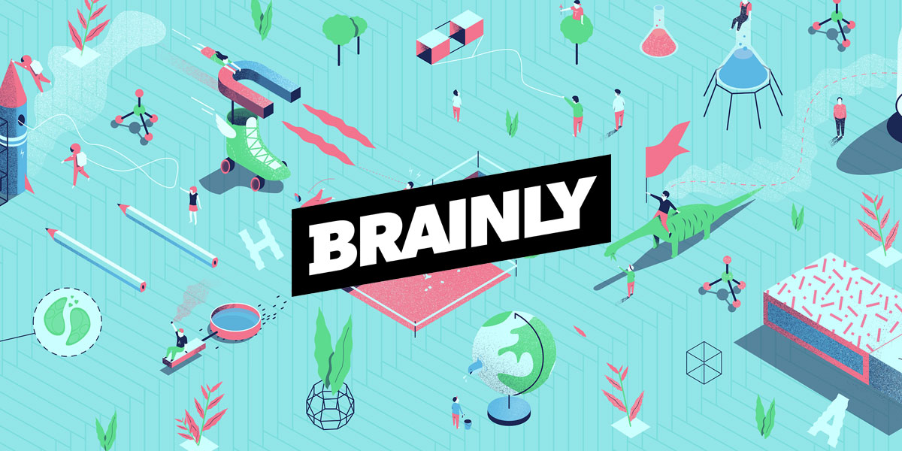

# INÍCIO

Página destinada à disciplina de Requisitos de Software (2019.1) acerca do Brainly; reserva-se a armazenar e apresentar os artefatos produzidos na disciplina, assim como materiais correlatos.

## EQUIPE

| Nome (primeiro e último) | Email | Github |
| :------: | :------: | :------: |
| Welison Regis | welison.almeida.923@gmail.com | WelisonR |
| Paulo Rocha | paulovitorrocha.unb@gmail.com | PauloVitorRocha |
| João Rossi | bielrossiborba@gmail.com	| bielrossi15 |
| Ivan Dobbin | ivandinizdobbin2@gmail.com | darmsDD |
| Gustavo Lima | gustavomarques.gml@gmail.com | gustavolima00 |
| André Pinto | andrelucax@gmail.com | andrelucax |
| João Rodrigues | joaomatheus.152013@gmail.com | rjoao |
| Lieverton Silva | lievertom@gmail.com | lievertom |
| Leonardo Medeiros | leonardomedeiros.6@gmail.com | leomedeiros1 |