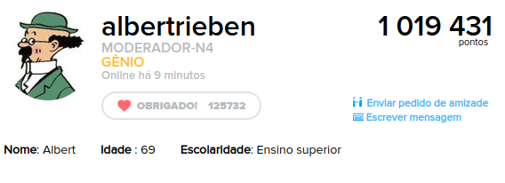

# INTROSPECÇÃO

## Versionamento
|  Versão | Data | Modificação | Autor |
|  :------: | :------: | :------: | :------: |
| 1.0 | 08/04/2019 | Introdução e Introspecção 1 | Welison Regis |
| 2.0 | 09/04/2019 | Introspecção 2 | Welison Regis |
| 3.0 | 09/04/2019 | Introspecção 3 e MoSCoW | André Pinto |
| 4.0 | 10/04/ 2019 | Aplicação de MoSCoW nos requisitos | Welison Regis |
| 5.0 | 16/04/2019 | Introspecção 1 e 2 (v2) após feedback pessoal | Welison Regis |

## Introspecção
Introspecção é uma técnica muito rica e profunda para a elicitação de requisitos. Através desse método, o indivíduo que pretende levantar os requisitos faz observações e descrições do conteúdo (pensamentos, sentimentos) que decorrem da auto-reflexão sobre o serviço e, mediante a isso, é possível entender as propriedades que o sistema deve possuir para que atenda as necessidades do seu público.

As introspecções descritas abaixo, são divididas em três tópicos principais: contexto, necessidades do contexto e requisitos elicitados. Para contextualizar a introspecção, utilizou-se a ideia de um _storytelling_, em que há uma persona que  desempenha uma atividade na plataforma. Decorrente do contexto, foi feita uma auto-reflexão para elencar as necessidades técnicas, sociais e individuais da persona, o que em seguida decorre na elicitação dos requisitos. Por fim, nessa primeira abordagem utilizou-se a técnica "MoSCoW" para priorizar os requisitos.

## INT01
### Introspecção 1 - Ferramentas de respostas v2

A versão anterior dessa introspecção pode ser verificada [AQUI](elicitacao_v1/introspeccao.md#introspeccao-1-ferramentas-de-respostas-v1).

### Persona
| **Persona** | **João Alves** |
|:-------:|:----------:|
|**Nome**: | João Alves|
|**Ocupação**:| estudante|
|**Idade**: |21|
|**Escolaridade**:| Ensino Superior incompleto em Tecnologia da Informação|
|**Nível de conhecimento sobre a plataforma**:| razoável, o usuário já realizou algumas respostas corretas na plataforma, além de interagir com perguntas|
|**Objetivo no uso da aplicação**:| Praticar o que aprende na área de TI e auxiliar outros estudantes que necessitem de ajuda.|

### Contexto
Durante o seu acesso à plataforma, João decidiu responder uma pergunta que solicitava ajuda na implementação de uma ordenação através do algoritmo _bubble sort_ utilizando a linguagem java. Em um primeiro momento, João escreveu uma solução que explicou o algoritmo, adicionando imagens que auxiliava na explicação da solução, além de notações matemáticas para explicar a complexidade algorítmica, porém, João não gostou do fato de não poder colocar o seu código bem formatado na resposta e também por não possuir recurso de destaque para citações.

Finalizada a resposta, João acessa o seu perfil, procura em todos os lugares um local para compartilhar a tarefa, mas acaba por pegar o _link_ para para compartilhar a questão para que seja possível que seus colegas de faculdade que estão estudando o mesmo assunto tenham acesso a explicação do algoritmo e, assim, facilitar o entendimento sobre o conteúdo.

#### O que poderia mudar sob a visão da pessoa

João gostaria de dispor de recursos para formatar decentemente sua questão, e isso inclui muito além dos recursos textuais básicos (negrito, sublinhado, itálico, símbolo), como é o caso da necessidade do _hightlight_ em trechos de citação, além da possibilidade de inclusão adequada de código-fonte. Fora isso, João vê que o sistema deve fornecer um sistema de compartilhamento para as questões.

#### Necessidades do Contexto

#### Requisitos elicitados e MoSCoW

##### Necessidades Técnicas
| Código | Requisito | Descrição | Prioridade |
| :----: | :-------: | :-------: | :--------: |
| INT1.1 | Recursos de anexos | O sistema deve suportar diversos formatos de anexos que ocupem um espaço razoável | S |
| INT1.2 | Consistência ferramental	| A ferramenta que possibilita respostas deve ser consistente entre as plataformas | M |

##### Necessidades Sociais
| Código | Requisito | Descrição | Prioridade |
| :----: | :-------: | :-------: | :--------: |
| INT1.3 | Compartilhar questão | O usuário pode compartilhar questões da plataforma  | S |
| INT1.4 | Mural de respostas | O _feed_ das contribuições de um usuário pode ser visualizado em seu perfil | C |
| INT1.5 | Comunicação na questão | É possível se comunicar e retirar dúvidas nos comentários da própria questão. | M |

##### Necessidades Individuais
| Código | Requisito | Descrição | Prioridade |
| :----: | :-------: | :-------: | :--------: |
| INT1.6 | Recursos textuais | O sistema deve fornecer recursos de escrita, como: negrito, itálico, sublinhado, diferentes tamanhos de texto | M |
| INT1.7 | Recurso de notações matemáticas | O sistema deve facilitar a inserção de símbolos matemáticos, assim como textos em LaTeX | S |
| INT1.8 | Recursos de _hightlight_ | O sistema deve fornecer recurso de _hightlight_ (destaque) para certas informações, como citações | C |
| INT1.9 | Recursos de programação | O sistema deve possibilitar a inserção adequada de código-fonte | S |

Legenda - técnica de priorização:

*   M: **Must have**; S: **Should have**; C: **Could have**; W: **Would have**.

## INT02
### Introspecção 2 - Moderação de atividades na plataforma v2

A versão anterior dessa introspecção pode ser verificada [AQUI](elicitacao_v1/introspeccao.md#introspeccao-2-moderacao-de-atividades-na-plataforma-v1).

A história abaixo relatada baseia-se em uma conversa com um moderador real a fim de entender melhor a moderação. Tentou-se retratar uma história com o máximo de detalhes a fim de promover uma melhor introspecção.

O usuário preferiu a confidencialidade da conversa. Link para [Albert](https://brainly.com.br/perfil/albertrieben-1703474).

### Persona

|**Persona** | **Albert Rieben**|
|:----------:|:----------------:|
|**Nome**:| Albert Rieben|
|**Ocupação**:| aposentado|
|**Idade**:| 69|
|**Escolaridade**:| Ensino Superior, engenheiro nuclear|
|**Nível de conhecimento sobre a plataforma**:| usuário há 4 anos, já respondeu cerca de 41 mil questões — possui alto nível de sabedoria sobre a políticas e o funcionamento da plataforma|
|**Atribuição na plataforma**:| moderador de conteúdo na plataforma Brainly;| 

### Contexto

##### Características da persona e relação inicial com a plataforma

Albert Rieben, engenheiro nuclear aposentado, encontrou há alguns anos a plataforma Brainly como um meio de esvair o tédio, distrair a mente, praticar seus conhecimentos e ajudar outros estudantes. Com algum tempo de atividade na aplicação, Albert mostrou notório saber principalmente nas áreas de física, matemática e química, adquirindo conhecimento nas condutas da plataforma. Hoje, com cerca de 41 mil respostas na plataforma, Albert exerce a função de moderador voluntário de nível máximo, cargo que aceitou há algum tempo após receber convite da administração devido ao seu empenho pelas ideologias da plataforma.

##### Atividades da persona na plataforma

As atividades de Albert Rieben na plataforma são rotineiras, repetitivas, porém isso não é sinônimo de pouco trabalho. Rieben acessa a plataforma durante todo o dia, dirigindo-se ao painel de denúncias realizadas, selecionando a matéria e filtrando principalmente pelas áreas de denúncias mais graves, como é o caso da solicitação de informações pessoais, ofensas, conteúdos proibidos etc. 

Durante a manhã, Rieben dirigiu-se até o painel de moderação, filtrou pelas denúncias relacionadas a solicitação de informações pessoais e recebeu 403 itens necessários de moderação. O primeiro caso era de um jovem chamado Guilherme que tinha uma publicação afirmando realizar trabalhos escolares e solicitando que os usuários entrem em contato com ele e, logo abaixo, outro usuário chamado João deixou o seu contato nas respostas para realizar a negociação; interveniente aparece Pablo, usuário exemplar, que denuncia (conforme a modalidade) a irregularidade de ambos. Prontamente, Albert Rieben aperta para moderar a pergunta, seleciona a justificativa de exclusão (não pergunta escolar), aperta para moderar a resposta, seleciona a justificativa de exclusão (publicação de dados pessoais), adiciona observação e as exclui individualmente; além disso aplica advertência em ambos os casos, sendo que posteriormente conscientiza os usuários sobre as condutas da plataforma através do _chat_.

Um pouco depois do ocorrido, Albert Rieben ao verificar o _chat_ constata que Guilherme acabou por xingá-lo após a comunicação da infração. O ocorrido leva Albert Rieben a analisar o perfil do usuário, e lá o moderador encontra que Guilherme já recebeu algumas advertências e estava cometendo as mesmas irregularidades. Decorrente da situação e utilizando de suas ferramentas de moderação, Albert Rieben apaga todas as atividades do usuário (perguntas, respostas, comentários, mensagens), exclui a conta e bane o usuário por IP.

Porém, como a vida não é feita só de mazelas, Albert Rieben também tem a chance de se agraciar com usuários com boas intenções. No seu painel de moderação, Albert Rieben verifica a denúncia de que uma resposta dada em física está incorreta, o que ele posteriormente constata e logo notifica o usuário Lucas do erro e a coloca para correção. Rapidamente Lucas corrige a questão que retorna para a avaliação de Albert Rieben, esse que verifica estar correta e aprova a resposta do usuário.

##### O que poderia melhorar sob a visão da persona

Ao final do dia, Albert Rieben verifica o número de denúncias pendentes e nota que ultrapassa 30 mil, vê com um olhar crítico a população desse número de denúncias, boa parte realizada por bots que às vezes erram em suas predições, resmunga pelo fato de não ser possível moderar pelo aplicativo do seu celular, porém, dorme tranquilo pelo fato de saber que colaborou mais uma vez para uma educação melhor no país.

#### Necessidades do Contexto

A narrativa acima exposta em formato de _storytelling_ foi desenvolvida em decorrência da conversa com o moderador que informou os detalhes de seu relacionamento com a plataforma e, através disso, pode-se discorrer de forma introspectiva os aspectos das necessidades da MODERAÇÃO na plataforma (tópico que estava escasso na elicitação) em categorias, conforme pode-se notar abaixo.

#### Requisitos elicitados e MoSCoW

##### Necessidades Técnicas
| Código | Requisito | Descrição | Prioridade |
| :----: | :-------: | :-------: | :--------: |
| INT2.1 | Moderação multiplataforma | Deve ser possível moderar em múltiplas plataformas (_web_ e _mobile_); | M |
| INT2.2 | Persistência de advertências | As advertências dos usuários devem constar em seus perfis; | M |
| INT2.3 | Categorias de denúncia | Deve haver categorias de denúncias; | S |
| INT2.4 | Filtro de denúncias | Deve ser possível ao moderador filtrar o tipo de denúncia por categorias; | S |
| INT2.5 | Realização de denúncias | Qualquer usuário deve ter a opção de realizar denúncias por modalidades de irregularidade; | S |
| INT2.6 | _Bot_ de denúncias | A plataforma deve dispor recursos de _bot_ para realizar denúncias automáticas de irregularidades; | W |

##### Necessidades Sociais
| Código | Requisito | Descrição | Prioridade |
| :----: | :-------: | :-------: | :--------: |
| INT2.7 | Recrutamento de moderadores | Deve-se recrutar usuários para a moderação conforme o seu bom desempenho na plataforma; | M |
| INT2.8 | Níveis de moderação | Deve haver níveis entre moderadores, o que libera mais ou menos ferramentas de moderação | M |
| INT2.9 | Conscientização das condutas da plataforma | Os moderadores devem conscientizar os usuários sobre as políticas de conduta da plataforma; | M |
| INT2.10 | Condições de advertência | Para aplicação de punições, deve-se levar em conta a conduta (advertências) do usuário na plataforma. | S |
| INT2.11 | Comunicação entre o time | Os moderadores devem ter um canal de comunicação entre eles junto a administração; | S |
| INT2.12 | Ranking de moderadores | Deve ser possível aos moderadores visualizar o número de ações realizadas, dispostas em um _ranking_ de moderadores. | W |

##### Necessidades Individuais
| Código | Requisito | Descrição | Prioridade |
| :----: | :-------: | :-------: | :--------: |
| INT2.13 | Painel de moderação | O moderador deve ter acesso a uma painel central que possibilite avaliar as denúncias realizadas; | M |
| INT2.14 | Exclusão de conteúdo | O moderador deve dispor de recurso para apagar questões, respostas e comentários. | M |
| INT2.15 | Banimento de contas | Deve ser possível ao moderador a exclusão de contas e o banimento do usuário; | M |
| INT2.16 | Correção de atividades | Após denúncia, o moderador poderá pedir a correção de uma atividade. | M |
| INT2.17 | Aprovação de tarefa | O moderador poderá aprovar uma tarefa denunciada, indicando sua regularidade. | M |
| INT2.18 | Mensagens padrão | O moderador deve dispor de mensagens padrões para facilitar a exclusão de irregularidades. | C |

### INT03
### Introspecção 3 - Usuários com maior fluxo de perguntas

Verônica, aluna do fundamental, estuda diariamente em casa, realizando exercícios e consequentemente surgem diversas dúvidas que precisam de uma resposta razoavelmente rápida, pois não quer acumular matéria. Verônica conhece o Brainly e passa a colocar suas dúvidas na plataforma, que em sua maioria são respondidas dentro de 10 minutos, porem as vezes encontra alguma resposta errada ou sem sentido que são posteriormente denunciada por outros usuários e apagadas por moderadores. Certo dia a turma Verônica sai com uma dúvida da sala e a moça, ao chegar em casa, posta a pergunta na plataforma e compartilha em sua rede social predileta, o facebook, para ajudar seus colegas.

Por outro lado, Paulo, aluno do ensino médio, costuma esquecer de responder seus deveres de casa, lembrando apenas no ônibus indo para a escola. Em uma jornada para escola, Paulo, conhece o Brainly, cria sua conta utilizando o facebook e coloca uma dúvida na plataforma, com ajuda de fotos para agilizar o processo, sendo respondida antes de chegar na escola e consequentemente realizando o dever no prazo.

##### Necessidades Técnicas
*   Acesso a um dispositivo que tenha internet;
*   Design intuitivo, bonito e de fácil manuseio;
*   Consistência entre as diferentes plataformas (mobile, web);
*   Disponibilizar ao usuário ferramentas para responder e perguntar.

##### Necessidades Sociais
Para melhor atender Verônica, a plataforma necessita de:

*   Existência de moderadores;
*   Possibilidade de exclusão de respostas irrelevantes;
*   Possibilidade de compartilhar pergunta/resposta em rede social.

Para melhor atender Paulo, a plataforma necessita de:

*   Possibilidade de entrar utilizando alguma rede social;

##### Necessidades Individuais
Para melhor atender Verônica, a plataforma necessita de:

*   Bom tempo médio de resposta;
*   Possibilidade de denunciar respostas .

Para melhor atender Paulo, a plataforma necessita de:

*   Possibilidade de entrar utilizando alguma rede social;
*   Rápida curva de aprendizagem;
*   Bom tempo médio de resposta;
*   Possibilidade de enviar fotos anexadas;
*   Economia de internet em dispositivos mobile;
*   Existência de uma versão mobile;

#### Requisitos Elicitados
Foi utilizado o MoSCoW para dar prioridade aos requisitos.

| Código | Requisito | Descrição | Prioridade |
| :----: | :-------: | :-------: | :--------: |
| INT3.1 | Existência de moderadores | O sistema deve possuir pessoas cuidando e analisando denúncias para evitar respostas irrelevantes | S |
| INT3.2 | Ferramentas para moderação | O sistema deve dar aos moderadores ferramentais para que eles possam atuar da melhor forma possível | S |
| INT3.3 | Consistência entre plataformas | O sistema deve oferecer a mesma experiência para usuários de diferentes plataformas | C |
| INT3.4 | Compartilhar em redes sociais | A plataforma deve oferecer ferramentas para que os usuários possam compartilhar as respostas nas redes sociais | C |
| INT3.5 | Logar com redes sociais | A plataforma deve oferecer um meio para que o usuário entre em sua conta a partir de redes sociais | C |
| INT3.6 | Bom tempo médio de respostas | A plataforma deve possuir membros ativos que ajudem a comunidade a crescer e respondam as perguntas de forma rápida e fácil | M |
| INT3.7 | Compartilhar em redes sociais | A plataforma deve oferecer ferramentas para que os usuários possam compartilhar as respostas nas redes sociais | C |
| INT3.8 | Denunciar resposta/conta | A plataforma deve oferecer ao usuário maneiras de denunciar algo que não condiz com as regras, facilitando e auxiliando moderadores | M |
| INT3.9 | Curva rápida de aprendizagem | A plataforma ter uma boa curva de aprendizagem, sem causar impacto aos novos usuários | M |
| INT3.10 | Anexo de imagens | A plataforma deve oferecer ferramentas para que os usuários possam compartilhar as perguntas/respostas com auxílio de imagens, facilitando o fluxo | S |
| INT3.11 | Versão mobile | O sistema deve possuir uma versão mobile de fácil acesso e com baixo consumo de bateria/dados | S |

Legenda - técnica de priorização:

*   M: **Must have**; S: **Should have**; C: **Could have**; W: **Would have**.
