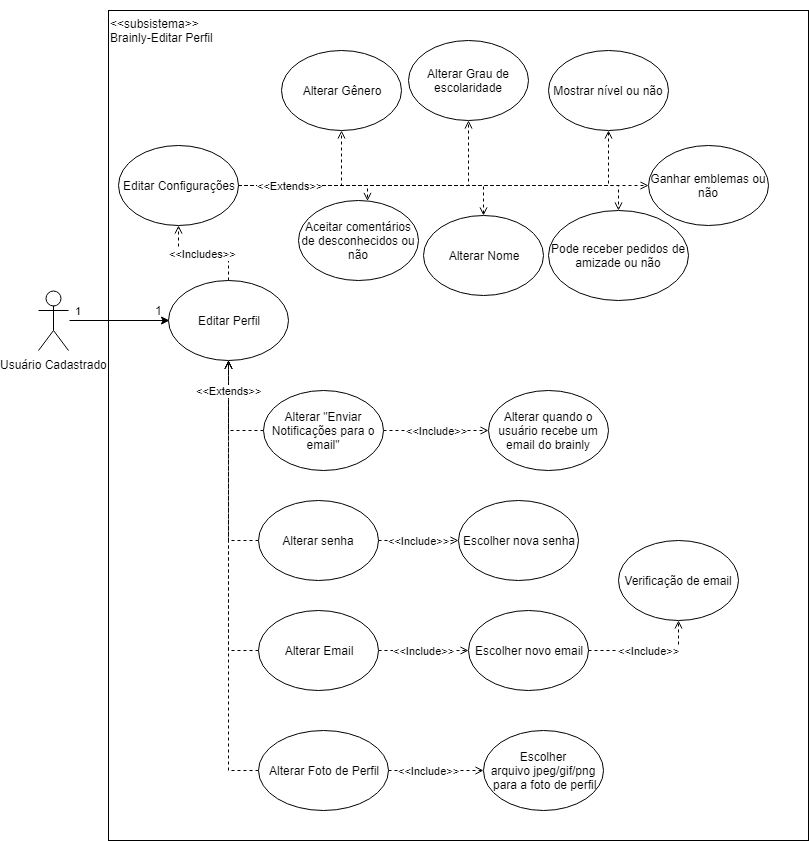

# [EDITAR PERFIL](../../cenarios10x5f8c4.md#alterar-perfil)

## Versionamento

|  Versão | Data | Modificação | Autor |
|  :------: | :------: | :------: | :------:
| 1.0 | 29/04/2019 | Adição do diagrama de casos de uso | Leonardo Medeiros, Ivan Dobbin |
| 1.1 | 29/04/2019 | Adição da especificação de casos de uso | Leonardo Medeiros, Ivan Dobbin, João Rossi |

## Diagrama de Casos de Uso

## Especificação de Casos de Uso

### 1 Breve descrição
Usuário faz alterações no seu perfil no Brainly para atualizar seus dados ou alterar suas preferências.
### 2 Breve descrição dos atores
#### 2.1 [Usuário](../../lexicos10x5f8c4.md#l12660)
Ator que possui acesso às funcionalidade comuns da plataforma, como, fazer perguntas, escrever respostas e comentários, adicionar amigos, entre outras. 
### 3 Pré-condições
Possuir um sistema operacional compatível com alguma das plataformas disponibilizadas pelo Brainly.

Ser cadastrado na plataforma Brainly.

Possuir acesso à internet.

### 4 Fluxo básico de eventos
    1. O caso de uso começa quando o usuário decide fazer alguma alteração no seu perfil.
   
    2. Usuário  opta por alterar suas configurações.
   
    3. Usuário pode alterar seu gênero.
   
    4. Usuário pode alterar seu nome.
   
    5. Usuário pode optar  por não receber comentários de desconhecidos
   
    6. Usuário pode alterar seu grau de escolaridade
   
    7. Usuário pode optar por não mostrar seu nível 
   
    8. Usuário pode optar por não receber pedidos de amizade
   
    9.  Usuário pode optar por não receber emblemas.

### 5 Fluxos alternativos
	1.a Usuário optar por alterar suas configuração de “enviar notificações para o meu e-mail”.
    
    1.b Usuário opta por alterar sua senha
    
    1.c Usuário opta por alterar seu email.
    
    1.d Usuário opta por alterar sua foto de perfil.

### 6 Subfluxo
	1.a Usuário optar por alterar suas configuração de “enviar notificações para o meu e-mail”.
        1. Usuário altera quando receberá emails do Brainly.

    1.b Usuário opta por alterar sua senha.
        1. Usuário escolhe nova senha.

    1.c Usuário opta por alterar seu email.
        1. Usuário escolhe novo email.
        2. Usuário faz a verificação no novo email.

    1.d Usuário opta por alterar sua foto de perfil.
        1. Usuário escolhe arquivo jpeg/gif/png para sua nova foto de perfil.

### 7 Fluxo de exceção
	[1.d] Usuário insere um arquivo que não é jpeg,gif ou png. Recebe a mensagem “Foto de perfil deve ser um arquivo jpeg/gif/png” e avisa que as configurações não foram mudadas.

        [1.d.1] Usuário insere um arquivo  jpeg,gif ou png que tem tamanho maior que 5 megabytes. Recebe a mensagem “Foto de perfil deve ter menos de 5 megabytes” e avisa que as configurações não foram mudadas.

    [3]Usuário não escolhe um gênero e clica em salvar. Recebe a mensagem “Escolha o seu gênero” e avisa que as configurações não foram mudadas.

    [6] Usuário não escolhe o grau de escolaridade e clica em salvar. Recebe a mensagem”Escolha o seu grau de escolaridade” e avisa que as configurações não foram mudadas.

    [4] Usuário digita um nome com 1 caractere e clica em salvar. Recebe a mensagem”Nome deve ter pelo menos 2 caracteres” e avisa que as configurações não foram mudadas.

    [1.b,1.c] Usuário digita a senha errada no campo “Senha atual” e clica em salvar. Recebe a mensagem “Sua senha está incorreta” e diz que as alterações não foram salvas.

    [1.b] Usuário digita 2 senhas diferentes nos campos”Nova Senha” e “Repetir senha” e clica em salvar. Recebe a mensagem “As senhas não estão iguais” e diz que as alterações não foram salvas.

    [1.c] Usuário digita um novo email. Novo email já possui usuário cadastrado.Recebe a mensagem “Já existe um usuário associado a este nome” e diz que as alterações não foram salvas.

    [1.c] Usuário digita um novo email. Novo email é inválido.Recebe a mensagem “E-mail incorreto” e diz que as alterações não foram salvas.

### 8 Requisitos Especiais
1. Responsabilizar o usuário por todos os dados enviados ou transmitidos em conexão com os serviços [BR2.12](../../brainstorm.md).
2. Ao se cadastrar o usuário terá acesso aos termos de uso e para concluir o registro deverá aceitá-lo [AP1.13](../../analise_protocolo.md)
