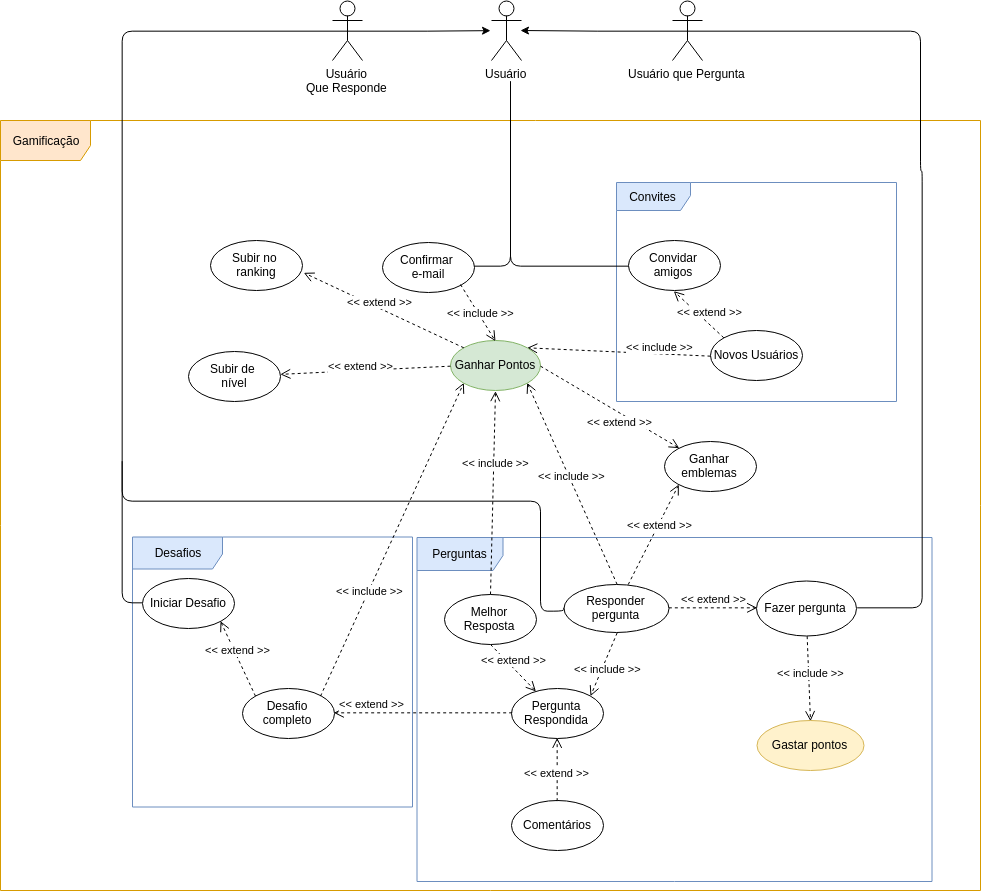

# [GAMIFICAÇÃO](../../rich_picture.md#richpicture-gamificacao)

## Versionamento

|  Versão | Data | Modificação | Autor |
|  :------: | :------: | :------: | :------: |
| 0.1 | 28/04/2019 | Adição do diagrama de casos de uso de gamificação | Leonardo Medeiros, Ivan Diniz Dobbin, João Rodrigues, João Rossi|
| 1.0 | 28/04/2019 | Especificação de casos de uso | Leonardo Medeiros, Ivan Diniz Dobbin, João Rodrigues, João Rossi|
| 1.1 | 28/04/2019 | Adição do segundo diagrama de casos de uso de gamificação | Gustavo Marques e André Lucas |
| 1.2 | 28/04/2019 | Adição do terceiro diagrama de casos de uso de gamificação | Gustavo Marques e André Lucas |
| 2.0 | 28/04/2019 | Mudança nas especificações de caso de uso de acordo com o novo diagrama de casos de uso | Gustavo Marques e André Lucas |

## Diagrama de Casos de Uso

[versoes anteriores](casos_uso_gamificacao_versoes.md)

## Especificação de Casos de Uso

### 1 Breve descrição
Técnica aplicada para incentivar os usuários a contribuir com a plataforma Brainly, ou seja, confirmar e-mail, convidar amigos e responder perguntas.

### 2 Breve descrição dos atores
#### 2.1 [Usuário](../../lexicos10x5f8c4.md#l12660)
Pessoa que utiliza a plataforma.
#### 2.1.1 [Usuário que pergunta](../../lexicos10x5f8c4.md#l12660)
Pessoa que realiza perguntas na plataforma Brainly.
#### 2.1.2 [Usuário que responde](../../lexicos10x5f8c4.md#l12660)
Pessoa que responde perguntas na plataforma Brainly.
### 3 Pré-condições
Ser cadastrado na plataforma Brainly.
### 4 Fluxo básico de eventos
    1 - Usuário que pergunta realiza alguma pergunta e oferece pontos;
    2 - Usuário que responde responde a pergunta e ganha pontos;
    3 - Gera uma pergunta respondida;
    4 - Fim do casos de uso.
### 5 Fluxos alternativos
    0 - Usuário confirma e-mail e ganha pontos;
    0.a - Usuário convida amigos;
    0.b - Amigo gera novo usuário e ganha pontos;
    0.c - Usuário que responde inicia desafio;
    2.a - Usuário que responde sobe de nível;
    2.b - Usuário que responde ganhar emblema;
    2.c - Usuário que responde subir no ranking;
    3.a - Usuário que responde completa desafio e ganha ponto;
    3.b - Usuário comenta reposta;
    3.c - Usuário que pergunta elege uma melhor resposta e ganha ponto.
### 6 Fluxo de Exceções
    1.a - Pergunta contém conteudo que não condiz com as politica do Brainly e tem a pergunta denunciada e excluida;
    2.d - Reposta contém conteudo que não condiz com as politica do Brainly e tem a resposta denunciada e excluida;
    3.d - Comentário contém conteudo que não condiz com as politica do Brainly e tem a comentario denunciado e excluido;
### 7 Requisitos Especiais
1. Responsabilizar o usuário por todos os dados enviados ou transmitidos em conexão com os serviços [BR2.1](../../brainstorm.md#Tabela-de-Requisitos-Funcionais).

2. Apagar perguntas que estão sem respostas por muito tempo [BR2.15](../../brainstorm.md).

3. A ferramenta que possibilita respostas deve ser consistente entre as plataforma [INT1.2](../../introspeccao.md).

4. Para aplicação de punições, deve-se levar em conta a conduta (advertências) do usuário na plataforma [INT2.10](../../introspeccao.md).

5. Possuir idade mínima (13) para se registrar na plataforma [BR2.1](../../brainstorm.md).

6. A plataforma deve possuir membros ativos que ajudem a comunidade a crescer e respondam as perguntas de forma rápida e fácil [INT3.6](../../introspeccao.md).
