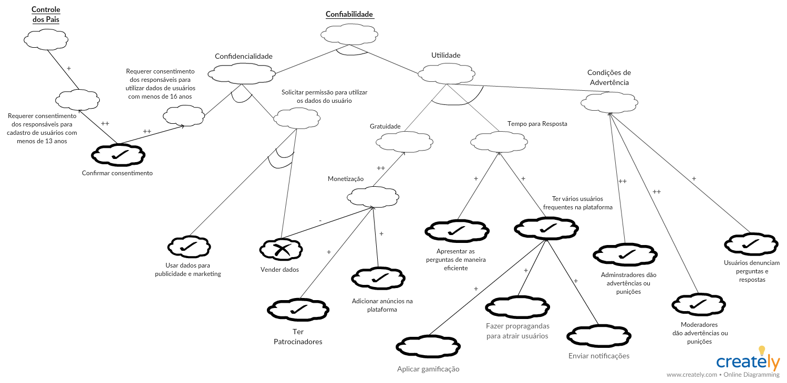
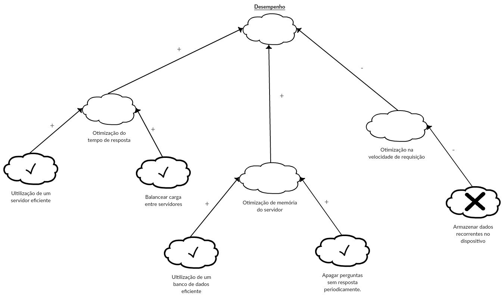
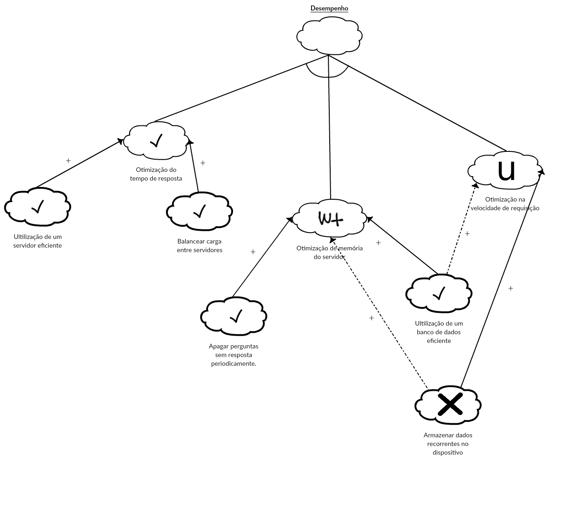
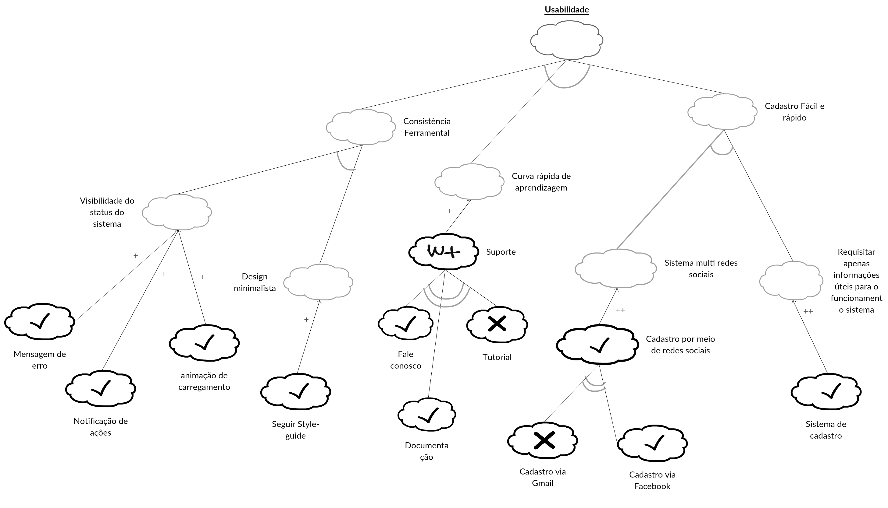

# NFR

## Versionamento

|  Versão |    Data    | Modificação  | Autor |
|  :----: | :--------: | :---------:  | :------: |
|    0.1  | 26/05/2019 | Criar página | João Rodrigues |
|    1.0  | 26/05/2019 | Adicionar segunda versão NFR de Confiabilidade | Ivan Diniz, João Rodrigues, João Gabriel |
|    1.1  | 27/05/2019 | Adicionar NFR Suportabilidade | Ivan Diniz, João Rodrigues, João Gabriel |
| 1.2 | 27/05/2019 | Adição do modelo NFR sobre Suporte ao usuário | André Pinto, Welison Regis |
| 1.3 | 27/05/2019 | Adição do modelo NFR sobre Desempenho | Leonardo Medeiros, Paulo Rocha, André Pinto, Lieverton Silva, Gustavo Lima |
| 1.4 | 27/05/2019 | Adição do modelo NFR sobre Usabilidade | João Matheus, Lieverton Silva, Paulo Rocha|

# INTRODUÇÃO
O NFR é um framework orientado a processos que procura evidenciar os requisitos não funcionais de um sistema, por meio de metas a serem atingidas.

## NFR CONFIABILIDADE
Versão 1.0

Versão 2.0

## NFR SUPORTABILIDADE

## NFR SUPORTE AO USUÁRIO

## NFR DESEMPENHO
Versão 1.0

Versão 2.0

## NFR USABILIDADE

