# NFR

## Versionamento

|  Versão |    Data    | Modificação  | Autor |
|  :----: | :--------: | :---------:  | :------: |
|    0.1  | 26/05/2019 | Criar página | João Rodrigues |
|    1.0  | 26/05/2019 | Adicionar segunda versão NFR de Confiabilidade | Ivan Diniz, João Rodrigues, João Gabriel |
|    1.1  | 27/05/2019 | Adicionar NFR Suportabilidade | Ivan Diniz, João Rodrigues, João Gabriel |
| 1.2 | 27/05/2019 | Adição do modelo NFR sobre Suporte ao usuário | André Pinto, Welison Regis |
| 1.3 | 27/05/2019 | Adição do modelo NFR sobre Desempenho | Leonardo Medeiros, Paulo Rocha, André Pinto, Lieverton Silva, Gustavo Lima |
| 1.4 | 27/05/2019 | Adição do modelo NFR sobre Usabilidade | João Matheus, Lieverton Silva, Paulo Rocha|
| 1.5 | 27/05/2019 | Separação entre NFR e análise confiabilidade e usabilidade |Paulo Rocha|
| 1.6 | 28/05/2019 | Adição de introdução, rastreabilidade dos NFRs e referências. | Welison Regis |
| 1.7 | 26/05/2019 | Adicionar segunda versão NFR de Suportabilidade | Ivan Diniz, João Gabriel |
| 1.8 | 28/05/2019 | Separação entre NFR e análise de desempenho |Paulo Rocha|
| 1.9 | 28/05/2019 | Preenchimento das elicitações associadas e linkagem |Paulo Rocha|
| 2.0 | 28/05/2019 | Adicionar primeira e nova versão do NFR de Confiabilidade  | João Rodrigues |
| 2.1 | 28/05/2019 | Adicionar nova versão de análise do NFR de Confiabilidade | João Rodrigues, Ivan Diniz, João Gabriel |
| 2.2 | 28/05/2019 | Adicionar nova versão do NFR de Suporte ao Usuário | João Rodrigues | 
| 2.3 | 28/05/2019 | Adicionar nova versão de análise do NFR de Suporte ao Usuário | Ivan Diniz, João Gabriel, João Rodrigues | 

# INTRODUÇÃO
O NFR Framework é uma abordagem orientada a processos, em que os **requisitos não-funcionais** são explicitamente representados como metas a serem obtidas. Nesse sentido, preocupa-se diretamente com o **comportamento do sistema** e com a avaliação das metas-flexíveis (softgoal) [CHUNG, 1995]. O desenvolvimento dos artefatos foi separado em dois itens: o **NFR sem a análise**, e **outra versão com a análise**.

Ferramenta utilizada para desenvolver os NFRs: [Creately](https://creately.com/).

## NFR CONFIABILIDADE
Versão 1.0

Versão 2.0

Versão 3.0
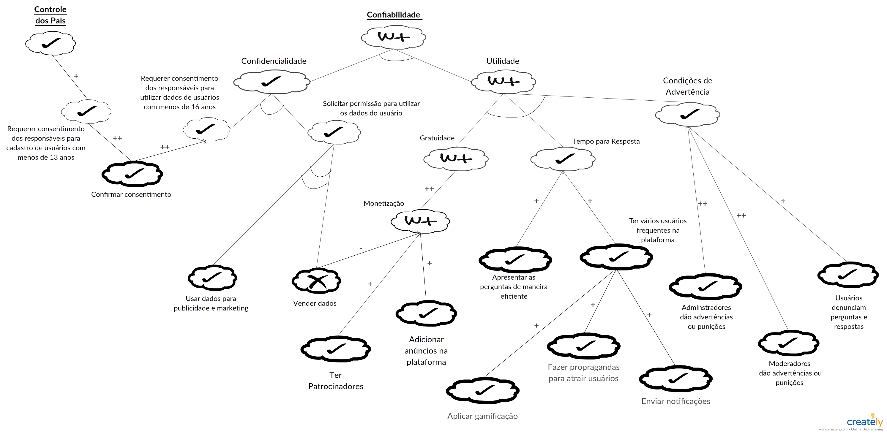
Versão 4.0
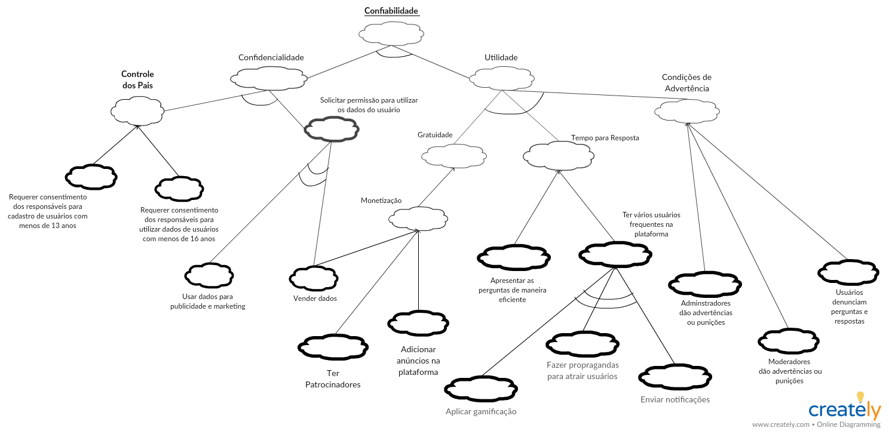
Análise NFR Confiabilidade
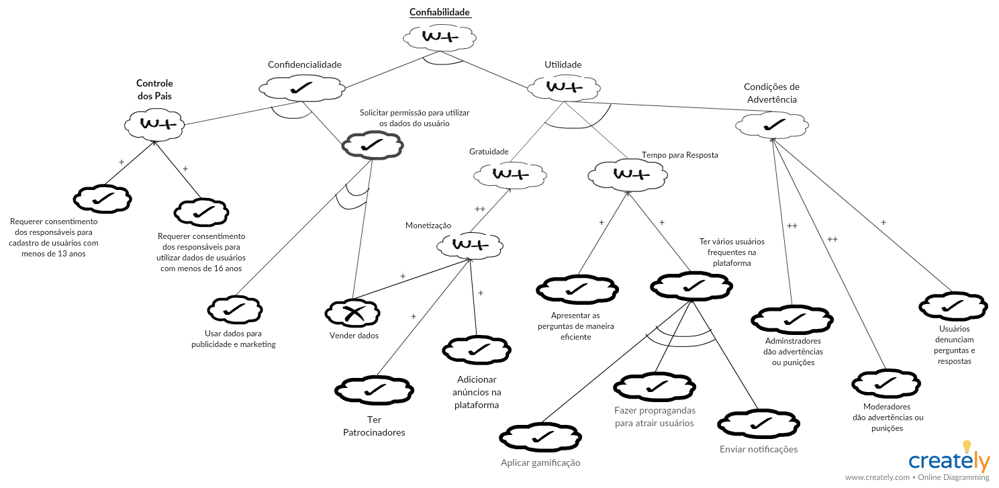

Modelagens Associadas: [**Especificação Suplementar**](./especificacao_suplementar.md#confiabilidade), [US31](./backlog.md#us31), [US13](./backlog.md#us13), [US26](./backlog.md#us26), [US29](./backlog.md#us29), [US34](./backlog.md#us34), [C3030](./cenarios10x5f8c4.md#c3030).

Elicitação Associada: [EN 1.3](./entrevista.md), [BR 2.1](./brainstorm.md), [BR 2.7](./brainstorm.md), [BR 2.10](./brainstorm.md).

## NFR SUPORTABILIDADE
Versão 1.0
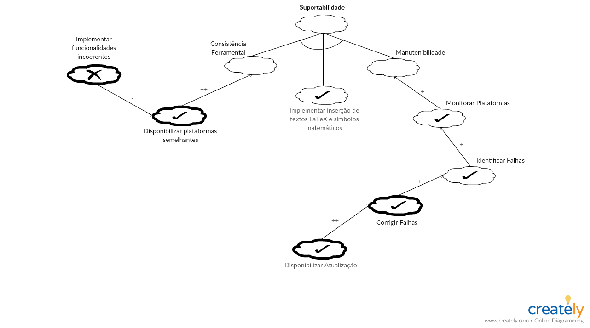
Versão 2.0  
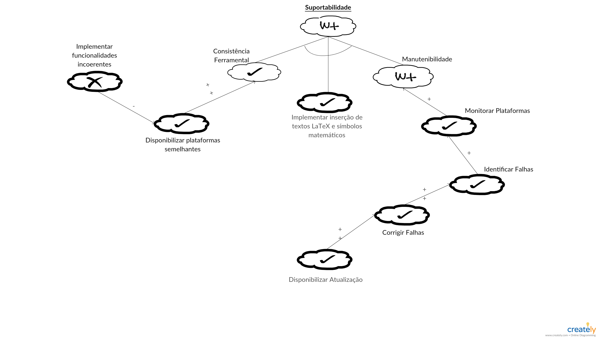
Versão 3.0  
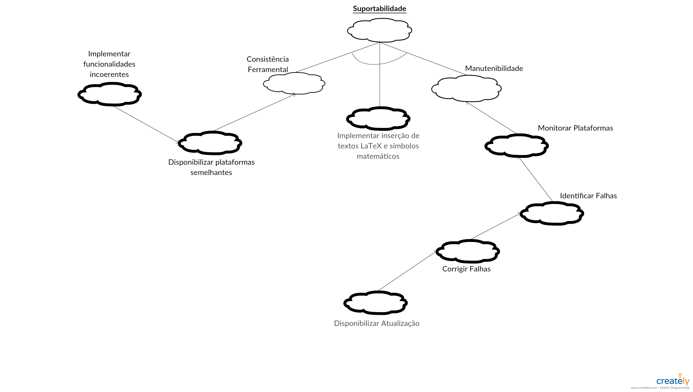
Análise NFR Suportabilidade
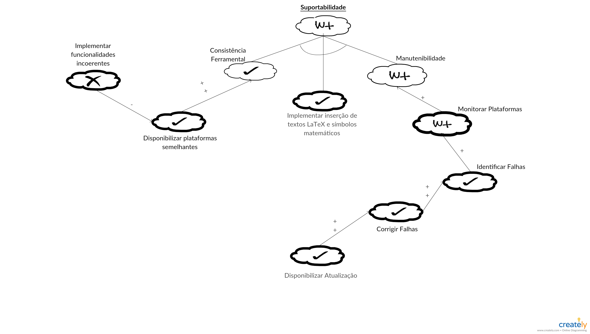

Modelagens Associadas: [**Especificação Suplementar**](./especificacao_suplementar.md#suportabilidade)

Elicitação Associada: [INT1.2](./introspeccao.md), [INT3.11](./introspeccao.md), [BR2.16](./brainstorm.md), [INT1.7](./introspeccao.md).

## NFR SUPORTE AO USUÁRIO
Versão 1.0
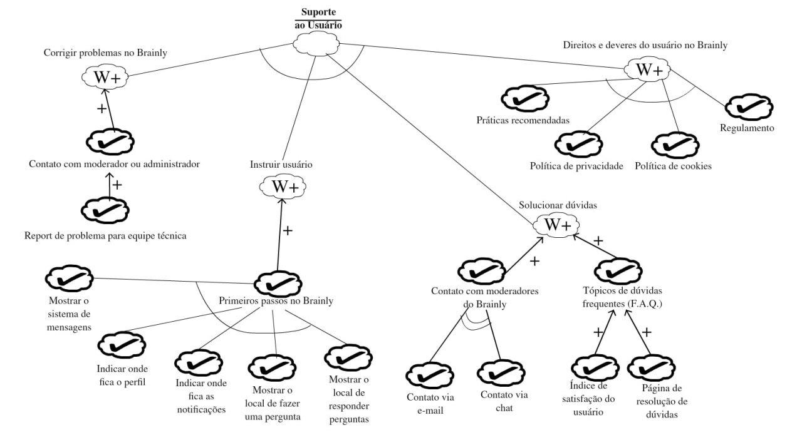
Versão 2.0
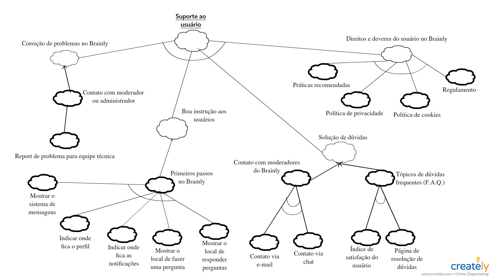
Análise NFR Suporte ao Usuário
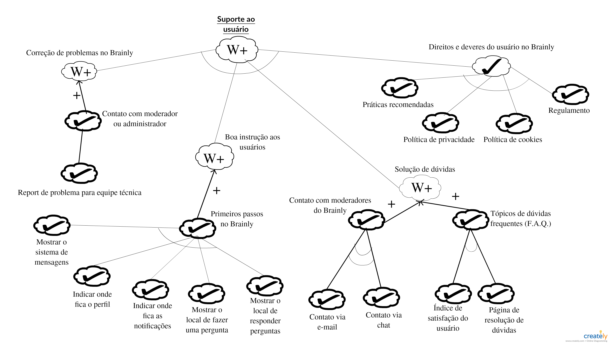

Modelagens Associadas: [**Especificação Suplementar**](./especificacao_suplementar.md#requisitos-de-sistema-de-ajuda-e-de-documentacao-de-usuario-on-line)

Elicitação Associada: [INT1.2](introspeccao.md), [INT3.11](introspeccao.md), [BR2.16](brainstorm.md), [INT1.7](introspeccao.md).

## NFR DESEMPENHO
Versão 1.0
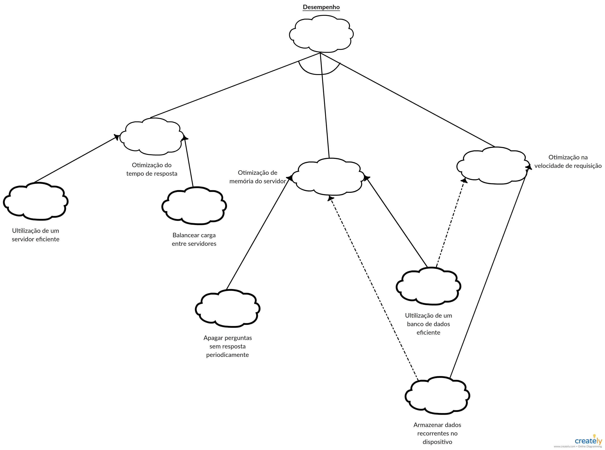
Análise NFR Desempenho
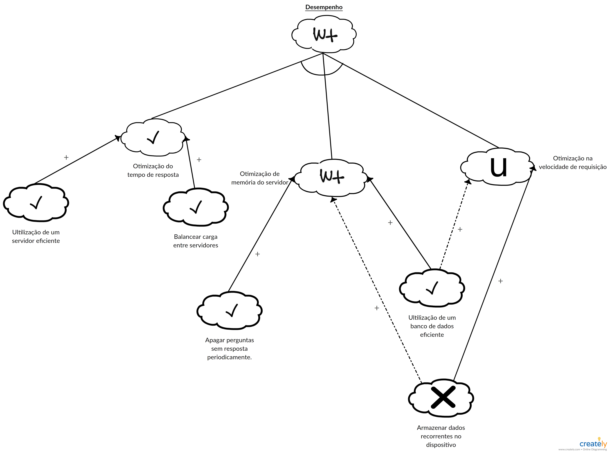

Modelagens Associadas: [**Especificação Suplementar**](./especificacao_suplementar.md#desempenho)

Elicitação Associada: [INT3.6](introspeccao.md), [INT3.11](introspeccao.md), [AP3.3](analise_protocolo.md), [BR2.15](brainstorm.md) 

## NFR USABILIDADE
Versão 1.0
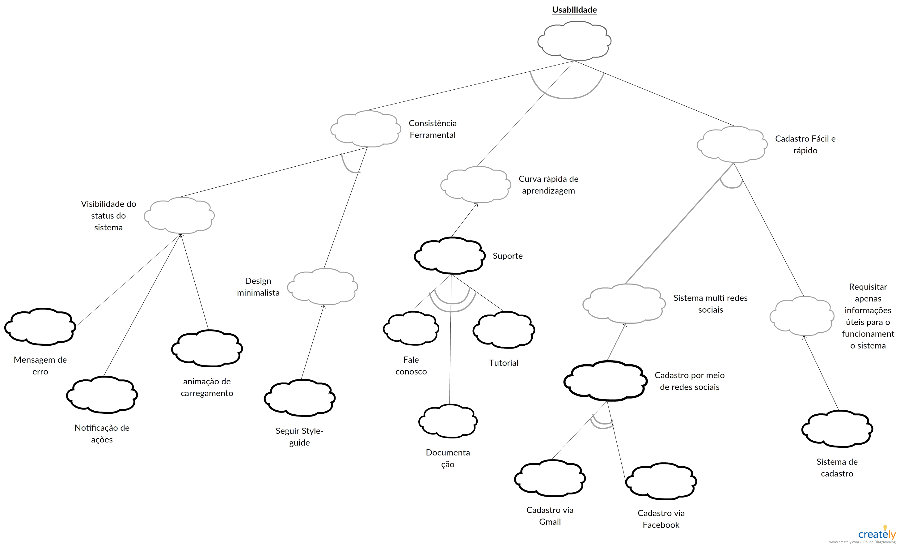
Análise NFR Usabilidade
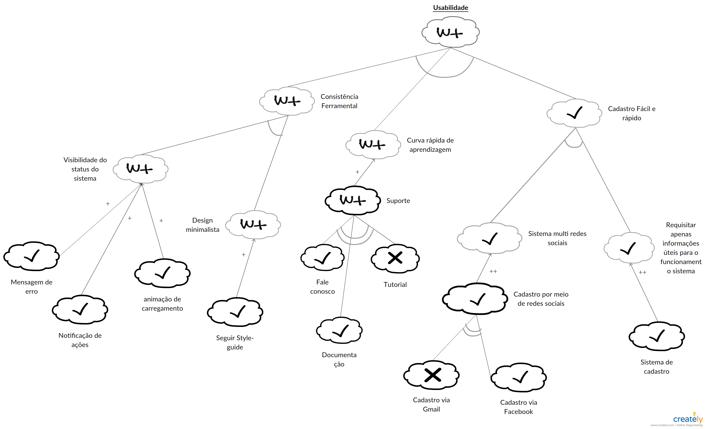

Modelagens Associadas: [**Especificação Suplementar**](./especificacao_suplementar.md#usabilidade)

Elicitação Associada: [INT1.2](introspeccao.md), [INT3.9](introspeccao.md), [INT3.11](introspeccao.md), [AP3.3](analise_protocolo.md), [AP3.4](analise_protocolo.md).

## REFERÊNCIA

[1] SERRANO, Maurício; SERRANO, Milene. **Requisitos - Aula 19. 1º/2019**. Material apresentado para a disciplina de Requisitos de Software no curso de Engenharia de Software da UnB, FGA.

[2] CHUNG, L. e NIXON, B., **“Using Non-Functional Requirements to Systematically Support Change”**, 1995;

[3] CHUNG, L., “Non-functional Requirements in Software Engineering”, visitado em 2007, disponível [aqui](https://www.utdallas.edu/~chung/RE/NFR-18.ppt);