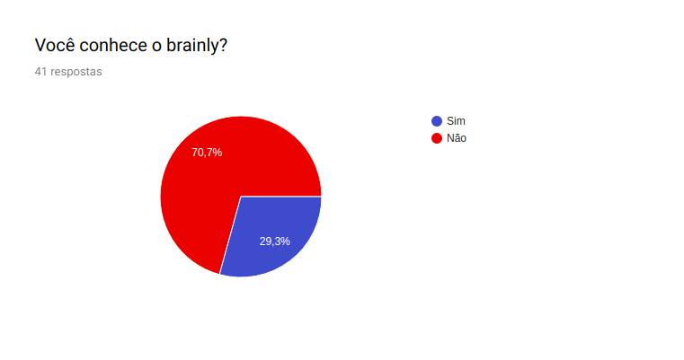
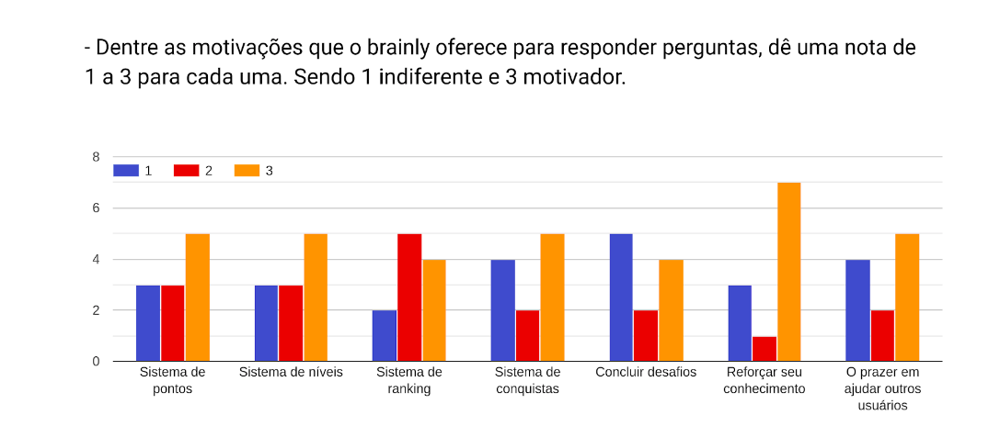
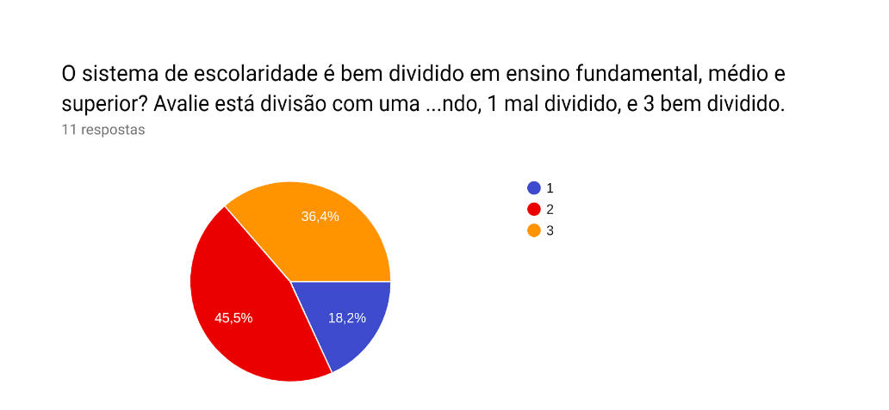
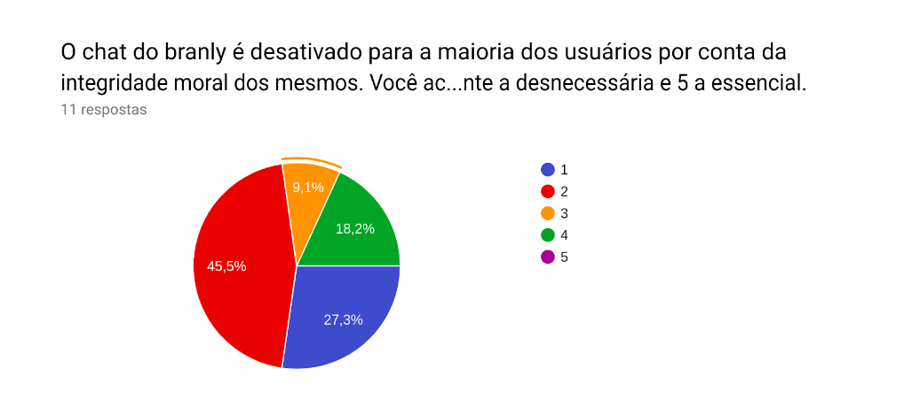
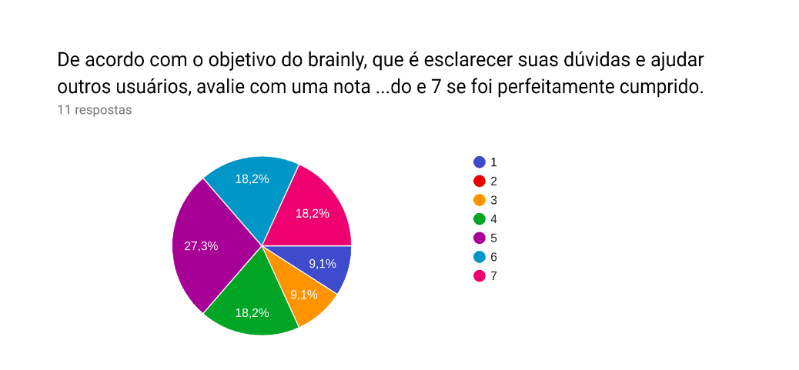
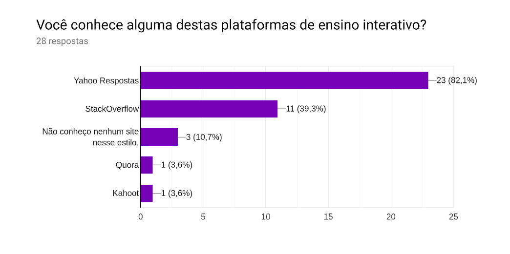
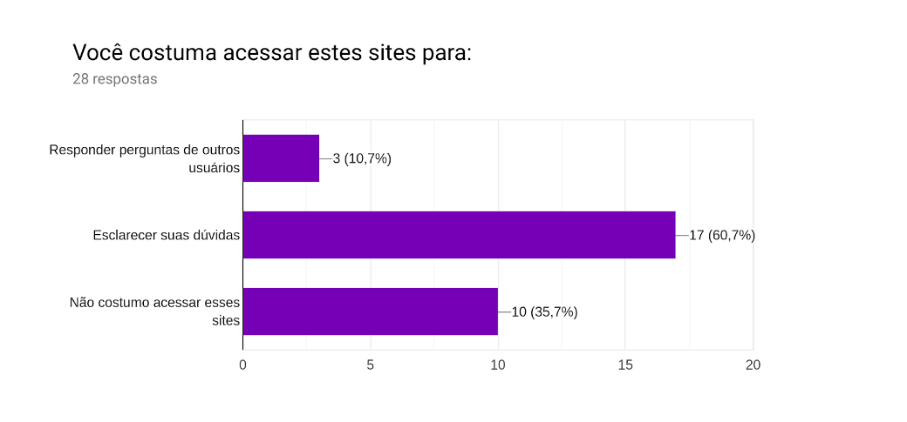
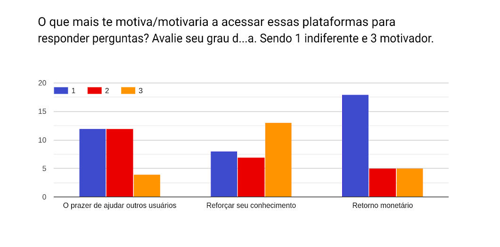
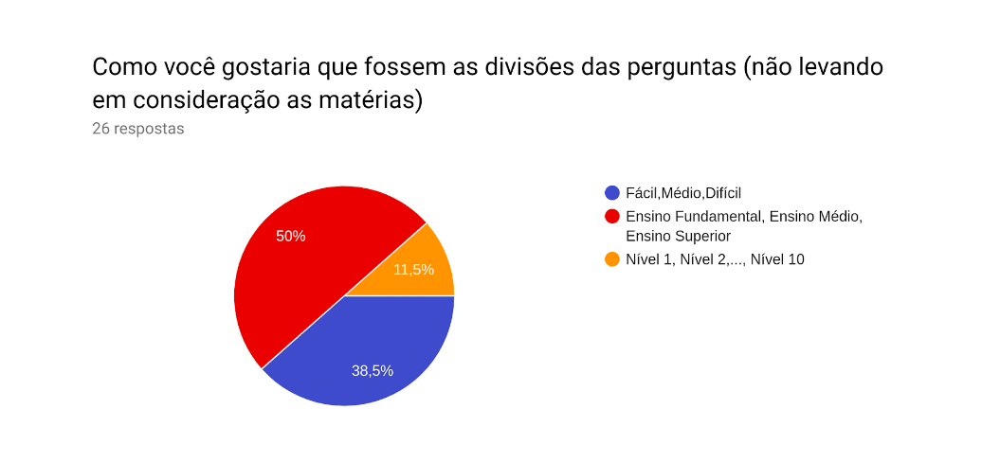
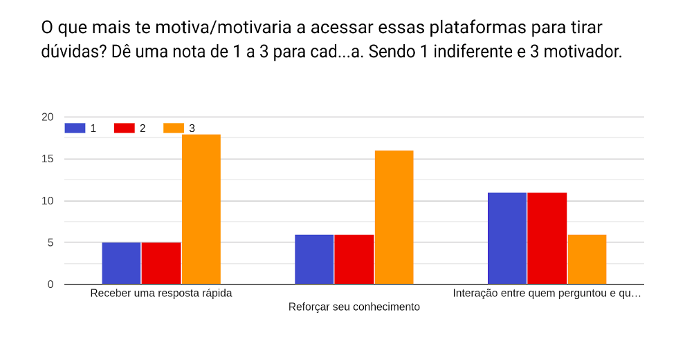

# QUESTIONÁRIO

|  Versão | Data | Modificação | Autor |
|  :------: | :------: | :------: | :------: |
| 0.1 | 08/04/2019 | Questionário geral e usuários do Brainly | Gustavo Marques, Ivan Dobbin |
| 0.2 | 08/04/2019 | Questionário geral apenas | Ivan Dobbin, Gustavo Marques |
| 1.0 | 09/04/2019 | Questionário direcionado | Leonardo Medeiros, Ivan Dobbin, Gustavo Marques |
| 2.0 | 09/04/2019 | Adiciona resultado do questionário e realiza análise | Gustavo Marques, Ivan Dobbin |
| 2.1 | 10/04/2019 | Altera estrutura de apresentação do questionário | Welison Regis |

**As perguntas realizadas nesse questionário podem ser visualizadas [AQUI](#questionario-aplicado)**.

## ANÁLISE DAS RESPOSTAS DO QUESTIONÁRIO

### Pergunta 1

 
 
De acordo com esse dado a plataforma não é tão conhecida pelo público entrevistado, no caso o público universitário.

### Pergunta 2

- Você entende como funciona o sistema de perguntas? Se não, quais foram suas dificuldades ao usar o sistema?
 
 

|   |
|  :------: |
| Sim |
| sim | 
| Não, interface muito confusa |
| Sim. O guia é bom para fazer perguntas boas |

Pelas respostas podemos concluir que o sistema de perguntas foi desenvolvido de tal maneira que a maioria dos usuários não tenha dificuldades em compreender seu funcionamento.
 

### Pergunta 3

 
 
Para usuários que já conhecem a plataforma o sistema de gamificação tem incentivado na hora de ajudar a plataforma com respostas. Isso não tira o fato de que reforçar o conhecimento é um foco principal. 

### Pergunta 4
- Você adicionaria alguma outra funcionalidade para motivar os usuário do brainly a responder perguntas? Se sim, qual? 
 
 

|   |
|  :------: |
| Não |
| Sim, mais recompensas | 
| Ajudar ao proximo |
| Responder o pc e não outro alguém. |
| As pessoas que tiveram perguntas respondidas poderiam  mostrar fruto dessa mesma resposta. Seria mais incentivador |
| Pagamento em dinheiro | 
| Retorno monetário. | 

Em geral a ideia de funcionalidade para motivação mais relevante é o retorno monetário para quem respondeu a pergunta. Além disso algumas das ideias citadas já estão implementadas na plataforma, que são: Aumentar a pontuação adquirida ao responder alguma pergunta, isso pode ser caracterizado como os desafios, e o feedback e acompanhamento de perguntas e respostas nas quais o usuário fez parte.
 

### Pergunta 5

 
 
Esses dados mostram que a divisão de matérias tem uma taxa baixa de rejeição, e pode ser considerada boa, sendo que a maioria dos usuários se mostram indiferentes e uma boa parte concorda que a divisão é boa do jeito que está.

### Pergunta 6

 
 
De acordo com o questionário o chat não é algo essencial para os usuários do brainly, portanto a política adotada de indisponibilizar o chat para novos usuários é bastante eficiente. Além de evitar problemas de integridade moral dos usuários não trás uma grande perda para o app.

### Pergunta 7
- Você adicionaria mais áreas de conhecimento no brainly, se sim, quais?
 
 

|   |
|  :------: |
| Não |
| Não sei | 
| A área que a pessoa for perguntar precisar |

As pessoas se mostraram indiferentes quanto a novas áreas de conhecimento da plataforma. As áreas de conhecimento existentes parecem ser o suficiente para os usuários da pesquisa.
 

### Pergunta 8

 
 
Para mais da metade dos entrevistados, a plataforma tem postura positiva no quesito de exercer seu objetivo principal, a taxa de pessoas que discordam dessa afirmação é baixa.

### Pergunta 9

 
 
O dado acima é reforçado, pelo fato de muitas pessoas conhecem plataformas concorrentes porém não conhecem o brainly. Isso mostra que o sistema tem perdido usuários do âmbito universitário para outras plataformas.

### Pergunta 10

 
 
Boa parte do público não tem intenção de acessar plataformas similares para responder perguntas. Portanto o trabalho de tornar o ato de responder dúvidas atrativo é importante.

### Pergunta 11

 
 
O retorno monetário como incentivo se mostrou indiferente para muitos usuários. O fator mais relevante para incentivar usuários a responder dúvidas é reforçar o conhecimento que ele já possui.

### Pergunta 12

 
 
Pode-se perceber que os usuários de nossa pesquisa em sua maioria preferem a divisão em níveis de escolaridade, assim podemos concluir que o Brainly fez uma boa divisão.

### Pergunta 13

 
 
Essa resposta reforça o que já foi deixado claro, que o principal incentivo para um usuário responder perguntas na plataforma é reforçar seu conhecimento. Também podemos ver que a grande maioria tem interesse apenas em receber respostas rápidas, e que a interação com quem respondeu ou quem perguntou não é algo primordial

### Pergunta 14
- Existe alguma característica dessas plataformas que te desmotiva ou que o desmotivaria a utilizá-las? Se sim, quais e qual sua sugestão para resolução desse problema? 

|   |
|  :------: |
| Não |
| Respostas sem sentido ou sem baseamento científico. | 
| Falta de confiabilidade nas respostas, uma solução seria o uso de referências |
| Resposta "desnecessárias". Se não se sabe a resposta, evitar respostas "sem noção" |
| Desconheço |
| Normalmente quero respostas rápidas,  então só olho as perguntas já feitas e respondidas, não faço novas | 
| Realizar inscrições |
| A falta de confiança nas respostas. Seria  legal se fosse uma plataforma respondida apenas por professores |
| não conheço e não utilizo essas plataformas | 
| Respostas sucintas e mal respondidas |
| Não saber se é confiável. |

As respostas acima mostra que a confiabilidade das respostas é algo de suma importância em uma plataforma como essa. Respostas ruins afetariam a plataforma como um todo. 

### Pergunta 15

 
 
Esse resultado mostra que foi feita uma boa escolha de público para a pesquisa, pois boa parte deste teria ou poderia ter interesse em conhecer o brainly.

 
 

# QUESTIONÁRIO APLICADO

## Pergunta 1 para todos.

- Você conhece o brainly? 
( ) Sim 
( ) Não 

## Perfil alvo - Usuários que não conhecem o brainly.
Branch 1

- Você conhece alguma dessas plataformas de ensino interativo? 
( ) Yahoo Respostas  
( ) Brainly  
( ) StackOverflow  
( ) Não conheço nenhum site nesse estilo. 
( ) Outro: _____________ 

- Você costuma acessar esses sites para: 
( ) Responder Perguntas de outros usuários  
( ) Esclarecer suas dúvidas  
( ) Não costumo acessar esses sites  

- O que mais te motiva/motivaria a acessar essas plataformas para resṕonder perguntas?  Dê uma nota de 1 a 3 para cada uma. Sendo 1 indiferente e 3 motivador. 
O prazer de ajudar outros usuários.&emsp;1( )  2( )  3( )  
Reforçar seu conhecimento. &emsp;&emsp;&emsp;&emsp;1( )  2( )  3( )    
Retorno monetário.&emsp;&emsp;&emsp;&emsp;&emsp;&emsp;&emsp;&emsp;1( )  2( )  3( )  

- O que mais te motiva/motivaria a acessar essas plataformas para tirar dúvidas?  Dê uma nota de 1 a 3 para cada uma. Sendo 1 indiferente e 3 motivador. 
( ) Receber uma resposta rápida.  
( ) Reforçar seu conhecimento.  
( ) Interação entre quem perguntou e quem respondeu(desde um agradecimento até tirar dúvidas sobre a resolução do problema) 
( ) Outros: _____________  

- Existe alguma característica dessas plataformas que te desmotiva ou que o desmotivaria a utilizá-las? Se sim, quais e qual sua sugestão para resolução desse problema? 
_______________________________________________________________________________ 

- Brainly é uma dessa plataformas de ensino interativo.Você gostaria de conhecer o Brainly para esclarecer dúvidas escolares e acadêmicas? 
( ) Sim 
( ) Não 
( ) Talvez 
## Perfil alvo - Usuários que utilizam o braily
Branch 2

- Você entende como funciona o sistema de perguntas? Se não, quais foram suas dificuldades ao usar o sistema? 
_________________________________________________________________________ 

- Dentre as motivações que o brainly oferece para responder perguntas, dê uma nota de 1 a 3 para cada uma. Sendo 1 indiferente e 3 motivador. 
( ) Sistema de pontos  
( ) Sistema de níveis  
( ) Sistema de ranking  
( ) Sistema de conquistas  
( ) Concluir desafios  
( ) Reforçar seu conhecimento  
( ) O prazer em ajudar outros usuários. 

- Você adicionaria alguma outra funcionalidade para motivar os usuário do brainly a responder perguntas? Se sim qual? 
___________________________________________________________________________________ 

- O sistema de escolaridade é bem dividido em ensino fundamental, médio e superior?  Dê uma nota de 1 a 3 sendo, 1 mal dividido, e 3 bem dividido. 
( ) 1 
( ) 2 
( ) 3 

- O chat do branly é desativado para a maioria dos usuários por conta da integridade moral dos mesmos.Você acha que esse tipo de plataforma deveria manter o chat? Lembrando que ainda pode-se interagir pelos comentários dos problemas de maneira limitada. De uma nota de 1 a 5, sendo 1 equivalente a desnecessária e 5 equivalente a essencial. 
( ) 1 
( ) 2 
( ) 3 
( ) 4 
( ) 5 
 
- Você adicionaria mais áreas de conhecimento no brainly, se sim, quais? 
_____________________________________________________________________________________ 

- De acordo com o objetivo do brainly, que é esclarecer suas dúvidas e ajudar outros usuários, dê uma nota de 1 a 7 correspondendo ao objetivo do app. 1 caso o objetivo não tenha sido cumprido e 7 se foi perfeitamente cumprido. 
( ) 1 
( ) 2 
( ) 3 
( ) 4 
( ) 5 
( ) 6 
( ) 7 