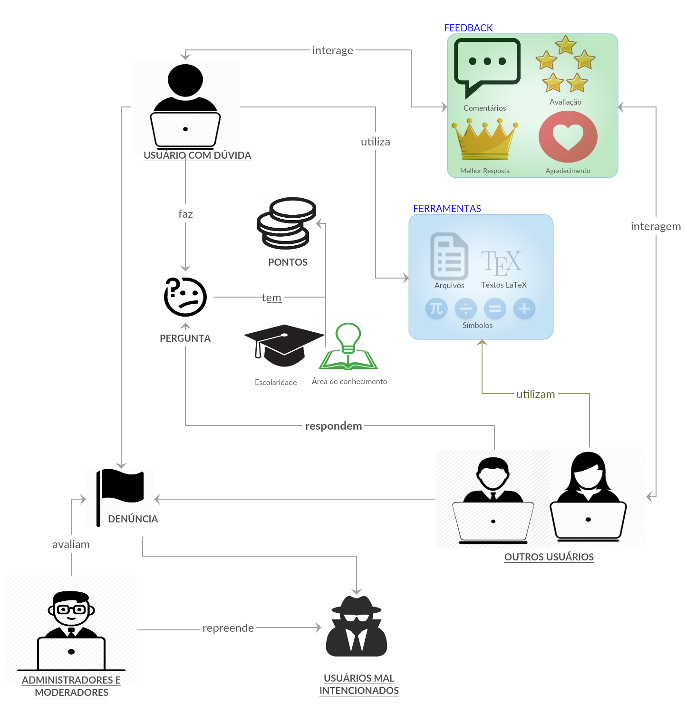

# RICH PICTURE

## Versionamento

|  Versão | Data | Modificação | Autor |
|  :------: | :------: | :------: | :------: |
| 1.0 | 27/03/2019 | Primeira versão RichPicture de visão geral | Welison Regis |
| 2.0 | 31/03/2019 | Segunda versão RichPicture de visão geral | Welison Regis |
| 1.0 | 31/03/2019 | Primeira versão RichPicture de gamificação | João Gabriel Rossi, Paulo Vitor, Ivan Diniz |
| 1.1 | 31/03/2019 | Primeira versão RichPicture de plataformas | João Rodrigues, Lieverton Santos, Gustavo Marques |
| 1.2 | 01/04/2019 | Primeira versão RichPicture de perguntas e respostas | André Pinto, Leonardo Medeiros, Welison Regis |
| 1.3 | 1/04/2019 | Renomeando categorias da tabela de nível | João Gabriel Rossi|
| 1.4 | 8/04/2019 | Adicionado RichPicture de primeiros passos para novo usuário cadastrado e não cadastrado | André Pinto |

## Rich Picture

Rich picture é uma ferramenta/modelagem para análise de problemas e apresentação de ideias.
É um desenho de uma situação que ilustra os elementos principais e relações que precisam ser levadas em consideração ao tentar criar alguma melhoria. Consiste de fotos, textos, símbolos e ícones, no qual todos são utilizados para ilustrar graficamente a situação.

Um modelo completamente informal, normalmente criado sem um rigor muito técnico, visando poder ser criado junto com o próprio cliente, normalmente desenhado baseado em um problema central no meio de uma página em branco e criando tópicos relacionados com esse problema e as suas ramificações.

## Rich Picture Visão Geral Brainly

## RichPicture Gamificação

## RichPicture Plataformas

## RichPicture Perguntas e Respostas

## RichPicture Primeiros Passos de Novo Usuário Não Cadastrado

## RichPicture Primeiros Passos de Novo Usuário Cadastrado

[Versões anteriores](https://welisonr.github.io/2019.1-Requisitos-Brainly/rich_picture_versoes/)
